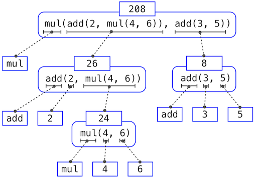
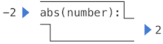

---
export_on_save:
  html: true
html:
  toc: true
  offline: true 
toc:
  depth_from: 3
  depth_to: 6
  ordered: false
---

# CS 61A Class Notes

**<u>Text book</u>** 

* [Structure and Interpretation of Computer Programs (SICP)](https://mitpress.mit.edu/sites/default/files/sicp/index.html) 
* [Composing Programs](http://composingprograms.com/) (Majorly referred in this course)
* [Dive into Python 3](https://diveintopython3.problemsolving.io/index.html)

---
<u>**Table of Contents**</u>

<!-- @import "[TOC]" {cmd="toc" depthFrom=1 depthTo=6 orderedList=false} -->

<!-- code_chunk_output -->

- [CS 61A Class Notes](#cs-61a-class-notes)
  - [Chapter 1: Building Abstractions with Functions](#chapter-1-building-abstractions-with-functions)
    - [1.1 Getting Started](#11-getting-started)
      - [Statements & Expressions](#statements--expressions)
      - [Functions](#functions)
      - [Objects](#objects)
      - [Interpreters](#interpreters)
      - [Errors](#errors)
    - [1.2 Elements of Programming](#12-elements-of-programming)
      - [Expressions](#expressions)
      - [Call Expressions](#call-expressions)
      - [Importing Library Functions](#importing-library-functions)
      - [Names and the Environment](#names-and-the-environment)
      - [Evaluating Nested Expressions](#evaluating-nested-expressions)
      - [The Non-Pure Print Function](#the-non-pure-print-function)
    - [1.3 Defining New Functions](#13-defining-new-functions)
      - [Function Definitions](#function-definitions)
      - [Environments](#environments)
      - [Calling User-Defined Functions](#calling-user-defined-functions)
      - [Example: Calling a User-Defined Function](#example-calling-a-user-defined-function)
      - [Local Names](#local-names)
      - [Choosing Names](#choosing-names)
      - [Functions as Abstractions](#functions-as-abstractions)
      - [Operators](#operators)
    - [1.4 Designing Functions](#14-designing-functions)
      - [Documentation](#documentation)
      - [Default Argument values](#default-argument-values)
    - [1.5 Control](#15-control)
      - [Statements](#statements)
      - [Compound Statements](#compound-statements)
      - [Defining Functions II: Local Assignment](#defining-functions-ii-local-assignment)
      - [Conditional Statements](#conditional-statements)
      - [Control Expressions](#control-expressions)
      - [Iteration](#iteration)
        - [[Example]: <u>Fibonacci numbers</u>](#example-ufibonacci-numbersu)
      - [Testing](#testing)
    - [1.6 Higher-Order Functions](#16-higher-order-functions)
      - [Functions as Arguments](#functions-as-arguments)
      - [Functions as General Methods](#functions-as-general-methods)
      - [Defining Functions III: Nested Definitions](#defining-functions-iii-nested-definitions)
      - [Functions as Returned Values](#functions-as-returned-values)
      - [How to Draw an Environment Diagram](#how-to-draw-an-environment-diagram)
      - [Example: Newton's Method](#example-newtons-method)
      - [Currying](#currying)
      - [Lambda Expressions](#lambda-expressions)
      - [Abstractions and First-Class Functions](#abstractions-and-first-class-functions)
      - [Function Decorators](#function-decorators)
    - [1.7 Recursive Functions](#17-recursive-functions)
        - [[Example]: <u>a function that sums the digits of a natural number</u>](#example-ua-function-that-sums-the-digits-of-a-natural-numberu)
      - [The Anatomy of Recursive Functions](#the-anatomy-of-recursive-functions)
        - [[Example]: <u>compute n factorial</u>](#example-ucompute-n-factorialu)
      - [Mutual Recursion](#mutual-recursion)
        - [[Example]: <u>determine whether a number is even or odd</u>](#example-udetermine-whether-a-number-is-even-or-oddu)
      - [Printing in Recursive Functionsd](#printing-in-recursive-functionsd)
        - [[Example]: <u>print all prefixes of a number from largest to smallest to largest</u>](#example-uprint-all-prefixes-of-a-number-from-largest-to-smallest-to-largestu)
        - [[Example]: <u>pebble game</u>](#example-upebble-gameu)
      - [Tree Recursion](#tree-recursion)
        - [[Example]: <u>Fibonacci sequence</u>](#example-ufibonacci-sequenceu)
        - [[Example]: <u>partitions</u>](#example-upartitionsu)
      - [Recursion and Iteration](#recursion-and-iteration)

<!-- /code_chunk_output -->


---

## Chapter 1: Building Abstractions with Functions

### 1.1 Getting Started

> *All computing begins with representing information, specifying logic to process it, and designing abstractions that manage the complexity of that logic.*

#### Statements & Expressions
Computer programs consist of instructions to either
1. Compute some value $\Longleftarrow$ **Expressions**
2. Carry out some action $\impliedby$ **Statements**


#### Functions
*e.g.* `>>> shakespeare = urlopen('http://composingprograms.com/shakespeare.txt')`

Functions encapsulate logic that manipulates data. `urlopen` is a function.


#### Objects
*e.g.* `>>> words = set(shakespeare.read().decode().split())`

A `set` is a type of object, one that supports set operations like computing intersections and membership.  An object seamlessly bundles together data and the logic that manipulates that data, in a way that manages that complexity of both.

#### Interpreters
Evaluating compound expressions requires a precise procedure that interprets code a predictable way.  A program that implements such a procedure, evaluating compound expressions, is called an interpreter.

#### Errors

> The fundamental equation of computers is:
>
> `computer = powerful + stupid`
>
> Computers are very powerful, looking at volumes of data very quickly. Computers can perform billions of operations per second, where each operation is pretty simple.
>
> Computers are also shockingly stupid and fragile. The operations that they can do are extremely rigid, simple, and mechanical. The computer lacks anything like real insight ... it's nothing like the HAL 9000 from the movies. If nothing else, you should not be intimidated by the computer as if it's some sort of brain. It's very mechanical underneath it all.
>
> Programming is about a person using their real insight to build something useful, constructed out of these teeny, simple little operations that the computer can do.
>  
> —Francisco Cai and Nick Parlante, Stanford CS101

Some guiding principles of debugging are:
1. Test incrementally
2. Isolate errors 
3. Check your assumptions 
4. Consult others


---
### 1.2 Elements of Programming

*Programs must be weitten for people to read, and only incidentally for machines to execute.*

Every powerful language has three mechanisms that a language provides for combining simple ideas to form more complex ideas:
* **primitive expressions and statements**, which represent the simplest building blocks that the language provides,
* **means of combination**, by which compound elements are built from simpler ones, and 
* **means of abstracion**, by which compound elements can be named and manipulated as units.

In programming, we deal with two kinds of elements: **functions** and **data**.

#### Expressions
*e.g.*
```python
>>> 42
42
>>> -1 - -1
0
```

* *infix* notation: the ***operator*** (*e.g.*, +, -, \*, or /) appears in between the ***operands*** (numbers).


<br/>

#### Call Expressions
&mdash; Applies a function to some arguments

> *"All expressions can use function call notation."*

* *e.g.*
```python
>>> max(7.5, 9.5)
9.5
```
When this call expression is evaluated, we say that the function `max` is *called* with *arguments* 7.5 and 9.5, and *returns* a *value* of 9.5.
<br/>

* The order of the arguments in a call expression matters. *e.g.* 
```python
>>> pow(100, 2)
10000
>>> pow(2, 100)
1267650600228229401496703205376
``` 
<br/>

* Three advantages that function notation has over the mathematical convention of indix notaion:
  1. functions may take an arbitrary number of arguments
  2. function notation extends in a straightforward way to ***nested*** expressions, where the elements are themselves compound expressions. *e.g.* 
    ```python
    >>> max(min(1, -2), min(pow(3, 5), -4))
    -2
    ``` 
  3. Mathematical notation has a great variety of forms, and some of this notation is very hard to type. 
<br/>

#### Importing Library Functions
Python organizes the functions and other quantities that it knows about into modules, which together comprise the Python Library.  To use these elements, one imports them. 
*e.g.* 
```python
>>> from math import sqrt
>>> sqrt(256)
16.0
``` 
```python
>>> from operator import add, sub, mul 
>>> add(14, 28)
42
>>> sub(100, mul(7, add(8, 4)))
16
``` 
The [Python 3 Library Docs](https://docs.python.org/3/library/index.html) list the functions defined by each module.
<br/>

#### Names and the Environment
* If a value has been given a name, we say that the name ***binds*** to the value.  In Python, we can establish new bindings using the assignment statement. 
*e.g.* 
    ```python
    >>> radius = 10
    >>> radius
    10
    >>> 2 * radius
    20
    ``` 
<br/>

* Names can also be bounded via `import` statements. *e.g.* 
    ```python
    >>> from math import pi
    >>> pi * 71 / 223
    1.0002380197528042
    ``` 

    The `=` symbol is called the ***assignment*** operator. Assignment is our simplest means of ***abstraction***, for it allows us to use simple names to refer to the results of compound operations.
<br/>

* The possibility of binding names to values and later retrieving those values by name means that the interpreter must maintain some sort of memory that keeps track of the names, values, and bindings.  This memory is called an ***environment***.
<br/>

* Names can also be bound to functions. *e.g.* 
    ```python
    >>> max
    <built-in function max>

    >>> f = max
    >>> f
    <built-in function max>
    >>> f(2, 3, 4)
    4
    ```
    <br/>

* In Python, names are often called ***variable names*** or ***variables*** because they can be bound to different values in the course of executing a program.  *e.g.* One can even bind built-in names to new values.
    ```python
    >>> max  = 5
    >>> max
    5
    ``` 
    After assigning `max` to 5, the name `max` is no longer bound to a function.
<br/>

* When excuting an assignment statement, Python evaluates the expression to the right of `=` before changing the binding to the name on the left. *e.g.* 
  ```python 
  >>> x = 2
  >>> x = x + 1
  >>> x
  3
  ``` 
<br/>

* We can also assign multiple values to multiple names in a single statement, where names on the left of `=` and expressions on the right of `=` are separated by commas. *e.g.* 
  ```python
  >>> area, circumference = pi * radius * radius, 2 * pi * radius
  >>> area
  314.1592653589793
  >>> circumference
  62.83185307179586
  ``` 
<br/>

* Changing the value of one name does note affect other names. Below, even though the name `area` was bound to a value defined originally in terms of `radius`, the value of `area` has not changed. Updating the value of `area` requires another assignment statement.
  ```python
  >>> radius = 11
  >>> area
  314.1592653589793
  >>> area = pi * radius * radius
  380.132711084365
  ```
  <br/>

* With multiple assignment, **all** expressions to the right of `=` are evaluated before *any*names to the left are bound to those values. As a result of this rule, swapping the values bound to two names can be performed in a single statement.  *e.g.* 
  ```python
  >>> x, y = 3, 4.5
  >>> y, x = x, y 
  >>> x
  4.5
  >>> y 
  3
  ```
  <br/>


#### Evaluating Nested Expressions
To evaluate a call expression, Python will do the following:
1. Evaluate the operator and operand subexpressions, then
2. Apply the function that is the value of the operator subexpression to the arguments that are the values of the oprand subexpressions.

It is easy to see that the evaluation procedure is ***recursive*** in nature; that is, it includes, as one of its steps, the need to invoke the rule itself.

For example, the process of evaluating 
```python
>>> sub(pow(2, add(1, 10)), pow(2, 5))
2016
``` 
can be demonstrated in the following figure


This illustration is called an ***expression tree***
* In computer science, trees conventionally grow from the top down.
* The objects at each point in a tree are called nodes; in this case, they are expressions paired with their values.
<br/>

We take care of the primitive expression cases by stipulating that:
* A numeral evaluates to the number it names,
* A name evaluates to the value associated with that name in the current environment.
<br/>

Notice the important role of an ***environment*** in determining the meaning of the symbols in expressions. In Python, it is meaningless to speak of the value of an expression such as `>>> add(x, 1)` without specifying any information aboutthe environment that would provide a meaning for the name `x` (or even for the name `add`).
<br/>

The evaluation procedure does not suffice to evaluate all Python code, only call expressions, numerals, and names.  In general, statements are not evaluated but ***executed***; they do not produce a value but instead make some changes.  Each type of expression or statement has its own evaluation or execution procedure.
<br/>

#### The Non-Pure Print Function 

**Pure functions:** Functions have some input (their arguments) and return some output (the result of applying them).  *e.g.* 
```python
>>> abs(-2)
2
``` 


As illustrated in the schematic, applying the `abs` function has no effects beyond returning a value.  Moreover, a pure function must always return the same value when called twice with the same arguments.
<br/>

**Non-pure functions:** In addition to returning a value, applying a non-pure function can generate *side effects*, which make some change to the state of the interpreter or computer. A common side effect is to generate additional output beyond the return value, using the `print` function.
```python
>>> print(1, 2, 3)
1 2 3
``` 


The value that `print` returns is always `None`, *a special Python value that represents **nothing***. 

> * The interactive Python interpreter does not automatically print the value `None`. 
> * A function that does not explicitly return a value will return `None`
> * In the case of `print`, the function itself is printing output as a side effect of being called.

Another example highlights the non-pure character of the function:
```python
>>> print(print(1), print(2))
1
2
None None
``` 


---

### 1.3 Defining New Functions

#### Function Definitions
Consist of a `def` statement that indicates a `<name>` and a comma-separated list of named `<formal parameters>`, then a `return` statement, called the <u>function body</u>, that specifies the `<return expression>` of the function, which is an expression to be evaluated wheneverthe function is applied:
> ```
> def <name>(<formal parameters>):
>     return <return expression>
> ``` 
* The second line ***must*** be indented -- most programmers use four speces to indent.

**Execution procedure for def statements:**
1. Create a function with <u>signature</u> `<name>(<formal parameters>)` 
2. Set the body of that function to be everything indented after the first line
3. Bind `<name>` to that function in the current frame 
<br/>

*e.g.* 
```python
>>> def square(x):
    return mul(x, x)

>>> square(21)
441
>>> square(square(3))
81
``` 
<br/>

* User-defined functions are used in exactly the same way as built-in functions.
* Both `def` statements and assignment statements bind names to values, and any *existing* bindings are lost.
<br/>

#### Environments

> *An environment is a sequence of frames.*

An environment in which an expression is evaluated consists of a sequence of ***frames***, depicted as boxes.  Each frame contains ***bindings***, each of which associates a name with its corresponding value.

There is a single ***global*** frame.  Assignment and import statements add entries to the first frame of the current environment.  We can use the ***environment diagram*** to demonstrate the process.  *e.g.* 

<br/>

Functions appear in environment diagrams as well.  For example,


* The name bound to a function is repeated twice, once in the frame and again as part of the function itself.  The name appearing in the function is called the ***intrinsic name***.  The name in a frame is a ***bound name***.
  * Different names may refer to the same function, but that function itself has only one intrinsic name.
  * The name bound to a function in a frame is the one used during evaluation.  The intrinsic name of a function does not play a role in evaluation.  *e.g.* 
  
  <br/>

*An interesting example:* 
```python
x = 2

def f():
    print(x)
    x = 3
    print(x)

f()
```
*(run the code, see where the problem is.)* 
<br/>


**Function Signatures**. A discription of the formal parameters of a function.  Functions differ in the number of argument that they are allowed to take.  To track these requirements, we draw each function in a way that shows the function name and its formal parameters.
<br/>

#### Calling User-Defined Functions

Applying a user-defined function introduces a second ***local*** frame, which is only accessible to that function.  To apply a user-defined function to some arguments:
1. Bind the arguments to the names of the function's formal parameters in a new ***local*** frame.
2. Execute the body of the function in the environment that ==starts with this frame==.

*e.g.* 


<br/>

* The "Return value" in the `square()` frame is not a name binding; instead it indicates the value returned by the function call that created the frame.
<br/>

* Even in this simple example, two different environments are used. The top-level expression `square(-2)` is evaluated in the global environment, while the return expression `mul(x, x)` is evaluated in the environment created by calling `square`. Both `x` and `mul` are bound in this environment, but in different frames. **~~[Not fully understood]~~** 


> * So far, the <u>current</u> environment is either:
>   * The global frame alone, *or*  
>   * A local frame, **followed** by the gloabal frame.

* **Name Evaluation**.  A name evaluates to the value bound to that name in the earliest frame of the current environment in which that name is found. **~~[Not fully understood]~~** 
  * *~~[my current understanding]~~* The sequences of frames are different in different environments.  In the environment created when the user-defined function is called, the corresponding local frame is the first frame top in that sequence.
  * Environments will be created frequently.  Some frames are shared among environments (*e.g.* the global frame).
  * See section 1.6 "Defining functions III"

  * *e.g.*, to look up some name in the body of the `square` function:
    1. Look for that name in the local frame.
    2. If not found, look for it in the global frame.  (Built-in names like "max" are in the global frame too, but we don't draw them in environment diagrams.)

  * *e.g.* (Try to draw the environment diagram!)
    ```python
    from operator import mul
    def square(square):
        return mul(square, square)
    square(-2)
    ```
<br/>

* Every time you call a function, you create a new frame, even though you called the same function multiple times. (see the example below)
<br/>

#### Example: Calling a User-Defined Function

```python
from operator import add, mul
def square(x):
    return mul(x, x)

def sum_squares(x, y):
    return add(square(x), square(y))

result = sum_squares(5, 12)
``` 


* The step-by-step diagrams can be generated using the [Python Tutor](http://pythontutor.com/composingprograms.html#mode=edit).
* Names are bound to values, which are distributed across many independent local frames, along with a single global frame that contains shared names.
* A new local frame is introuced every time a function is called, even if the same function is called twice.
* All three local frames contain a binding for the name `x`, but that name is bound to different values in different frames.  Local frames keep these names separate.
<br/>

#### Local Names

The implementer's choice of names for the function's formal parameters should not affect the function's behavior. *e.g.*, the following functions should provide the same behavior: 
```python
>>> def square(x):
        return mul(x, x)
>>> def square(y):
        return mul(y, y)
``` 
$\implies$ The parameter names of a function must remain local to the body of the function.

We say that the ***scope*** of a local name is limited to the body of the user-defined function that defines it.  When a name is no longer accessible, it is out of scope.

*e.g.*,

```python
>>> def f(x, y):
        return g(x)

>>> def g(a):
        return a + y

>>> result = f(1, 2)
NameError: global name 'y' is not defined 
``` 
*(draw the environment diagram to see why)*
<br/>

#### Choosing Names

Despite the interchangeability of formal parameters' names, well-chosen function and parameter names are essential for the human interpretability of function definitions!

Guidelines from the [style guide for Python code](http://www.python.org/dev/peps/pep-0008):
1. Function names are **lowercase**, with words separated by **underscores**.  Descriptive names are encouraged.
2. Function names typically evoke operations applied to arguments by the interpreter (*e.g.*, `print`, `add`, `square`) or the name of the quantity that results (*e.g.*, `max`, `abs`, `sum`).
3. Parameter names are **lowercase**, with words separated by **underscores**. Single-word names are preferred.
4. Parameter names should evoke the role of the parameter in the function, not just the kind of argument that is allowed.
5. Single letter parameter names are acceptable when their role is obvious, but avoid "l" (lowercase ell), "O" (capital oh), or "I" (capital i) to avoid confusion with numerals.
<br/>

#### Functions as Abstractions

We can write `sum_squares` without concerning ourselves with *how* to square a number.  As far as `sum_squares` is concerned, `square` is not a particular function body, but rather an abstraction of a function, a so-called functional abstraction.  At this level of abstraction, any function that computes the square is equally good.

In other words, a function definition should be able to **suppress details**. $\implies$ a function should be able to work as a "black box".
<br/>

**Aspects of a functional abstraction.**  To master the use of a functional abstraction, it is often useful to consider its three core attributes:
1. **Domain:** the set of arguments the function can take
2. **Range：** the set of values the function can return
3. **Intent:** the relationship the function computesbetween inputs and output (as well as any side effects it might generate).

for example, any `square` function that we use to umplement `sum_squares` should have these attributes:
* The *domain* is any single real number
* The *range* is any non-negative real number
* The *intent* is that the output is the square of the input 
<br/>


#### Operators

Normal arithmetic rules also apply to the infix Python expressions.
<br/>

When it comes to division, Python provies two infix operators: / and //.  
* The / operator is normal division, so that it results in a ***floating point***, or decimal value, even if the divisor evenly divides the dividend.
* The // operator rounds the result down to an integer
* These two operators are shorthand for the `truediv` and `floordiv` functions.

*e.g.*
```python
>>> 5 / 4
1.25
>>> 8 / 4
2.0

>>> 5 // 4
1
>>> -5 // 4
-2

>>> from operator import truediv, floordiv
>>> truediv(5, 4)
1.25
>>> floordiv(5, 4)
1
``` 
<br/>

---

### 1.4 Designing Functions

Fundamentally, the qualities of good functions all reinforce the idea that functions are abstractions.
* Each function should have **exactly one job**.  That job should be identifiable with a short name and characterizable in a single line of text.  Functions that perform multiple jobs in sequence should be divided into multiple functions.

* ***Don't repeat yourself*** is a central tenet of software engineering.  The so-called DRY principle states that multiple fragments of code should not describe redundant logic.  Instead, that logic should be implemented once, given a name, and applied multiple times.  If you find yourself copying and pasting a block of code, you have probably found an opportunity for functional abstraction.

* Functions should be **defined generally**. Squaring is not in the Python Library precisely because it is a special case of the `pow` function, which raises numbers to arbitrary powers.
<br/>

#### Documentation

A function definition will often include documentation describing the function, called a ***docstring***.

* Docstring must be indented along with the function body.

* Docstrings are conventionally triple quoted.
  
* Include doctrings for all but the simplest functions.
  
* The first line describes the job of the function in one line.  The following lines can describe arguments and clarify the behavior of the function.

*e.g.*
```python
>>> def pressure(v, t, n):
        """Compute the pressure in pascals of an ideal gas.

        Applies the ideal gas law: http://en.wikipedia.org/wiki/Ideal_gas_law

        v -- volume of gas, in cubic meters
        t -- absolute temperature in degrees kelvin
        n -- particles of gas
        """
        k = 1.38e-23  # Boltzmann's constant
        return n * k * t / v
```
<br/>

When you call `help` with the name of a function as an argument, you see its docstring (type `q` to quit Python help).  *e.g.* 
```python
>>> help(pressure)
``` 
<br/>

**Comments.** Comments in Python can be attached to the end of a line following the `#` symbol.
<br/>


#### Default Argument values

In Python, we can provide default values for the arguments of a function.  When calling that function, arguments with default values are optional.  If they are provided, then the default value is bound to the formal parameter name instead.

Example:
```python
>>> def pressure(v, t, n=6.022e23):
        """Compute the pressure in pascals of an ideal gas.

        v -- volume of gas, in cubic meters
        t -- absolute temperature in degrees kelvin
        n -- particles of gas (default: one mole)
        """
        k = 1.38e-23  # Boltzmann's constant
        return n * k * t / v
``` 

* The `=` symbol means two different things in this example:
  * In the `def` statement header, `=` does not perform assignment, but instead indicates a default value to use when the `pressure` function is called.
  * By contrast, the assignment statement to `k` in the body of the function binds the name `k` to an approximation of Boltzmann's constant.

```python
>>> pressure(1, 273.15)
2269.974834
>>> pressure(1, 273.15, 3 * 6.022e23)
6809.924502
``` 
<br/>

* There is **NO** way to skip arguments in Python.  You can only omit passing arguments **only** if they are at the end of the parameter list.
<br/>


---

### 1.5 Control

**Control statements.**  Statements that control the flow of a program's execution based on the results of logical comparisons.

#### Statements

Three statements learnt so far: assignment, `def`, and `return` statements.

Rather than being evaluated , statements are ***executed***.  Each statement describe some change to the interpreter state, and executing a statement applies that change.

Expressions can also be executed as statements, in which case they are evaluated, but their value is discarded. 
*Example 1:*
```python
>>> def square(x):
        mul(x, x) # Watch out! This call doesn't return a value.
``` 

*Example 2:*
```python
>>> def print_square(x):
        print(square(x)) # Non-pure function
``` 
<br/>

To do something with the result of an expression, you need to say so:
1. store it with an assignment statement
2. return it with a return statement
<br/>

*At its highest level, the Python interpreter's job is to execute programs, composed of statements.  However, much of the interesting work of computation comes from evaluating expressions.  Statements govern the relationship among different expressions in a program and what happens to their results.*
<br/>

#### Compound Statements

* **Simple statement:** a single line that doesn't end in a colon.

* **Compound statement:** typically spans multiple lines and start with a one-line <u>header</u> ending in a colon, which identifies the type of statement. Together, a header and an indented <u>suite</u> of statements is called a <u>clause</u>.  A compound statement consists of one or more clauses:
    ```python
    <header>:
        <statement>
        <statement>
        ...
    <separating header>:
        <statement>
        <statement>
        ...
    ...
    ``` 
    * Expressions, return statements, and assignment statements are simple statements.
    * A `def` statement is a coumpound statement.  The suite that follows the `def` header defines the function body.
<br/>

**The header controls its suite.** *e.g.* in the case of `def` statements, we saw that the return expression is not evaluated immediately, but instead stored for later use when the defined function is eventually called.
<br/>

We can understand multi-line programs now.
* To execute a swquence of statements, execute the first statement.  If that statement does not redirect control, then proceed to execute the rest of the sequence of statements, if any remain.

The difinition exposes the essential structure of a recursively defined ***sequence***: a sequence can be decomposed into its first element and the rest of its elements.  The "rest" of a sequence of statements is itself a sequence of statements!  Thus, we can *recursively* apply this execution rule.
<br/>


#### Defining Functions II: Local Assignment 

Assignment statements can appear within a function body. *e.g.* 
```python
>>> def percent_difference(x, y):
        difference = abs(x-y)
        return 100 * difference / x 
>>> result = percent_difference(40, 50)
``` 

The effect of an assignment statement is to bind a name to a value in the ***first*** frame of the current environment. As a consequence, assignment statements within a function body cannot affect the global frame.  The fact that functions can only manipulate tir local environment is critical to creating ***modular*** programs, in which pure functions interact only via the values they take and return.
<br/>

#### Conditional Statements 

**Conditional statements**. 
A conditional statement in Python consists of a series of headers and suites: a required `if` clause, an optional sequence of `elif` clauses, and finally an optional `else` clause:
```python
if <expression>:
    <suite>
elif <expression>:
    <suite>
else:
    <suite>
``` 
The computational process of executing a conditonal clause:
1. Evaluate the header's expression.
2. If it is a true value, execute the suite.  Then, skip over all subsequent clauses in the conditional statement.

If the `else` clause is reached (which only happens if all `if` and `elif` expressions evaluate to false values), its suite is executed.
<br/>

**Boolean contexts**. 
The expressions inside the header staetments of condional blocks are said to be in ***boolean contexts***: their truth values matter to control flow, but otherwise teir values are not assiigned or returned.

Python includes several false values, including 0, `None`, and the *boolean* value `False`.  All other numbers are true values.
<br/>

**Boolean values**.
Python has two boolean values, called `True` and `False`.  Boolean values represent truth values in logical expressions.  The built-in comparison operations, `>`, `<`, `>=`, `<=`, `==`, `!=`, return these values.  *e.g.* 
```python
>>> 4 < 2
False
>>> 5 >= 5 
True 
``` 

`0`, `None` and `[]` are treated as `False` in Python, while any non-zero numbers and not empty lists are `True`.
<br/>

**Boolean operators**.
Three basic logical operators are also built into Python:
```python
>>> True and False
False
>>> True or False
True
>>> not False
True
``` 
Logical expressions have corresponding evaluation procedures.  These procedures exploit the fact that the truth value of a logical expression can sometimes be determined without <u>evaluating</u> all of its subexpressions, a feature called ***short-circuiting***.

* To evaluate the expression `<left> and <right>`:
  1. Evaluate the subexpression `<left>`.
  2. If the result is a false value `v`, then the expression evaluates to `v`.
  3. Otherwise, the expression evaluates to the **value** of the subexpression `<right>`.
<br/>

* To evaluate the expression `<left> or <right>`:
  1. Evaluate the subexpression `<left>`.
  2. If the result is a true value `v`, then the expression evaluates to `v`.
  3. Otherwise, the expression evaluates to the **value** of the subexpression `<right>`.
<br/>

* To evaluate the expression `not <exp>`:
  1. Evaluate `<exp>`; The value is `True` if the result is a flase value, and `False` otherwise.
<br/>

* Interesting examples:
  ```python
  >>> True and 1 / 0 and False
  Error

  >>> True or 1 / 0 or False
  True 

  >>> 1 / 0 or True 
  Error 
  ``` 
<br/>

* The short-circuiting feature can also be used as a kind of **control expression** 
<br/>

**The order of boolean operators:**

* `not` has the highest priority
* `and` 
* `or` has the lowest priority 
<br/>

Functions that perform comparisons and return boolean values typically begin with `is`, not followed by an underscore (*e.g.*, `isfinite`, `isdigit`, `isinstance`, *etc.*)
<br/>


#### Control Expressions 

In Python, a **conditional expression** has the form:

```python
<consequent> if <predicate> else <alternative>
``` 

<u>Evaluation rule:</u>
1. Evaluate the `<predicate>` expression.
2. If it's a true value, the value of the whole expression is the value of the `<consequent>`.
3. Otherwise, the value of the whole expression is the value of the `<alternative>`.

*e.g.*,

```python
>>> x = 0
>>> abs(1 / x if x != 0 else 0)
0
``` 
<br/>


#### Iteration 
Only through repeated execution of statements do we unlock the full potential of computers.

Functions are one form of repetition; *Iterative control structures* are another mechanism for executing the same statements many times.
<br/>

##### [Example]: <u>Fibonacci numbers</u>

Each number is the sum of the preceding two: `0, 1, 1, 2, 3, 5, 8, 13, 21, ...`
```python
>>> def fib(n):
        """Compute the nth Fibonacci number, for n >= 2."""
        pred, curr = 0, 1   # Fibonacci numbers 1 and 2
        k = 2               # Which Fib number is curr?
        while k < n:
            pred, curr = curr, pred + curr
            k = k + 1
        return curr

>>> result = fib(8)
``` 
<br/>

A `while` clause contains a header expression followed by a suite:
```python
while <expression>:
    <suite>
``` 

To execute a `while` clause:
1. Evaluate the header's expression.
2. If it is a true value, execute the suite, then return to step 1.

In order to prevent the suite of a `while` clause from being executed indefinitely ,the suite should always change some binding in each pass.

A `while` statement that does not terminate is called an infinite loop.  Press `<Control>-C` to force Python to stop looping.

A `return` statement, even in a nested while loop, can still terminate the whole iteration process. *e.g.* 
```python
def prime_factors(n)
    """print the prime factors of n in non-decreasing order 

    >>> prime_factors(8)
    2
    2
    2
    >>> prime_factors(10)
    2
    5
    >>> prime_factors(858)
    2
    3
    11
    13
    """
    while n > 1:
        k = 2
        while n % k != 0:
            k += 1
        return k
        n = n // k
        print(k)
``` 
*(Try this code, see the results; Then delete* `return k` *, try it again.)*
<br/>


#### Testing

***Testing*** a function is the act of verifying that the function's behavior matches expectations.

**Assertions**.
Programmers use `assert` statements to verify expectations, such as the output of a function being tested.  An `assert` statement has an expression in a *boolean context*, followed by a quoted line text (single or double quotes are both fine, but be consistent) that will be displayed if the <u>expression evaluates to a **false** value</u>.

*e.g.* 
```python
>>> assert fib(8) == 13, 'The 8th Fibonacci number should be 13'
``` 

A test function for `fib` should test several arguments, including extreme values of `n`.  *e.g.* 
```python
>>> def fib_test():
        assert fib(2) == 1, 'The 2nd Fibonacci number should be 1'
        assert fib(3) == 1, 'The 3rd Fibonacci number should be 1'
        assert fib(50) == 7778742049, 'Error at the 50th Fibonacci number'
``` 

When writing Python in files, rather than directly into the interpreter, tests are typically written in the same file or a neighboring file with the suffix `_test.py`.
<br/>

**Doctests**.
Python provides a convenient method for placing simple tests directly in the docstring of a function.  The first line of a docstring should contain a one-line description of the function, followed by a blan line. A detailed description of arguments and behavior may follow.  In addition, the docstring may include a smaple interactive session that calls the function:
```python
>>> def sum_naturals(n):
        """Return the sum of the first n natural numbers.

        >>> sum_naturals(10)
        55
        >>> sum_naturals(100)
        5050
        """
        total, k = 0, 1
        while k <= n:
            total, k = total + k, k + 1
        return total
``` 
<br/>

Use a `doctest` function called `run_docstring_examples` to verify the doctest interactions for only a single function.  Its first argument is the function to test.  The second should **always** be the result of the expression `globals()`, a built-in function that returns the global environment.  The third argument is `True` to indicate that we would like "verbose" output: a catalog of all tests run.  *e.g.* 
```python
>>> from doctest import run_docstring_examples
>>> run_docstring_examples(sum_naturals, globals(), True)
Finding tests in NoName
Trying:
    sum_naturals(10)
Expecting:
    55
ok
Trying:
    sum_naturals(100)
Expecting:
    5050
ok
``` 
<br/>

When writing Python in files, all doctests in a file can be run by starting Python with the doctest command line option:
```
python3 -m doctest <python_source_file>
``` 
<br/>

The key to effective testing is to write (and run) tests immediately after implementing new functions. It is even good practice to write some tests before you implement, in order to have some example inputs and outputs in your mind.

A test that applies a single function is called a ***unit test***.  Exhaustive unit testing is a hallmark of good program design.
<br/>


---

### 1.6 Higher-Order Functions

Functions that manipulate functions are called ***higher-order functions***.

#### Functions as Arguments 

*Examples:* 
```python
>>> def sum_naturals(n):
        total, k = 0, 1
        while k <= n:
            total, k = total + k, k + 1
        return total
>>> sum_naturals(100)
5050
``` 

```python
>>> def sum_cubes(n):
        total, k = 0, 1
        while k <= n:
            total, k = total + k*k*k, k + 1
        return total
>>> sum_cubes(100)
25502500
``` 

```python
>>> def pi_sum(n):
        total, k = 0, 1
        while k <= n:
            total, k = total + 8 / ((4*k-3) * (4*k-1)), k + 1
        return total
>>> pi_sum(100)
3.1365926848388144
``` 

These three funcitons clearly share a common underlying pattern.  They are for the most part identical, differing only in name and the function of `k` used to compute the term to be added.  We could generate each of the functions by filling in slots in the same template:
```
def <name>(n)
    total, k = 0, 1
    while k <= n:
        total, k = total + <term>(k), k + 1
    return total
``` 

$\implies$ We would like our language to be powerful enough so that we can write a function that expresses the concept of summation itself rather than only functions that compute particular sums.  

In Python, we can do so readily by taking the common template shown above and transforming the "slots" into formal parameters:

```python
def summation(n, term):
    total, k = 0, 1
    while k <= n:
        total, k = total + term(k), k + 1
    return total

def cube(x):
    return x*x*x

def sum_cubes(n):
    return summation(n, cube)

result = sum_cubes(3)
``` 

More implementations:
* Using an `identity` function that returns its argument, we can also sum natural numbers using exactly the same `summation` function.
  ```python
  >>> def identity(x):
          return x

  >>> def sum_naturals(n):
          return summation(n, identity)

  >>> sum_naturals(10)
  55
  ``` 

* The `summation` function can also be called directly, without defining another function for a specific sequence.
  ```python
  >>> summation(10, square)
  385
  ``` 
<br/>


#### Functions as General Methods

With higher-order functions, we begin to see a more powerful kind of abstraction: *some functions express general methods of computation, independent of the particular functions they call.* 
<br/>

Consider *the following example*, which implements a general method for iterative improvement and uses it to compute the **golden ratio**.

An iterative improvement algorithm begins with a `guess` of a solution to an equation.  It repeatedly applies an `update` function to improve that guess, and applies a `close` comparison to check whether the current `guess` is "close enough" to be considered correct.

```python
>>> def improve(update, close, guess=1):
        while not close(guess):
            guess = update(guess)
        return guess
``` 

The `improve` function is a general expression of repetitive refinement.  It doesn't specify what problem is being solved: those details are left to the `update` and `close` functions passed in as arguments.

Based on the golden ration's well-known properties：
```python
>>> def golden_update(guess):
        return 1/guess + 1

>>> def square_close_to_successor(guess):
        return approx_eq(guess * guess, guess + 1)

>>> def approx_eq(x, y, tolerance=1e-15):
        return abs(x - y) < tolerance
``` 

Calling `improve` with the arguments `golden_update` and `square_close_to_successor` will compute a finite approximation to the golden ratio.

```python
>>> improve(golden_update, square_close_to_successor)
1.6180339887498951
``` 

This example illustrates two related big ideas in computer science:
1. Naming and functions allow us to abstract away a vast amount of complexity.  While each function definition has been trivial, the computational provess set in motion by our evaluation procedure is quite intricate.
2. It is only by virtue of the fact that we have an extrmely general evaluation procedure for the Python language that small components can be composed into complex processes.
<br/>

Use the closed-form solution of the golden ratio to test the `improve` method:
```python
>>> from math import sqrt
>>> phi = 1/2 + sqrt(5)/2
>>> def improve_test():
        approx_phi = improve(golden_update, square_close_to_successor)
        assert approx_eq(phi, approx_phi), 'phi differs from its approximation'

>>> improve_test()
``` 
<br/>


#### Defining Functions III: Nested Definitions

Negative consequences of above approaches:
1. The global frame becomes fluttered with names of small functions.
2. We are constrined by particular function signatures: *e.g.* the `update` argument to improve must take exactly one argument.

***Nested function definitions*** address both of these problems, but require us to enrich our environment model.
<br/>


**Consider a new problem:** computing the square root of a number.

Repeated application of the following update converges to the square root of `a`: 

```python
>>> def average(x, y):
        return (x + y) / 2

>>> def sqrt_update(x, a):
        return average(x, a/x)
``` 

This two-argument update function is incompatible with `improve` (it takes two arguments, not one), and it provides only a single update (*update on x*), while we really care about taking square roots by repeated updates.  The solution to both of these issues is to place function definitions inside the body of other definitions.

```python
>>> def sqrt(a):
        def sqrt_update(x):
            return average(x, a/x)
        def sqrt_close(x):
            return approx_eq(x * x, a)
        return improve(sqrt_update, sqrt_close)
``` 

Like local assignment, local `def` statements only affect the current local frame. These functions are only in scope while `sqrt` is being evaluated.  Consistent with our evaluation procedure, these local `def` statements don't even get evaluated until `sqrt` is called.
<br/>

**Lexical scope.** 

Locally defined functions also have access to the name bindings in the scope in which they are defined.  

This discipline of sharing names among nested definitions is called ***lexical scoping***.  Critically, the inner functions have access to the names in the environment where they are defined (not where they are called).

We require two extensions to our environment model to enable lexical scoping:
1. Each user-defined function has a parent environment: the environment in which it was defined.
2. When a user-defined function is called, its local frame extends its parent environment.

*e.g.* 
```python
def average(x, y):
    return (x + y)/2

def improve(update, close, guess=1):
    while not close(guess):
        guess = update(guess)
    return guess

def approx_eq(x, y, tolerance=1e-3):
    return abs(x - y) < tolerance

def sqrt(a):
    def sqrt_update(x):
        return average(x, a/x)
    def sqrt_close(x):
        return approx_eq(x * x, a)
    return improve(sqrt_update, sqrt_close)

result = sqrt(256)
``` 

* Use [Python Tutor](http://pythontutor.com/composingprograms.html#mode=edit) or the cs 61a text book to see the environment diagram of each step.
  
* Notice the ***parent*** annotation of functions and frames.  The parent of a function value is the first frame of the environment in which that function was defined.
  
* When `sqrt_update` is called, the parent for the function `sqrt_update` is transferred to the created frame.
<br/>

**==Extended Environments.==**

* An environment can consist of **an arbitarily long chain of frames**, which always concludes with the global frame.

* Previous to this `sqrt` example, environments had at most **two** frames: a local frame and the global frame.

* By using nested `def` statements, we can create longer chains.
  * *e.g.* The environment for this call to `sqrt_update` consists of **three** frames: the local `sqrt_update` frame, the `sqrt` frame in which `sqrt_update` was defined, and the global frame.
  * By following the parent of each frame, we can determine the *sequence* of frames in the environment.

* Recall the evaluation process: Looking up a name finds the first value bound to that name in the current environment (*i.e.* a chain of frames).
  * *e.g.* In this `sqrt_update` example, Python checks first in the `sqrt_update` frame -- no `a` exists.  Python checks next in the parent frame, `f1` (where `sqrt_update` is defined), and finds a binding for `a` to 256.
<br/>


Hence, we realize two key advantages of <u>lexical scoping</u> in Python.

1. The names of a local function do not interfere with names external to the function in which it is defined, because the ==local function name will be bound in the current local environment in which it was defined==, rather than the global environment.

2. A local function can access the environment of the ==enclosing function==, because the body of the local function is evaluated in an environment that extends the evaluation environment in which it was defined. 

Locally defined functions are often called ***closures*** because the way they "enclose" the information.
<br/>


#### Functions as Returned Values 

An important feature of lexically scoped programming languages is that locally defined functions maintain their parent environment when they are returned.

We can define *function composition* using our existing tools:

```python
>>> def compose1(f, g):
        def h(x):
            return f(g(x))
        return h
```

The environment diagram for this example shows how the names `f` and `g` are resolved corretly, even in the presence of conflicting names.

<br/>

* No modification to our environment model is required to explain our ability to return functions in this way.
<br/>

* An important feature of lexically scoped programming languages is that locally defined functions **maintain their parent environment** when they are **returned**, which extends the environment and make the locally defined function able to access the names in its parent frame.
<br/>


#### How to Draw an Environment Diagram 

<div align = "center">

</div>
<br/>


#### Example: Newton's Method 

<br/>

#### Currying

We can use higher-order functions to convert a function that takes multiple arguments into a chain of functions that each take a single argument.

*e.g.*, given a function `f(x, y)`, we can define a function `g` such that `g(x)(y)` is equivalent to `f(x, y)`.  Here, `g` is a higher order function that takes in a single argument `x` and returns another function that takes in a single argument `y`.

This transformation is called ***currying***.

<u>Example: a curried version of the `pow` function</u>

```python
>>> def curried_pow(x):
        def h(y):
            return pow(x, y)
        return h

>>> curried_pow(2)(3)
8
``` 
<br/>

In general languages such as Python, currying is useful when we require a funtion that takes in only a single argument, *e.g.*, the *map* pattern (which applies a single-argument function to a sequence of values). 

```python
>>> def map_to_range(start, end, f):
        while start < end:
            print(f(start))
            start = start + 1
``` 
we can use `map_to_range` and `curried_pow` to compute the first ten powers of two, rather than writing a function to do so:
```python
>>> map_to_range(0, 10, curried_pow(2))
1
2
4
8
16
32
64
128
256
512
``` 
<br/>

We can also define functions to *automate* currying, as well as the inverse *uncurrying* tranformation:

```python
>>> def curry2(f):
        """Return a curried version of the given two-argument function."""
        def g(x):
            def h(y):
                return f(x, y)
            return h
        return g 

>>> uncurry2(g):
    """Return a two-argument version of the given curried function."""
    def f(x, y):
        return g(x)(y)
    return f 

>>> pow_curried = curry2(pow)
>>> pow_curried(2)(5)
32
>>> map_to_range(0, 10, pow_curried(2))
1
2
4
8
16
32
64
128
256
512
``` 

The `curry2` function takes in a two-argument `f` and returns a single-argument function `g`.  When `g` is applied to an argument `x`, it returns a single-argument function `h`.  When `h` is applied to `y`, it calls `f(x, y)`.  The `uncurry2` function reverses the currying transformation, so that `uncurry2(curry2(f))` is equivalent to `f`.

```python
>>> uncurry2(pow_curried)(2, 5)
32
``` 
<br/>


#### Lambda Expressions 

In Python, we can create function values on the fly using `lambda` expressions, which evaluate to *unnamed* functions.

A lambda expression evaluates to a function that has a **single return expression as its body**. <u>Assignment</u> and <u>control</u> statements are **not** allowed.

```python
>>> def compose1(f, g):
        return lambda x: f(g(x))
``` 

We can understand the structure of a `lambda` expression by constructing a corresponding English sentence:

``` python 
     lambda            x            :         f(g(x))
"A function that    takes x    and returns    f(g(x))"
``` 
<br/>

The result of a lambda expression is called a *lambda function*.  It has **no** intrinsic name (and so Python prints `<lambda>` for the name), but otherwise it behaves like any other function.

```python
>>> s = lambda x: x * x
>>> s
<function <lambda> at 0xf3f490>
>>> s(12)
144
``` 
<br/>

In an environment diagram, the result of a lambda expression is a function as well, named with the greek letter $\lambda$. *e.g.*,

<br/>
<br/>

<u>**Note**</u>: compound `lambda` expressions are notoriously illegible, despite their brevity.  *e.g.*, the following definition is correct, but hard to understand quickly:

```python
>>> compose1 = lambda f, g: lambda x: f(g(x))
``` 

In general, Python style prefers explicit `def` statements to lambda expressions, but allows them in cases where a simple function is needed as an argument or return value.
<br/>


#### Abstractions and First-Class Functions 

As programmers, we should be alert to opportunities to identify the underlying abstractions in our programs, build upon them and generalize them to create more powerful abstractions.
<br/>

In general, programming languages impose restrictions on the ways in which computational elements can be manipulated.  Elements with the **fewest restrctions** are said to have **first-class** status.  Some of the "rights and previleges" of first-class elements are:

1. They may be bound to names.
2. They may be passed as arguments to functions.
3. They may be returned as the results of functions.
4. They may be included in data structures.

Python <u>awards functions full first-class status</u>, and the resulting gain in expressive power is enormous.
<br/>


#### Function Decorators

Python provides a special syntax to apply higher-order functions as part of executing a `def` statement, called a decorator.  Perhaps the most common example is a trace:

```python
>>> def trace(fn):
        def wrapped(x):
            print('->', fn, '(', x, ')')
            return fn(x)
        return wrapped 

>>> @trace
    def triple(x):
        return 3 * x

>>> triple(12)
-> <function triple at 0x102a39848> ( 12 )
36
``` 

The `def` statement for `triple` has an annotation, `@trace`, which affects the execution rule for `def`.  As usual, the function `triple` is bound to the returned function value of calling `trace` on the newly defined `triple` function.  In code, this decorator is equivalent to:

```python
>>> def triple(x):
        return 3 * x

>>> triple = trace(triple)
``` 
<br/>

**[Not fully understood]** In the projects associated with this text, decorators are used for tracing, as well as selecting which functions to call when a program is run from the command line.
<br/>

The decorator symbol `@` may also be followed by a **call expression**.  The expression following `@` is evaluated <u>first</u> (just as the name `trace` was evaluated above), the `def`statement <u>second</u>, and <u>finally</u> the result of evaluating the decorator expression is applied to the newly defined function, and the result is bound to the name in the `def` statement.
<br/>


---


### 1.7 Recursive Functions 

A function is called *recursive* if the body of the function calls the function itself, either directly or indirectly.

##### [Example]: <u>a function that sums the digits of a natural number</u>

```python
>>> def sum_digits(n):
        """Return the sum of the digits of positive integer n."""
        if n < 10:
            return n 
        else: 
            all_but_last, last = n // 10, n % 10
            return sum_digits(all_but_last) + last 
``` 

The problem of summing the digits of a number is broken down into two steps: 
1. summing all but the last digit, 
2. adding the last digit.

The function is recursive because the first step is *the same kind of problem* as the original problem.
<br/>

This example illustrates how funcitons with simple bodies can evolve complex computational processes by using recursion.  Recursive functions express computation by simplifying problems incrementally.
<br/>
<br/>

#### The Anatomy of Recursive Functions 

A **common pattern** in the body of many recursive functions:

1. The body begins with a <u>*base case*</u>, a conditional statement that defines the behavior of the function for the inputs that are simplest to process.

2. The base cases are then followed by one or more <u>*recursive calls*</u>.  Recursive calls always have a certain character: they simplify the original problem.
<br/>


##### [Example]: <u>compute n factorial</u>

Belwo example shows the difference between recursive functions and the iterative approaches.

```python
>>> def fact_iter(n):
        total, k = 1, 1
        while k <= n:
            total, k = total * k, k + 1
        return total

>>> def fact(n):
        if n == 1:
            return n 
        return n * fact(n - 1)

>>> fact_iter(4)
24

>>> fact(4)
24
``` 

These two factorial functions differ conceptually:

* The iterative function constructs the result from the base case of 1 to the final total by successively multiplying in each term.

* The recursive function constructs the result directly from thr final term, `n`, and the result of the simpler problem, `fact(n - 1)`. 

We can also see: the result of each call depends on the next until the base case is reached.
<br/>

It is often clearer to think about recursive calls as *functional abstractions*.  *i.e.*, we should **not** care about how `fact(n - 1)` is implemented in the body of `fact`; we should simply **trust** that it computes the factoral of `n - 1`.
$\implies$ <u>*recursive leap of faith*</u>
$\implies$ verifying the correctness of a recursive function is a form of *proof by induction*. 

Recursive functions leverage the ruls of evaluating call expressions to bind names to values, often avoid the nuisance of correctly assigning local names during iteration.  
$\implies$ recursive functions can be easier to define correctly.
$\implies$ recognizing the computational processes evolved by recursive functions requires practice.
<br/>
<br/>


#### Mutual Recursion 

When a recursive procedure is divided among two functions that call each other, the functions are said to be <u>*mutually recursive*</u>
<br/>


##### [Example]: <u>determine whether a number is even or odd</u>

Consider the following definition of even and odd for non-negative integers:

* a number is even if it is one more than an odd number
* a number is odd if it is one more than an even number 
* 0 is even 

Implement this definition to determine whether a number is even or odd:

```python
>>> def is_even(n):
        if n == 0:
            return True 
        else:
            return is_odd(n - 1)

>>> def is_odd(n):
        if n == 0:
            return False
        else:
            return is_even(n - 1)
``` 

Mutually recursive functions can be turned into a single recursive function by breaking the abstraction boundary between the two functions:

```python
>>> def is_even(n):
        if n == 0:
            return True 
        else:
            if n - 1 == 0:
                return False
            else:
                return is_even(n - 2)
``` 
<br/>

As such, mutual recursion is no more mysterious or powerful than simple recursion, and it provies a mechanism for maintaining abstraction within a complicated recursive program.
<br/>
<br/>


#### Printing in Recursive Functionsd

The computational process evolved by a recursive function can often be visualized using calls to `print`.  
<br/>


##### [Example]: <u>print all prefixes of a number from largest to smallest to largest</u>

```python
>>> def cascade(n):
        """print a cascade of prefixes of n."""
        if n < 10:
            print(n)
        else:
            print(n)
            cascade(n // 10)
            print(n)

>>> cascade(2013)
2013
201
20
2
20
201
2013
``` 

It is not a rigid requirement that base cases be expressed before recursive calls.  We can rewrite the example in a more compact way:

```python
>>> def cascade(n):
        """print a cascade of prefixes of n."""
        print(n)
        if n >= 10:
            cascade(n // 10)
            print(n)
``` 
<br/>


##### [Example]: <u>pebble game</u>

There are `n` initial pebbles on a table.  Alice and Bob take turns, removing either one or two pebbles from the table, and the player who removes the final pebble wins.

Suppose that Alice and Bob play this game, each using a simple strategy:

* Alice always removes a single pebble
* Bob removes two pebbles if an even number of pebbles is on the table, and one otherwise 

Who will win the game?

```python
>>> def play_alice(n):
        if n == 0:
            print("Bob wins!")
        else:
            play_bob(n - 1)

>>> def play_bob(n):
        if n == 0:
            print("Alice wins!")
        else:
            if n % 2 == 0:
                play_alice(n - 2)
            else:
                play_alice(n - 1)
``` 

In `play_bob`, we see that multiple recursive calls may appear in the body of a function.  However, in this example, each call to `play_bob` calls `play_alice` at most once.
<br/>
<br/>


#### Tree Recursion 

Another common pattern of computation is called <u>*tree recursion*</u>, in which a function calls itself **more than once**.

> *As a general rule of thumb, whenever you need to try **multiple possibilities at the same time**, you should consider using tree recursion.*

<br/>


##### [Example]: <u>Fibonacci sequence</u>

```python
>>> def fib(n):
        if n == 1:
            return 0
        elif n == 2:
            return 1
        else:
            return fib(n - 2) + fib(n - 1)
``` 

More appealing relative to our previous attempts: it exactly mirrors the familiar definition of Fibonacci numbers.
<br/>

A function with **multiple recursive calls** is said to be <u>*tree recursive*</u> because each call branches into multiple smaller calls, each of which branches into yet smaller calls, just as the branches of a tree become smaller but more numerous as they extend from the trunk.

In fact, the previous method to compute Fibonacci numbers is more efficient than the tree recursion.  But there are occasions where tree recursive solution is substantially simpler than any iterative alternative.
<br/>


##### [Example]: <u>partitions</u>

The number of partitions of a positive integer `n`, using parts up to size `m`, is the number of ways in which `n` can be expressed as the sum of positive integer parts up to `m` in increasing order. 

*e.g.*, the number of partitions of 6 using parts up to 4 is 9:
``` {.line-numbers}
6 = 2 + 4
6 = 1 + 1 + 4
6 = 3 + 3
6 = 1 + 2 + 3
6 = 1 + 1 + 1 + 3
6 = 2 + 2 + 2
6 = 1 + 1 + 2 + 2
6 = 1 + 1 + 1 + 1 + 2
6 = 1 + 1 + 1 + 1 + 1 + 1
``` 

If we define a function `count_partitions(n, m)` that returns the number of different partitions of `n` using parts up to `m`, there is a simple solution as a tree-recursive function, based on the following observation:

The number of ways to partitions `n` using integers up to `m` equals

1. the number of ways to partition `n - m` using integers up to `m`, and 
2. the number of ways to partition `n` using integers up to `m - 1`

Therefore, wen can recursively reduce the problem of partitioning `n` using integers up to `m` into two simpler problems:

1. partition a smaller number `n - m`, and 
2. partition with smaller components up to `m - 1`

There are the following base cases:

1. there is one way to partition 0: include no parts.
2. there are 0 ways to partition a negative `n`.
3. there are 0 ways to partition any `n` greater than 0 using parts of size 0 or less.

```python
>>> def count_partitions(n, m):
        """Count the ways to partition n using parts up to m."""
        if n == 0:
            return 1
        elif n < 0:
            return 0
        elif m == 0:
            return 0
        else:
            return count_partitions(n - m, m) + count_partitions(n, m - 1)

>>> count_partitions(6, 4)
9
>>> count_partitions(20, 20)
627
``` 

We can think of a tree-recursive function as exploring different possibilities.  In this case, we explore the possibility that we use a part of size `m` and the possibility that we do not.  The first and second recursive calls correspond to these possibilities.

Implementing this function without recursion would be substantially more involved.
<br/>
<br/>


#### Recursion and Iteration 

<div align = "center">

</div>

<div align = "center">

</div>

