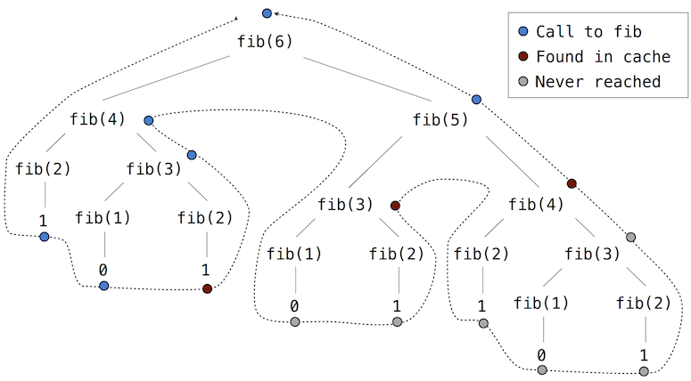

---
export_on_save:
  html: true
html:
  toc: true
  offline: true 
toc:
  depth_from: 3
  depth_to: 5
  ordered: false
---

# CS 61A Class Notes

<u>**Text book**</u>
 
* [Structure and Interpretation of Computer Programs (SICP)](https://mitpress.mit.edu/sites/default/files/sicp/index.html) 
* [Composing Programs](http://composingprograms.com/) (Majorly referred in this course)
* [Dive into Python 3](https://diveintopython3.problemsolving.io/index.html)

---

<u>**Table of Contents**</u>


<!-- @import "[TOC]" {cmd="toc" depthFrom=1 depthTo=6 orderedList=false} -->

<!-- code_chunk_output -->

- [CS 61A Class Notes](#cs-61a-class-notes)
  - [Chapter 2: Building Abstractions with Data](#chapter-2-building-abstractions-with-data)
    - [2.1 Introduction](#21-introduction)
      - [2.1.1 Native Data Types](#211-native-data-types)
        - [Floats](#ufloatsu)
        - [Non-numeric types](#unon-numeric-typesu)
    - [2.2 Data Abstraction](#22-data-abstraction)
      - [2.2.1 Example: Rational Numbers](#221-example-rational-numbers)
      - [2.2.2 Pairs](#222-pairs)
        - [Representing rational numbers](#urepresenting-rational-numbersu)
      - [2.2.3 Abstraction Barriers](#223-abstraction-barriers)
      - [2.2.4 The Properties of Data](#224-the-properties-of-data)
    - [2.3 Sequences](#23-sequences)
      - [2.3.1 Lists](#231-lists)
        - [Containers](#ucontainersu)
      - [2.3.2 Sequence Iteration](#232-sequence-iteration)
        - [[Example]: counting how many times a value appears in a sequence](#example-ucounting-how-many-times-a-value-appears-in-a-sequenceu)
        - [Sequence unpacking](#usequence-unpackingu)
        - [Ranges](#urangesu)
      - [2.3.3 Sequence Processing](#233-sequence-processing)
        - [List comprehension](#ulist-comprehensionu)
        - [Aggregation](#uaggregationu)
        - [[Example]: Perfect number](#example-uperfect-numberu)
        - [[Example]: Minimum perimeter of a rectangle](#example-uminimum-perimeter-of-a-rectangleu)
        - [High-order functions](#uhigh-order-functionsu)
        - [Conventional names](#uconventional-namesu)
      - [2.3.4 Sequence Abstraction](#234-sequence-abstraction)
        - [Membership](#umembershipu)
        - [Slicing](#uslicingu)
      - [2.3.5 Strings](#235-strings)
        - [Membership](#umembershipu-1)
        - [Multiline literals](#umultiline-literalsu)
        - [String coercion](#ustring-coercionu)
        - [Charactre encodings and Unicode](#ucharactre-encodings-and-unicodeu)
      - [2.3.6 Trees](#236-trees)
        - [[Example]: Tree-recursive functions and Fibonacci tree](#example-utree-recursive-functions-and-fibonacci-treeu)
        - [[Example]: Partition trees](#example-upartition-treesu)
        - [[Example]: Tree binarization](#example-utree-binarizationu)
      - [2.3.7 Linked Lists](#237-linked-lists)
        - [Recursive manipulation](#urecursive-manipulationu)
        - [Recursive construction](#urecursive-constructionu)
    - [2.4 Mutable Data](#24-mutable-data)
      - [2.4.1 The Object Metaphor](#241-the-object-metaphor)
        - [[Example]: date](#example-udateu)
      - [2.4.2 Sequence Objects](#242-sequence-objects)
        - [[Example]: history of playing cards](#example-uhistory-of-playing-cardsu)
        - [Sharing and identity](#usharing-and-identityu)
        - [List manipualtion](#ulist-manipualtionu)
        - [List comprehensions](#ulist-comprehensionsu)
        - [Tuples](#utuplesu)
      - [2.4.3 Dictionaries](#243-dictionaries)
      - [2.4.4 Local State](#244-local-state)
        - [[Example]: withdrawing money](#example-uwithdrawing-moneyu)
        - [Python particulars](#upython-particularsu)
        - [Mutable values \& persistent local state](#umutable-values-persistent-local-stateu)
      - [2.4.5 The Benefits of Non-Local Assignment](#245-the-benefits-of-non-local-assignment)
      - [2.4.6 The Cost of Non-Local Assignment](#246-the-cost-of-non-local-assignment)
        - [Sameness and change](#usameness-and-changeu)
      - [2.4.7 Iterators](#247-iterators)
      - [2.4.8 Iterables](#248-iterables)
      - [2.4.9 Built-in Iterators](#249-built-in-iterators)
      - [2.4.10 Generators](#2410-generators)
        - [Generators & Iterators](#ugenerators-iteratorsu)
      - [2.4.11 Implementing Lists and Dictionaries](#2411-implementing-lists-and-dictionaries)
      - [2.4.14 Mutable Default Arguments](#2414-mutable-default-arguments)
    - [2.5 Object-Oriented Programming](#25-object-oriented-programming)
      - [2.5.1 Objects and Classes](#251-objects-and-classes)
        - [[Example]: bank account](#example-ubank-accountu)
      - [2.5.2 Defining Classes](#252-defining-classes)
        - [Identity](#uidentityu)
        - [Methods](#umethodsu)
      - [2.5.3 Message Passing and Dot Expressions](#253-message-passing-and-dot-expressions)
        - [Dot expressions](#udot-expressionsu)
        - [Methods and functions](#umethods-and-functionsu)
        - [Naming conventions](#unaming-conventionsu)
      - [2.5.4 Class Attributes](#254-class-attributes)
        - [Attribute names](#uattribute-namesu)
        - [Attribute assignment](#uattribute-assignmentu)
      - [2.5.5 Inheritance](#255-inheritance)
      - [2.5.6 Using Inheritance](#256-using-inheritance)
        - [An interesting example](#uan-interesting-exampleu)
        - [Calling ancestors](#ucalling-ancestorsu)
        - [Interfaces](#uinterfacesu)
      - [2.5.7 Multiple Inheritance](#257-multiple-inheritance)
        - [Further reading](#ufurther-readingu)
      - [2.5.8 The Role of Objects](#258-the-role-of-objects)
    - [2.6 Implementing Classes and Objects](#26-implementing-classes-and-objects)
    - [2.7 Object Abstraction](#27-object-abstraction)
      - [2.7.1 String Conversion](#271-string-conversion)
        - [Implementations of `repr` and `str`](#uimplementations-of-repr-and-stru)
      - [2.7.2 Special Methods](#272-special-methods)
        - [True and false values](#utrue-and-false-valuesu)
        - [Sequence operation](#usequence-operationu)
        - [Callable objects](#ucallable-objectsu)
        - [Arithmetic](#uarithmeticu)
      - [2.7.3 Multiple Representations](#273-multiple-representations)
        - [[Example]: Complex numbers](#example-ucomplex-numbersu)
          - [Interfaces](#interfaces)
          - [Properties](#properties)
      - [2.7.4 Generic Functions](#274-generic-functions)
        - [Type dispatching](#utype-dispatchingu)
        - [Coercion](#ucoercionu)
    - [2.8 Efficiency](#28-efficiency)
      - [2.8.1 Measuring Efficiency](#281-measuring-efficiency)
        - [Space](#uspaceu)
      - [2.8.2 Memorization](#282-memorization)
      - [2.8.3 Orders of Growth](#283-orders-of-growth)
        - [Theta notation](#utheta-notationu)
      - [2.8.4 Example: Exponentiation](#284-example-exponentiation)
    - [2.9 Recursive Objects](#29-recursive-objects)
      - [2.9.1 Linked List Class](#291-linked-list-class)
        - [Recursive construction](#urecursive-constructionu-1)
      - [2.9.2 Tree Class](#292-tree-class)
        - [Internal values](#uinternal-valuesu)
      - [2.9.3 Sets](#293-sets)
        - [Implementing sets](#uimplementing-setsu)
        - [Sets as unordered sequences](#usets-as-unordered-sequencesu)
        - [Sets as ordered sequences](#usets-as-ordered-sequencesu)
        - [Sets as binary search trees](#usets-as-binary-search-treesu)
        - [Python set implementation](#upython-set-implementationu)

<!-- /code_chunk_output -->


---

## Chapter 2: Building Abstractions with Data

### 2.1 Introduction

#### 2.1.1 Native Data Types

Every value in Python has a <u>*class*</u> that determines what type of value it is.  Value that share a class also share behavior.

*e.g.*, the integers `1` and `2` are both instances of the `int` class.  These two values can be treated similarly, such as being negated or added to another integer.

The built-in `type` function allows us to inspect the class of any value:

```python
>>> type(2)
<class 'int'>
``` 
<br/>

The values we have used so far are instances of a small number of *native* data types that are buklt into the Python language.  Native data types have the following properties:

1. There are expressions that evaluate to values of native types, called <u>*literals*</u>.

2. There are built-in functions and operators to manipulate values of native types.

The `int` class is the native data type used to represent integers.  Integer literals (sequences of adjacent numerals) evaluate to `int` values, and mathematical operators manupulate these values.

```python
>>> 12 + 300000000
300000012
``` 
<br/>

Python includes three native numeric types: **integer** (`int`), **real numbers** (`float`), and **complex numbers** (`complex`).

```python
>>> type(1.5)
<class 'float'>

>>> type(1 + 1j)
<class 'complex'>
``` 
<br/>


##### <u>Floats</u>

The name `float` comes from the way in which real numbers are represented in Python and many other programming languages: a "floating point" representation.

Some high-level differences between `int` and `float` objects are important to know:

* `int` objects represent integers *exactly*, without any approximation or limits on their size.

* `float` objects can represent a wide range of fractional numbers but *not all numbers* can be represented exactly, and there are minimum and maximum values.

Therefore, `float` values should be reated as approximations to real values.  These approximations have only a finite amount of precision.  Combining `float` calues can lead to *approximation errors*:

```python
>>> 7 / 3 * 3
7.0

>>> 1 / 3 * 7 * 3
6.999999999999999
``` 

Problems with this approximation appear when we conduct equality tests:

```python
>>> 1 / 3 == 0.333333333333333312345  # Beware of float approximation
True
``` 
<br/>

These subtle difference between the `int` and `float` class have wide-ranging consequences for writing programs 
$\implies$ **must be memorized**

Fortunately,

* There are only a handful of native data types
* These same details are consistent across many programming languages.
<br/>


##### <u>Non-numeric types</u>

* Values can be represent many other types of data, such as sounds, images, locations, web addresses, network connections, and more.  

* A few are represented by native data types, such as the `bool` class for values `True` and `False`.

* The type of most values must be defined by programmers using the means of combination and abstraction.
<br/>
<br/>

--- 

### 2.2 Data Abstraction 

To represent compound structure which is widely seen in the real world (*e.g.*, we need both  latitude and longitude coordinates to represent a geographic position), we would like our programming language to have the capacity to form a <u>*compound data*</u> value that our programs can manipulate as a single conceptual unit, but which also has two parts that can be considered individually.

$\implies$ <u>***Data abstraction***</u>, a powerful design methodology represents the general technique of isolating the parts of a program that deal with <u>how data are represented</u> from the parts that deal with <u>how data are manipulated</u>.

*e.g.*, we can manipulate geographic positions as whole values, when we can shield parts of our program that compute using positions from the details of how those positions are represented.

Similar to <u>***function abstraction***</u>, which separates the <u>way the funciton is used</u> from the details of <u>how the function is implemented</U>.
<br/>

The basic idea of data abstraction is to structure programs so that they operate on abstract data.  That is, 

* our programs should use data in such a way as to make as few assumptions about the data as possible.
* A concrete data representation is defined as an independent part of the program.

These two parts are connected by a small set of *functions* that implement abstract data in terms of the concrete representation.
<br/>
<br/>


#### 2.2.1 Example: Rational Numbers 

A rational number is a ratio of integers, and rational numbers constitute an important sub-class of real numbers.  A rational number such as `1/3` or `17/29` is typically written as:

```python
<numerator>/<denominator>
``` 

where both the <numerator> and <denominator> are placeholders for **integer** values.

Actually dividing integers produces a `float` approximation, losing the exact precision of integers.

```python
>>> 1/3 
0.3333333333333333
>>> 1/3 == 0.333333333333333300000  # Dividing integers yields an approximation
True
``` 

However, we can create an exact representation for rational numbers by combing together the numerator and denominator.
<br/>

Analogous to the idea of function abstractions, let us begin by assuming that

* we already have a way of constructing a rational number from a numerator and denominator 

* given a rational number, we have a way of selecting its numerator and its denominator component

* the constructor and selectors are available as the following three functions:

    * `rational(n, d)` returns the rational number with numerator `n` and denominator `d`.
    * `numer(x)` returns the numerator of the rational number `x` 
    * `denom(x)` returns the denominator of the rational number `x` 

Here we are using a powerful strategy for designing programs: <u>*wishful thinkning*</u>.  We haven't yet said how a rational number is represented, or how the functions `numer`, `denom`, and `rational` should be implemented.  Even so, if we did define these functions, we could then add, multiply, print, and test equality of rational numbers:

```python
>>> def add_rationals(x, y):
        nx, dx = numer(x), denom(x)
        ny, dy = numer(y), denom(y)
        return rational(nx * dy + ny * dx, dx * dy)

>>> def mul_rationals(x, y):
        return rational(numer(x) * numer(y), denom(x) * denom(y))

>>> def print_rational(x):
        print(numer(x), '/', denom(x))

>>> def rationals_are_equal(x, y):
        return numer(x) * denom(y) == numer(y) * denom(x)
``` 

Now, we have the <u>operations on rational numbers</u> in terms of the selector functions `numer` and `denom`, and the constructor function `rational`, but we haven't yet defined these functions.

What we need is some way to glue together a numerator and a denominator into a compound value.
<br/>
<br/>


#### 2.2.2 Pairs 

Python provides a compound structure called a `list`, which can be constructed by placing expressions within square brackets separated by commas.  Such an expression is called a <u>*list literal*</u>.

```python
>>> [10, 20]
[10, 20]
``` 

The elements of a list can be accessed in two ways:

* multiple assignment:
  ```python
  >>> pair = [10, 20]
  >>> pair
  [10, 20]
  >>> x, y = pair
  >>> x
  10
  >>> y
  20
  ``` 

* element selection operator, which is also expressed using square brackets.  
  ```python
  >>> pair[0]
  10
  >>> pair[1]
  20
  ``` 
  * list in Python (and sequences in most other programming languages) are **0-indexed**, meaning that the index 0 selects the **first element**.
  * the equivalent function for the element selection operator is called `getitem`,
    ```python
    >>> from operator import getitem
    >>> getitem(pair, 0)
    10
    >>> getitem(pair, 1)
    20
    ``` 

Two-element lists are not the only method of representing pairs in Python.  Any way of bunding two values together into one can be considered a pair.
<br/>


##### <u>Representing rational numbers</u>

We can now represent a rational number as a pair of two integers: a numerator and a denominator.

```python
>>> def rational(n, d):
        return [n, d]

>>> def numer(x):
        return x[0]

>>> def denom(x):
        return x[1]
``` 

Together with the arithmetic operations we defined earlier, we can manipulate rational numbers with the functions we have defined.

```python
>>> half = rational(1, 2)
>>> print_rational(half)
1 / 2
>>> third = rational(1, 3)
>>> print_rational(mul_rationals(half, third))
1 / 6
>>> print_rational(add_rationals(third, third))
6 / 9
``` 

Our rational number implementation does not reduce rational numbers to lowest terms.  If we have a function for computing the <u>greatest common denominator</u> of two integers, we can remedy this flaw.  As with many useful tools, such a function already exists in the Python Library:

```python
>>> from fractions import gcd
>>> def rational(n, d):
        g = gcd(n, d)
        return (n // g, d // g)

>>> print_rational(add_rationals(third, third))
2 / 3
``` 
<br/>
<br/>


#### 2.2.3 Abstraction Barriers 

In general, the underlying idea of data abstraction:

1. identify a basic set of operations 
2. express all manipulations of values of some kind based on the basic set of operations 
3. use only these operations in manipulating the data 

$\implies$ By *restricting* the use of operations in this way, it is much easier to change the representation of abstract data **without** changing the behavior of a program.
<br/>

Let us consider the rational number example.

For rational numbers, different parts of the program manipulate rational numbers using different oprations, as described in the following table:

**Parts of the program that...**|**Treat rationals as...**|**Using only...**| **Level**
--|--|--|:--:
Use rational numbers to perform computation | whole data values | `add_rational`, `mul_rational`, `rationals_are_equal`, `print_rational` | $\text{high} \newline \huge\downarrow \newline \normalsize\text{low}$
Create rationals or implement rational operations | numerators and denominators | `rational`, `numer`, `denom` | ^
Implement selectors and constructor for rationals | two-element lists | list literals and element selection | ^
<br/>

In each **layer** above, the functions in the final column enforce an <u>**abstraction barrier**</u>.  These functions are called by a <u>higher level</u> and implemented using a <u>lower level</u> of abstraction.

An abstraction barrier *violation* occurs whenever a part of the program that can use a higher level function instead uses a function in a lower lever.

*e.g.*, a function that computes the square of a rational number is best implemented in terms of `mul_rational`, which does not assume anything about the implementation of a rational number.

```python
>>> def square_rational(x):
        return mul_rational(x, x)
``` 

Referring directly to numerators and denominators would violate one abstraction barrier:

```python
>>> def square_rational_violating_once(x):
        return rational(numer(x) * numer(x), denom(x) * denom(x))
``` 

Assuming that rationals are represented as two-element lists would violate two abstraction barriers:

```python
>>> def square_rational_violating_twice(x):
        return [x[0] * x[0], x[1] * x[1]]
``` 
<br/>

Abstraction barrier make programs easier to maintain and to modify.
$\implies$ The fewer functions that depend on a particular representation, the fewer changes are required when one wants to change that representation.

All three `square_rational` implementations have the *correct behavior*, but **only the first** is robust to future changes.

* The `square_rational` function would **not** require updating even if we altered the representation of rational numbers

* `square_rational_violating_once` would need to be changed whenever the selector or constructor signatures changed

* `square_rational_violating_twice` would need to be changed whenever the implementation of rational number changed.
<br/>
<br/>


#### 2.2.4 The Properties of Data 

Abstraction barriers shape the way in which we think about data.

A valid representation of a rational number is not restricted to any particular implementation (such as a two-element list); it is a value returned by `rational` that can be passed to `numer` and `denom`.

In addition, the appropriate relationship must hold among the constructor and selectors, *i.e.*, if we construct a rational number `x` from integers `n` and `d`, then it should be the case that `numer(x)/denom(x)` is equal to `n/d`.
<br/>

In general, we can epxress abstract data using a collection of selectors and constructors, together with some <u>behavior conditions</u>.  As long as the behavior conditions are met (such as the division property above), the selectors and constructors constitute a valid representation of a kind of data.  The implementation details below an abstraction barrier may change, but if the behavior does not, then the ata abstraction remains valid, and the program writtern using this data abstraction will remain correct.
<br/>

This idea can be applied broadly, including to the pair values that we used to implement rational numbers.  The behavior we require to implement a pair is that it glues two values together.  Stated as a behavior condition:

* If a pair `p`was constructed from values `x` and `y`, then `select(p, 0)` returns `x`, and `select(p, 1)` returns `y`.

Instead of using the `list`type, we can implement the two functions `pair` and `select` that fulfill this description just as well as a two-element list.

```python
>>> def pair(x, y):
        """Return a function that represents a pair."""
        def get(index):
            if index == 0:
                return x
            elif index == 1:
                return y
        return get

>>> def select(p, i):
        """Return the element at index i of pair p."""
        return p(i)

>>> p = pair(20, 14)
>>> select(p, 0)
20
>>> select(p, 1)
14
``` 

This functional representation, although obscure, is a perfectly adequate way to represent pairs, since it fulfills the only conditions that pairs need to fulfill.  The practice of data abstraction allows us to switch among representations easily.
<br/>
<br/>


---

### 2.3 Sequences 

A sequence is an ordered collection of values.  

Sequences are not instances of a particular built-in type or abstract data representation, but instead a collection of behaviors that are shared among several different types of data.  *i.e.*, there are many kinds of sequences, but they all share common behavior:

* <u>**Length.**</u> A sequence has a finite length.  An empty sequence has length 0.
  
* <u>**Element selection.**</u> A sequence has an element corresponding to any non-negative integer index less than its length, starting at 0 for the first element. 

Python includes several native data types that are sequences, the most important of which is the `list`.
<br/>
<br/>

#### 2.3.1 Lists 

A `list` value is a sequence that can have arbitary length.

Lists have a large set of built-in behaviors, along with specific syntax to express those behaviors.

*e.g.*,
```python
>>> digits = [1, 8, 2, 8]
>>> len(digits)
4
>>> digits[3]
8
``` 
<br/>

Additionally, lists can be added together and multiplied by integers.  For sequences, addition and multiplication do not add or multiply elements, but instead **combine** and **replicate** the sequences themselves. 

*e.g.*, 
```python
>>> [2, 7] + digits * 2
[2, 7, 1, 8, 2, 8, 1, 8, 2, 8]
``` 
<br/>

Any values can be included in a list, including **another list**.  Furthermore, the types of the list's contents need **not** be the same. (*i.e.*, the list needs **not** to be *homogenous*.)  Element selection can be applied multiple times in order to select a deeply nested element in a list containing lists.

*e.g.*, 
```python
>>> pairs = [[10, 20], [30, 40]]
>>> pairs[1]
[30, 40]
>>> pairs[1][0]
30
``` 
<br/>

##### <u>Containers</u>

Built-in operators for testing whether an element appears in a compound value.

*e.g.*, 
```python
>>> 1 in digits
True 
>>> 8 in digits 
True 
>>> not (5 in digits)
True 
>>> '1' in digits 
False
``` 

It is only a simple operator that searchs for <u>*individual element*</u> element by element. 

*e.g.*,
```python
>>> [1, 8] in digits
False
>>> [1, 2] in [3, [1, 2], 4]
True 
>>> [1, 2] in [3, [[1, 2]], 4]
False
``` 
<br/>

**Containers** describe all the types that can be used as <u>*iterable values*</u> (*e.g.*, `list`, `range`, *.etc*)

<br/>
<br/>


#### 2.3.2 Sequence Iteration 

In many cases, we would like to iterate over the elements of a sequence and perform some computation for each element in turn.
$\implies$ Python has an additional *control statement* to process sequential data: the `for` statement.
<br/>

##### [Example]: <u>counting how many times a value appears in a sequence</u>

```python
>>> def count(s, value):
        """Count the number of occurrences of value in sequence s."""
        total, index = 0, 0
        while index < len(s):
            if s[index] == value:
                total = total + 1
            index = index + 1
        return total 

>>> count(digits, 8)
2
``` 

The Python `for` statement can simplify this function body by iterating over the element values directly without introducing the name `index` at all.

```python
>>> def count(s, value):
        """Count the number of occurrences of value in sequence s."""
        total = 0
        for elem in s:
            if elem == value:
                total = total + 1
        return total 

>>> count(digits, 8)
2
``` 
<br/>


A `for` statement consists of a single clause with the form:

```python
for <name> in <expression>:
    <suite>
``` 
<br/>


A `for` statement is executed by the following procedure:

1. Evaluate the header `<expression>`, which must yield an iterable value.

2. For each element value in that iterable value, in order:
   1. Bind `<name>` to that value in the current frame.
   2. Execute the `<suite>`.

This execution procedure refers to <u>*iterable values*</u>.  Lists are a type of sequence, and sequence are iterable values.  (Python includes other iterable types.)

An important consequence of this evaluation procedure is that `<name>` will be bound to the last element of the sequence after the `for` statement executed. 

The `for` loop introduces yet another way in which the environment can be updated by a statement.
<br/>


##### <u>Sequence unpacking</u>

A common pattern in program is to have a sequence of elements that are themselves sequences, but all of a fixed length.  A `for` statement may include multiple names in its header to "unpack" each element sequence into its respective elements.

For example, we may have a list of two-element lists

```python
>>> pairs = [[1, 2], [2, 2], [2, 3], [4, 4]]
``` 

and wish to find the number of these pairs that have the same first and second element 

```python
>>> same_count = 0
``` 

The following `for` statement with two names in tis header will bind each name `x` and `y` to the first and second elements in each pair, respectively

```python
>>> for x, y in pairs:
        if x == y:
            same_count += 1

>>> same_count 
2
``` 

This pattern of binding multiple names to multiple values in a fixed-length sequence is called <u>**sequence unpacking**</u>;  it is the same pattern that we see in assignment statements that bind multiple names to multiple values.
<br/>


##### <u>Ranges</u>

A `range` is another built-in type of sequence in Python, which represents a range of integers.

Ranges are created with `range`, which takes *two integer arguments*: the <u>first number</u> and <u>one **beyond** the last number</u> in the desired range.

```python
>>> range(1, 10)  # Includes 1, but not 10
range(1, 10)
``` 

Calling the `list` constructor on a range evaluates to a list with the same elements as the range, so that the elements can be easily inspected:

```python
>>> list(range(5, 8))
[5, 6, 7]
``` 

If only one argument is given, it is interpreted as one beyond the last value for a range that starts at 0.

```python
>>> list(range(4))
[0, 1, 2, 3]
``` 

Ranges commonly appear as the expression in a `for` header to specify the number of times that the suite should be executed: A *common convention* is to use a <u>single underscore</u> character for the name in the `for` header if the name is unused in the suite:

```python
>>> for _ in range(3):
        print('Go Bears!')

Go Bears!
Go Bears!
Go Bears!
``` 

This underscore is just another name in the environment as far as the interpreter is concerned, but has a conventional meaning among programmers that indicates the name will not appear in any future expressions.
<br/>
<br/>


#### 2.3.3 Sequence Processing

<br/>

##### <u>List comprehension</u>

**List comprehension** is an *expression* that can <u>evaluate a fixed expression</u> for <u>element in a sequence</u> and collect the resulting values <u>in a result sequence</U>.

*e.g.*,
```python
>>> odds = [1, 3, 5, 7, 9]
>>> [x + 1 for x in odds]
[2, 4, 6, 8, 10]
``` 

The `for` keyword above is **not** a part of a `for` statement, but instead part of a list comprehension because it is contained within square brackets.
<br/>

Another common sequence processing operation is to select a <u>subset</u> of values that <u>satisfy some condition</u>.  List comprehension can also expression this patter.

*e.g.*,
```python
>>> [x for x in odds if 25 % x == 0]
[1, 5]
``` 
<br/>

The *general form* of a list comprehension is:

```python
[<map expression> for <name> in <sequence expression> if <filter expression>]
``` 

To evaluate the list comprehension:

1. evaluates the `<squence expression>`, which must return an <u>**iterable value**</u>

2. for each element in order, the element value is <u>bound to</u> `<name>`, 
    * the `<filter expression>` is evaluated, and if it yields a true value, 
    * the `<map expression>` is evaluated.

3. The values of the `<map expression>` are collected into a list.
<br/>

> *We can always rewrite a list comprehension as an equivalent **for statement**.*

<br/>


##### <u>Aggregation</u>

A third common pattern in sequence processing is to aggregate all values in a sequence into a single value.  The built-in functions `sum`, `min`, and `max` are all examples of <u>aggregation functions</u>.
<br/>

* `sum(iterable[, start]) -> value`: Return the sum of an iterable of **numbers** (**NOT** strings) plus the value of parameter 'start' (which defaults to 0).  When the iterable is empty, return start.
  ```python
  >>> sum([2, 3, 4], 5)
  14

  >>> sum([[2, 3], [4]]) 
  Traceback (most recent call last):
    File "<stdin>", line 1, in <module>
  TypeError: unsupported operand type(s) for +: 'int' and 'list'

  >>> sum([[2, 3], [4]], [])  # notice the use of the start value
  [2, 3, 4]
  ``` 
  <br/>

* `max(iterable[, key=func]) -> value` / `max(a, b, c, ...[, key=func]) -> value`: With a single iterable argument (could also be strings), return its largest item.  With two or more arguments, return the largest argument.
  ```python
  >>> max(0, 1, 2, 3, 4)
  4
  
  >>> max(range(10), key=lambda x: 7 - (x - 4) * (x - 2))
  3
  ``` 
  <br/>

* `all(iterable) -> bool`: Return `True` if `bool(x)` is `True` for all values `x` in the iterable.  If the iterable is empty, return `True`.
  ```python
  >>> all([x < 5 for x in range(5)])
  True 

  >>> all(range(5))
  False
  ``` 
  <br/>

By combining the patterns of evaluating an expression for each element, selecting a subset of elements, and aggregating elements, we can solve problems using a sequence processing approach.
<br/>


##### [Example]: <u>Perfect number</u>

A perfect number is a positive integer that is equal to the sum of its divisors.  The divisors of `n` are positive integers less than `n` that divide evenly into `n`.  Listing the divisors of `n` can be expressed with a list comprehension.

```python
>>> def divisors(n):
        return [1] + [x for x in range(2, n) if n % x == 0]

>>> divisors(4)
[1, 2]
>>> divisors(12)
[1, 2, 3, 4, 6]
``` 

Using `divisors`, we can compute all perfect numbers from 1 to 1000 with another list comprehension.  (1 is typically considered as a perfect number, but it does not qualify under our previous definition.)

```python
>>> [n for n in range(2, 1000) if sum(divisors(n)) == n]
[6, 28, 496]
``` 
<br/>


##### [Example]: <u>Minimum perimeter of a rectangle</u>

We can reuse the `divisors` to find the minimum perimeter of a rectangle with integer side lengths, given its area.

```python
>>> def width(area, height):
        assert area % height == 0
        return area // height

>>> width(5, 1)
5
>>> width(5, 2)
Traceback (most recent call last):
  File "<stdin>", line 1, in <module>
  File "<stdin>", line 2, in width
AssertionError
``` 

we can compute the minimum perimeter by considering all heights

```python
>>> def perimeter(width, height):
        return 2 * (width + height)

>>> def minimum_perimeter(area):
        heights = divisors(area)
        perimeters = [perimeter(width, n) for n in heights]
        return min(perimeters)

>>> area = 80
>>> width(area, 5)
16
>>> perimeter(16, 5)
42
>>> minimum_perimeter(area)
36
>>> [minimum_perimeter(n) for n in range(1, 10)]
[4, 6, 8, 8, 12, 10, 16, 12, 12]
``` 
<br/>


##### <u>High-order functions</u>

The common patterns we observed in sequence processing can be expressed using higher-order functions.

1. Evaluateing an expression for each element in a sequence:
    ```python
    >>> def apply_to_all(map_fn, s):
            return [map_fn(x) for x in s]
    ``` 

2. Selecting only elements for which some expression is true:
    ```python
    >>> def keep_if(filter_fn, s):
            return [x for x in s if filter_fn(x)]
    ``` 

3. Many forms of aggregation can be expressed as repeatedly applying a two-argument function to the *reduced* value so far ad each element in turn:
    ```python
    >>> def reduce(reduce_fn, s, initial):
            reduced = initial
            for x in s:
                reduced = reduce_fn(reduced, x)
            return reduced
    
    >>> reduce(mul, [2, 4, 8], 1)
    64
    ``` 
<br/>

We can find perfect numbers using these higher-order functions as well.

```python
>>> def divisors_of(n):
        divides_n = lambda x: n % x == 0
        return [1] + keep_if(divides_n, range(2, n))

>>> divisors_of(12)
[1, 2, 3, 4, 6]

>>> from operator import add
>>> def sum_of_divisors(n):
        return reduce(add, divisors_of(n), 0)
>>> def perfect(n):
        return sum_of_divisors(n) == n

>>> keep_if(perfect, range(1, 1000))
[1, 6, 28, 496]
``` 
<br/>

##### <u>Conventional names</u>

In computer science community, the more common name for `apply_to_all` is `map`, and the more common name for `keep_if` is `filter`.  

In Python, the built-in `map` and `filter` are generalizations of these functions that do **not** return lists.  The definitions in the last subsection are equivalent to applying the `list` constructor to the result of built-in `map` and `filter` calls:

```python
>>> apply_to_all = lambda map_fn, s: list(map(map_fn, s))
>>> keep_if = lambda filter_fn, s: list(filter(filter_fn, s))
``` 
<br/>

The `reduce` function is built into the `functools` module of the Python standard library.  In this version, the `initial` argument is optional:

```python
>>> from functools import reduce 
>>> from operator import mul 
>>> def product(s):
        return reduce(mul, s)

>>> product([1, 2, 3, 4, 5])
120
``` 
<br/>

In Python programs, it is more common to use <u>list comprehensions</u> directly than <u>higher-order functions</u>, but both approaches to sequence processing are widely used.
<br/>
<br/>


#### 2.3.4 Sequence Abstraction 

We have introduced two native data types that satisfy the sequence abstraction: **lists** and **ranges**.  Both satisfy the conditions with which we began this section: **length** and **element selection**.

Python includes two more behaviors of sequence types that extend the sequence abstraction.
<br/>


##### <u>Membership</u>

A value can be tested for membership in a sequence.  Python has two operators `in` and `not in` that evaluate to `True` or `False` depending on whether an element appears in a sequence.

*e.g.*,
```python
>>> digits = [1, 8, 2, 8]
>>> 2 in digits 
True 
>>> 1828 not in digits 
True 
``` 
<br/>


##### <u>Slicing</u>

Sequences contain smaller sequences within them.  A *slice* of a sequence is any contiguous span of the original sequence, designated by a pair of integers.

*e.g.*,
```python
>>> digits[0 : 2]
[1, 8]
>>> digits[1 :]
[8, 2, 8]
>>> digits[: 2]
[1, 8]
>>> digits[:]
[1, 8, 2, 8]

>>> digits[1 : -1]
[8, 2]

>>> digits[-2 : 0 : -1]
[2, 8]
>>> digits[1 : -1 : -1]
[]
>>> digits[: : 2]
[1, 2]
``` 

* The slicing operation returns a **new list**
  
* As with the `range` constructor, the first integer indicates the srarting index of the slice and the second indicates one <u>beyond</u> the ending index.

* Any bound that is *omitted* si assumed to be an extreme value: **0** for the starting index, and the **length of the sequence** for the ending index.

* **Negative index** is also allowed in slicing.  The ending element has the index **-1**.
  * A way to view this: index `-1` == index `len(list) - 1`

* We can also specify the **step size** of slicing, written inside the bracket separated by the second colon.  The step size could also be *negative*, indicating the backward slicing direction.
  * If the step size is negative, the **default** start index becomse the end of the list, and the **default** end index becomes the beginning of the list.
<br/>
<br/>


#### 2.3.5 Strings 

Text values are perhaps more fundamental to computer science than even numbers.

> *e.g.*, Python programs are written and stored as text.
> ```python
> >>> 'curry = lambda f: lambda x: lambda y: f(x, y)'
> 'curry = lambda f: lambda x: lambda y: f(x, y)'
>
> >>> exec('curry = lambda f: lambda x: lambda y: f(x, y)')
> >>> curry
> <function <lambda> at 0x1003c1bf8>
> ``` 

The native data type for text in Python is called a **string**, and corresponds to the constructor `str`.
<br/>

* String literals can express arbitary text, surrounded by either *single* or *double* quotation marks:
  ```python
  >>> 'I am string!'
  'I am string!'
  >>> "I've got an apostrophe"
  "I've got an apostrophe"
  >>> '您好'
  '您好'
  ``` 

* Strings satisfy the two basic conditions of a sequence that we introduced before:
  * they have a **length**
  * they support **element selection** 
  ```python
  >>> city = 'Berkeley'
  >>> len(city)
  8
  >>> city[3]
  'k'
  ``` 

* The elements of a string are themselves strings that have only a *single character* (length of 1).  A character is any single letter or the alphabet, punctuaion mark, or other symbol. (Python does not have a separate character type.)

* Like lists, strings can also be combined via **addition** and **multiplication** 
  ```python
  >>> 'Berkeley' + ', CA'
  'Berkeley, CA'
  >>> 'Shabu ' * 2
  'Shabu Shabu '
  ``` 
<br/>


##### <u>Membership</u>

The behavior of strings diverges from other sequence types in Python.  The string abstraction does **not** conform to the full sequence abstraction that we described for lists and ranges.

In particular, the membership operator `in` applies to strings, but has an entirely <u>*different behavior*</u> than when it is applied to sequences.  **It matches substrings rather than elements.** 

*e.g.*,
```python
>>> 'here' in "Where's Waldo?"
True 
``` 
<br/>


##### <u>Multiline literals</u>

Strings are not limited to a single line.  *Triple* quotes delimit string literals that span multiple lines, like we see in the docstrings.

*e.g.*,
```python
>>> """The Zen of Python
claims, Readability counts.
Read more: import this."""
'The Zen of Python\nclaims, "Readability counts."\nRead more: import this.'
``` 

In the printed result above, the `\n` (pronounced "backslash en") is a **single element** that represents a <u>new line</u>.
<br/>


##### <u>String coercion</u>

A string can be created from **any object** in Python by calling the `str` constructor function with an object value as its argument. 

*e.g.*,
```python
>>> str(2) + ' is an element of ' + str(digits)
'2 is an element of [1, 8, 2, 8]'
``` 
<br/>


##### <u>Charactre encodings and Unicode</u>

Read [the string chapeter of Dive into Python 3](https://diveintopython3.problemsolving.io/strings.html) for details. 
<br/>
<br/>


#### 2.3.6 Trees 

Our ability to use lists as the elements of other lists provides a new means of combination in our programming language &mdash; a <u>*closure property*</u> of a data type.  In general, a method for combining data values has a closure property if the result of combination can itself be combined using the same method.

Closure is the key to power in any means of combination because it permits us to create hierarchical structures &mdash; structures made up of parts, which themselves made up of parts, and so on.

We can visualize lists in environment diagrams using *box-and-pointer* notation, as shown in the example below:

<div align = "center">

</div>
<br/>

Nesting lists within lists can introduce complexity.  The ***tree*** is a fundamental data abstraction that imposes regularity on how hierarchinal values are structured and manipulated.

* A tree has a root label and a sequence of branches.

* Each branch of a tree is a tree.

* A <u>tree</u> with no branches is called a leaf.

* Any tree contained within a tree is called a sub-tree of that tree (such as a branch of a branch).

* The root of each sub-tree of a tree is called a node in that tree.
<br/>

The data abstraction for a tree consists of the <u>constructor</u> `tree` and the <u>selectors</u> `label` and `branches`.  Belwo is a simplified version:

```python
>>> def tree(root_label, branches=[]):
        for branch in branches:
            assert is_tree(branch), 'branches must be trees'
        return [root_label] + list(branches)

>>> def label(tree):
        return tree[0]

>>> def branches(tree):
        return tree[1:]
``` 

A tree is well-formed only if it has a root label and all branches are also trees.  The `is_tree` function is applied in the `tree` constructor to verify that all branches are well-formed.

```python
>>> def is_tree(tree):
        if type(tree) != list or len(tree) < 1:
            return False
        for branch in branches(tree):
            if not is_tree(branch):
                return False
        return True 
``` 

The `is_tree` function checks whether or not a tree has branches.

```python
>>> def is_leaf(tree):
        return not branches(tree)
``` 

These can be constructed by nested expressions.  The following tree `t` has root label 3 and two braches.

```python
>>> t = tree(3, [tree(1), tree(2, [tree(1), tree(1)])])
>>> t
[3, [1], [2, [1], [1]]]
>>> label(t)
3
>>> branches(t)
[[1], [2, [1], [1]]]
>>> label(branches(t)[1])
2
>>> is_leaf(t)
False
>>> is_leaf(branches(t)[0])
True
``` 
<br/>


##### [Example]: <u>Tree-recursive functions and Fibonacci tree</u>

Tree-recursive functions can be used to construct trees.  

The nth Fibonacci tree has a root label on the nth Fibonacci number and, for `n > 1`, two branches that are also Fibonacci trees.  

A Fibonacci tree illustrates the tree-recursive computation of a Fibonacci number.

```python
>>> def fib_tree(n):
        if n == 0 or n == 1:
            return tree(n)
        else:
            left, right = fib_tree(n - 2), fib_tree(n - 1)
            fib_n = label(left) + label(right)
            return tree(fib_n, [left, right])

>>> fib_tree(5)
[5, [2, [1], [1, [0], [1]]], [3, [1, [0], [1]], [2, [1], [1, [0], [1]]]]]
``` 

Tree-recursive functions are also used to process trees.  For example, the `count_leaves` function counts the leaves of a tree.

```python
>>> def count_leaves(tree):
        if is_leaf(tree):
            return 1
        else:
            branch_counts = [count_leaves(b) for b in branches(tree)]
            return sum(branch_counts)

>>> count_leaves(fib_tree(5))
8
``` 
<br/>


##### [Example]: <u>Partition trees</u>    

Trees can also be used to represent the partitions of an integer.  A partition tree for `n` using parts up to size `m` is a binary (two branches) tree that represents the choices taken during computation.

In a non-leaf partition tree:

* the left (index 0) branch contains all ways of partitioning `n`using at least one `m`,

* the right (index 1) branch contains partitions using parts up to `m - 1`, and 
  
* the root label is `m` 

The labels at the *leaves* of a partition tree express whether the path from the root of the tree to the leaf represents a successful partition of `n`.

```python
>>> def partition_tree(n, m):
        """Return a partition tree of n using parts of up to m."""
        if n == 0:
            return tree(True)
        elif n < 0 or m == 0:
            return tree(False)
        else:
            left = partition_tree(n - m, m)
            right = partition_tree(n, m - 1)
            return tree(m, [left, right])

>>> partition_tree(2, 2)
[2, [True], [1, [1, [True], [False]], [False]]]
``` 

Printing the partitions from a partition tree is another tree-recursive process that traverses the tree, constructing each partition as a list.  Whenever a `True` leaf is reached, the partition is printed.

```python       
>>> def print_parts(tree, partition=[]):
        if is_leaf(tree):
            if label(tree):
                print(' + '.join(partition))
        else:
            left, right = branches(tree)
            m = str(label(tree))
            print_parts(left, partition + [m])
            print_parts(right, partition)

>>> print_parts(partition_tree(6, 4))
4 + 2
4 + 1 + 1
3 + 3
3 + 2 + 1
3 + 1 + 1 + 1
2 + 2 + 2
2 + 2 + 1 + 1
2 + 1 + 1 + 1 + 1
1 + 1 + 1 + 1 + 1 + 1
``` 
<br/>


##### [Example]: <u>Tree binarization</u>

Slicing can be used on the branches of a tree as well.

A binarized tree has at most two branches.  A common tree transformation called <u>*binarization*</u> finds a binarized tree with the same labels as an original tree by grouping together branches.

```python
>>> def right_binarize(t):
        """Construct a right-branching binary tree."""
        return tree(label(t), binarize_branches(branches(t)))

>>> def binarize_branches(bs):
        """Binarize a list of branches."""
        if len(bs) > 2:
            first, rest = bs[0], bs[1:]
            return [right_binarize(first), right_binarize(rest)]
        else:
            return [right_binarize(b) for b in bs]

>>> right_binarize(tree(0, [tree(x) for x in [1, 2, 3, 4, 5, 6, 7]]))
[0, [1], [[2], [[3], [[4], [[5], [[6], [7]]]]]]]
``` 
<br/>
<br/>


#### 2.3.7 Linked Lists

We can also develop sequence representation that are *not* built into Python.  A common representation of a sequence constructed from nested pairs is called a <u>*linked list*</u>.

The environment diagram below illustrates the linked list representation of a four-element sequence containing 1, 2, 3, and 4.

<br/>

A linked list is a pair containing the first element of the sequence (in the case 1) and the rest fo the sequence (in this case a representation of 2, 3, 4).  The second element is also a linked list.  The rest of the inner-most linked containing only 4 is `'empty'`, a value that represents an empty linked list.

Linked lists have recursive structure $\implies$ the rest of a linked list is a linked list or `'empty'`.

We can define an abstract data representation to validate, construct and select the components of linked lists.

```python
>>> empty = 'empty'
>>> def is_link(s):
        """s is a linked list if it is empty or a (first, rest) pair."""
        return s == empty or (len(s) == 2 and is_link(s[1]))

>>> def link(first, rest):
        """Construct a linked list from its first element and the rest."""
        assert is_link(rest), 'rest must be a linked list'
        return [first, rest]

>>> def first(s):
        """Return the first element of a linked list."""
        assert is_link(s), 'first only applies to linked lists.'
        assert s != empty, 'empty linked list has no first element.'
        return s[0]

>>> def rest(s):
        """Return the rest of the elements of a linked list s."""
        assert is_link(s), 'rest onl applies to linked lists.'
        assert s != empty, 'empty linked list has no rest.'
        return s[1]
``` 

* `link` is a constructor and `first` and `rest` are selectors for an abstract data representation of linked list.

* The behavior condition for a linked list is that, like a pair, its constructor and selectors are inverse functions.
  * *i.e.*, if a linked list `s` was constructed from first element `f` and linked list `r`, then `first(s)` returns `f`, and `rest(s)` returns `r`
<br/>

We can use the constructor and selectors to manipulate linked list:

```python
>>> four = link(1, link(2, link(3, link(4, empty))))
>>> first(four)
1
>>> rest(four)
[2, [3, [4, 'empty']]]
``` 
<u>Note:</u> Our implementation above uses pairs that are two-element `list` values.  It is also totally possible to use *functions* alone to implement the pair and thus the linked list.
<br/>


Using the abstract data representation we have defined, we can implement the two behaviors that characterize a sequence: **length** and **element selection**.

```python
>>> def len_link(s):
        """Return the length of linked list s."""
        length = 0
        while s != empty:
            s, length = rest(s), length + 1
        return length 

>>> def getitem_link(s, i):
        """Return the element at index i of linked list s."""
        while i > 0:
            s, i = rest(s), i - 1
        return first(s)

>>> len_link(four)
4
>>> getitem_link(four, 1)
2
``` 

This example demonstrates a common pattern of computation with linked lists, where each step in an iteration operates on an icreasingly shorter suffix of the original list.  

This incremental processing to find the length and elements of a linked list does take some time to compute.  Python's built-in sequence types are implemented in a more efficient way.
<br/>


##### <u>Recursive manipulation</u>

Both `len_link` and `getitem_link` are iterative.  We can also implement length and element selection using *recursion*.

```python
>>> def len_link_recursive(s):
        """Return the length of a linked list s."""
        if s == empty:
            return 0
        else:
            return 1 + len_link_recursive(rest[1])

>>> def getitem_link_recursive(s, i):
        """Return the element at index i of linked list s."""
        if i == 0:
            return first(s)
        return getitem_link_recursive(rest(s), i - 1)

>>> len_link_recursive(four)
4
>>> getitem_link_recursive(four, 1)
2
``` 

Recursion is also useful for transforming and combining linked lists.

```python
>>> def extend_link(s, t):
        """Return a list with the elements of s followed by those of t."""
        assert is_link(s) and is_link(t)
        if s == empty:
            return t 
        else:
            return link(first(s), extend_link(rest(s), t))

>>> extend_link(four, four)
[1, [2, [3, [4, [1, [2, [3, [4, 'empty']]]]]]]]


>>> def apply_to_all_link(f, s):
        """Apply f to each element of s."""
        assert is_link(s)
        if s == empty:
            return s
        else:
            return link(f(first(s)), apply_to_all_link(f, rest(s)))

>>> apply_to_all_link(lambda x: x * x, four)
[1, [4, [9, [16, 'empty']]]]


>>> def keep_if_link(f, s):
        """Return a list with elements of s for which f(e) is true.""" 
        assert is_link(s)
        if s == empty:
            return s
        else:
            kept == keep_if_link(f, rest(s))
            if f(first(s)):
                return link(first(s), kept)
            else:
                return kept 

>>> keep_if_link(lambda x: x % 2 == 0, four)
[2, [4, 'empty']]


>>> def join_link(s, separator):
        """Return a string of all elements in s separated by separator."""
        if s == empty:
            return ""
        elif rest(s) == empty:
            return str(first(s))
        else:
            return str(first(s)) + separator + join_link(rest(s), separator)

>>> join_link(four, ", ")
'1, 2, 3, 4'
``` 
<br/>


##### <u>Recursive construction</u>

Linked lists are particularly useful when constructing sequences incrementally, a situation that arises ofeen in recursive computations.

The `count_partition` function from Chapter 1 counted the number of ways to partition an integer `n` using parts up to size `m` via a tree-recursive process.  With sequences, we can slo enumerate these partitions explicitly using a similar process.

We follow the same recursive analysis of the problem as we did while counting: partitioning `n` using integers up to `m`involves either

1. partitionning `n - m` suing integers up to `m`, or 
2. partitionning `n` using integers up to `m - 1`.

For base cases:

1. 0 has empty partition
2. partitioning a negative integer or using parts samller than 1 is impossible.

```python
>>> def partitions(n, m):
        """Return a linked list of partitions of n using parts of up to m.
        Each partition is represented as a linked list."""
        if n == 0:
            return link(empty, empty)
        elif n < 0 or m == 0:
            return empty 
        else:
            using_m = partitions(n-m, m)
            with_m = apply_to_all_link(lambda s: link(m, s), using_m)
            without_m = partitions(n, m - 1)
            return extend_link(with_m, without_m)
```
***[Not fully understood] What is the advantage of this method?***

The result is highly nested: a linked list of liked lists, and each linked list is represented as nested pairs that are `list` values.  

We can display it in a human-readable manner using the following code:

```python
>>> def print_partitions(n, m):
        lists = partitions(n, m)
        strings = apply_to_all_link(lambda s: join_link(s, " + "), lists)
        print(join_link(strings, "\n"))

>>> print_partitions(6, 4)
4 + 2
4 + 1 + 1
3 + 3
3 + 2 + 1
3 + 1 + 1 + 1
2 + 2 + 2
2 + 2 + 1 + 1
2 + 1 + 1 + 1 + 1
1 + 1 + 1 + 1 + 1 + 1
``` 
<br/>
<br/>

---


### 2.4 Mutable Data 

We need strategies to help us structure large systems to be *modular*, meaning that they divide naturally into coherent parts that can be separately developed and maintained.

***[Not fully understood]*** One powerful technique for creating modular programs is to incorporate data that may change state over time.  In this way, a single data object can represent something that evolves independently of the rest of the program.  Adding state to data is a central ingredient of a paradigm called <u>*object-oriented programming*</u>.
<br/>


#### 2.4.1 The Object Metaphor 

**Objects** combine data values with behavior.  Objects represent information, but also *behave* like the things that they represent.  The logic of how an boject interacts with other objects is bundled along with the information that encodes the object's value. ***[Not fully understood]*** 

When an object is printed, it knows how to spell itself out in text.  If an object is composed of parts, it knows how to reveal those parts on demand.  Objects are both information and processes, bundled together to represent the properties, interactions, and behaviors of complex things. ***[Not fully understood]*** 

Object behavior is implemented in Python through specialized object syntac and associated terminology.
<br/>

##### [Example]: <u>date</u> 

A data is a kind of object,

```python
>>> from datetime import date 
>>> tues = date(2014, 5, 13)
``` 

The name `date` is bound to a **class**.  A class represents a kind of value.  Individual dates are called **instances** of that class.  Instances can be *constructed* by calling the class on arguments that characterize the instance. 

```python
>>> print(date(2014, 5, 19) - tues)
6 days, 0:00:00
``` 

While `tues` was constructed from primitive numbers, it behaves like a date.  For instance, subtracting it from another date will give a time difference.
<br/> 


Objects have **attributes**, which are named values that are part of the object.  In Python, like many other programming languages, we use *dot notation* to designate an attribute of an object.

> \<expression\> . \<name\>

Above, the `<expression>` evaluates to an object, and `<name>` is the name of an attribute for that object. 

Unlike the names that we have considered so far, these attirbute names are **not** available in the *general environment*.  Instead, arribute names are particular to the object instance preceding the dot.

```python
>>> tues.year
2014
```

Objects also have **methods**, which are function-valued attibutes. The object "knows" how to carry out those methods. $\impliedby$ Methods are functions that compute their results rom both their <u>arguments</u> and their <u>object</u>.

For example, the `strftime` method (a classic function name meant to evoke "string format of time") of `tues` takes a single argument that specifies how to display a date (*e.g.*, `%A` means that the day of the week should be spelled out in full).

```python
>>> tue.strftime('%A, %B %d')
'Tuesday, May 13'
``` 

Computing the return value of `strftime` requires two inputs: 

1. the string that describes the format of the output and 
2. the date information bundled into `tues`.

Date-specific logic is applied within this method to yield this result.  We never stated that the 13th of May, 2014, was a Tuesday, bu knowing the corresponding weekday is part of what it means to be a date.  By bundling behavior and information together, this Python object offers us a convincing, self-contained abstraction of a date.

Dates are objects, but numbers, strings, lists, and ranges are all objects as well.  They represent values, but also behave in a manner that befits the value they represent.  They also have attributes and methods.  

For instance, *strings* have an array of methods that facilitate text processing. 

```python
>>> '1234'.isnumeric()
True 
>>> 'rOBERT dE nIRO'.swapcase()
'Robert De Niro'
>>> 'eyes'.upper().endswitch('YES')
True 
``` 

In fact, <u>all values in Python are **objects**.</u>  *i.e.*, all values have behavior and attributes.  They act like the values they represent.
<br/>
<br/>


#### 2.4.2 Sequence Objects

Instances of primitive built-in values such as <u>numbers</u> are **immutable**. $\implies$ The values themselves cannot change over the course of program execution.

Lists on the other hand are **mutable**.
<br/>

Mutable objects are used to represent values that change over time.  

A person is the same person from one day to the next, despite having aged, received a haircut, or otherwise changed in some way.  

Similarly, an object may have changing properties due to *mutating* operations. *e.g.*, it is possible to change the contents of a list.  Most changes are performed by invoking methods on list objects.
<br/>


##### [Example]: <u>history of playing cards</u>

We can introduce many list modification operations through an example that illustrates the history of playing cards.  Comments in the examples describe the effect of each method invocation.

Playing cards were invented in China, perhaps around the 9th century.  An early deck had three suits, which corresponded to denominations of money.

```python
>>> chinese = ['coin', 'string', 'myrid']  # A list literal
>>> suits = chinese                        # Two names refer to the same list
``` 

As cards migrated to Europe (perhaps through Egypt), only the suit of coins remained in Spanish decks (*oro*).

```python
>>> suits.pop()                            # Remove and return the final element
'myriad'
>>> suits.remove('string')                 # Remove the first element that equals the argument
``` 

Three more suits were added (they evolved in name and design over time),

```python
>>> suits.append('cup')                    # Add an element to the end
>>> suits.extend(['sword', 'club'])        # Add all elements of a sequence to the end
``` 

and Italians called swords *spades*,

```python
>>> suits[2] = 'spade'                     # Replace an element
``` 

giving the suits of a traditional Italian deck of cards.

```python
>>> suits
['coin', 'cup', 'spade', 'club']
``` 

The French variant used today in the U.S. changes the first two suits:

```python
>>> suits[0:2] = ['heart', 'diamond']      # Replace a slice
>>> suits 
['heart', 'diamond', 'spade', 'club']
``` 

Methods also exist for inserting, sorting, and reversing lists.  All of these mutation operations change the value of the list; they do not create new list objects.
<br/>


##### <u>Sharing and identity</u>

Because we have been changing a single list rather than creating new lists, the object bound to the name `chinese` has also changed, becuase it is the same list object that was bound to `suits`!

```python
>>> chinese                                # This name co-refers with "suits' to the same changing list
['heart', 'diamond', 'spade', 'club']
``` 

<u>This behavior is new!</u> $\impliedby$ Previously, if a name did not appear in a statement, then its value would not be affected by that statement.

With mutable data, *methods called on one name can affect another name at the same time.*

Could also check the [environment diagram](http://pythontutor.com/composingprograms.html#mode=edit) to see how the value bound to `chinese` is changed by statements involving only `suits`.
<br/>

Lists can be copied using the `list` constructor function.  Changes to one list do not affect another, unless they share structure.

```python
>>> nest = list(suits)                     # Bind "nest" to a second list with the same elements
>>> nest[0] = suits                        # Create a nested list
``` 

According to this environment,changing the list referenced by `suits` will affect the nested list that is the first element of `nest`, but not the other elements.

```python
>>> suits.insert(2, 'Joker')               # Insert an element at index 2, shifting the rest
>>> nest 
[['heart', 'diamond', 'Joker', 'spade', 'club'], 'diamond', 'spade', 'club']
``` 

And likewise, undoing this change in the first element of `nest` will change `suit` as well 

```python
>>> nest[0].pop(2)
'Joker'
>>> suits 
['heart', 'diamond', 'spade', 'club']
``` 
<br/>

Because two lists may have the same contents but in fact be different lists, we require a means to test whether two objects are the same.  Python includes two comparison operators, called `is` and `is not`, that test whether two expressions in fact evaluate to the *identical* object.  Two objects are identical if they are edqual in their current value, **and** any change to one will always be reflected in the other.  **Identity is a stronger condition than equality.** 

```python
>>> suits is nest[0]
True 
>>> suits is ['heart', 'diamond', 'spade', 'club']
False
>>> suits == ['heart', 'diamond', 'spade', 'club']
True 
``` 

The final two comparisons illustrate the difference between `is` and `==`.  The former checks for identity, while the latter checks for the equality of contents.
<br/>


##### <u>List manipualtion</u>

The behavior of list functions and methods can best be understood in terms of object mutation and identity.

* **Slicing** a list creates a new list and leaves the original list *unchanged*.  A slice from the beginning to the end of the list is one way to copy the contents of a list.

  
<br/>


* **Slicing assignment** replaces a slice with new values (must be values containing elements, *e.g.*, list, tuple, *.etc*).
  
  * It can also remove elements rom a list by assigning `[]` to a slice 
    ```python
    >>> s = [2, 3]
    >>> t = [5, 6]
    >>> s[:1] = []
    >>> t[0:2] = []
    >>> s
    [3]
    >>> t 
    []
    ``` 
<br/>

* *Interesting example*:
  
<br/>


* Although the list is copied, the *values contained* within the list are *not*.  Instead, a new list is constructed that contains a subset of the same values as the sliced list.  Therefore, mutating a list within a sliced list will affect the original list.
  

  * The built-in function `list` has the same effects as the `s[:]`. *i.e.*, they both can copy the whole list, but the values placed in this list will not be copied.
<br/>


* Adding two lists together creates a new list that contains the values of the first list, followed by the values in the second list.  Therefore, `a + b` and `b + a` can result in different values for two lists `a` and `b`.
<br/>


* The `append` method of a list takes one value as an argument and adds it to the end of the list.  
  
  * The argument can be any value, such as a *number* or *another list*.  If *the argument is a list*, then that list (**and not a copy**) is added as an item in the list. 
  * The method always returns `None`, and it mutates the list by increasing its length by **one**.
<br/>


* The `extend` method of a list takes an iterable value as an argument and adds each of its elements to the end of the list.  
  
  * It mutates the list by increasing its length by the **length of the iterable argument**.
  * The statement `x += y` for a list `x` and iterable `y` is equivalent to `x.extend(y)` (*aside from some obscure and minor differences beyond the scope of this text*)
    * Usually avoid using this expression.
  * Passing any argument to `extend` that is not iterable will cause a `TypeError`.
  * The method does **not** return anything.
<br/>


* The `pop` method removes and returns the last element of the list.  When given an integer argument `i`, it removes and returns the element at index `i` of the list.
  
  * The method mutates the list, reducing its length by **one**.
  * Attempting to pop from an empty list causes an `IndexError` 
<br/>


* The `remove` method takes one argument that must be equal to a value in the list.  It removes the **first** item in the list that is equal to its argument.
  
  * Calling `remove` on a value that is not equal to any item in the list causes a `ValueError`
<br/>


* The `index` method takes one argument that must be equal to a value in the list.  It returns the **index** in the list of the **first** item that is **equal to the argument**.
  ```python
  >>> a = [13, 14, 13, 12, [13, 14], 15]
  >>> a.index([13, 14])
  4
  >>> a.index(13)
  0
  ``` 
  * Calling `index` on a value that is not equal to any item in the list causes a `ValueError`.
<br/>


* The `insert` method takes two arguments: **an index** and **a value to be inserted**.  The value is added to the list at the given index.  All elements before the given index stay the same, but all elements after the index have their indices increased by one.
  
  * This method mutates the list by increasing its size by **one**, then returns `None`.
<br/>


* The `count` method of a list takes in an item as an argument and returns **how many times** an equal item appears in the list.  
  ```python
  >>> a = [1, [2, 3], 1, [4, 5]]
  >>> a.count([2, 3])
  1
  >>> a.count(1)
  2
  >>> a.count(5)
  0
  ``` 
  * If the argument is not equal to any element of the list, then `count` returns 0.
<br/>


##### <u>List comprehensions</u>

A list comprehension always creates a new list.  

For example, the `unicodedata` module tracks the official names of every character in the Unicode alphabet.  We can look up the characters corresponding to names, including those for card suits.

```python
>>> from unicodedata import lookup
>>> [lookup('WHITE ' + s.upper() + ' SUIT') for s in suits]
['♡', '♢', '♤', '♧']
``` 

This resulting list **does not** share any of its contents with `suits`, and evaluating the list conprehension does not modify the `suits` list.

(*read more about the Unicode standard for representing text in the [Unicode section](https://diveintopython3.problemsolving.io/strings.html#one-ring-to-rule-them-all) of Dive into Python 3*)
<br/>


##### <u>Tuples</u>

A tuple, an instance of the built-in type, is an **<u>immutable</u> sequence**.  

Tuples are created using a tuple literal that separates element expressions by **commas**.  Parentheses are *optional* but used commonly in practice.

**Any objects** can be placed within tuples.

*e.g.*,
```python
>>> 1, 2 + 3
(1, 5)
>>> ("the", 1, ("and", "only"))
("the", 1, ("and", "only"))
>>> type( (10, 20) )
<class 'tuple'>
``` 

**Empty** and **one-element** tuples have special literal syntax.

```python
>>> ()          # 0 elements
()
>>> (10,)       # 1 element
(10,)
``` 
<br/>

Like lists, tuples have a finite **length** and support **element selection**.  They also have a few methods that are also available for lists, such as `count` and `index`.

*e.g.*,
```python
>>> code = ("up", "up", "down", "down") + ("left", "right") * 2
>>> len(code)
8
>>> code[3]
'down'
>>> code.count("down")
2
>>> code.index("left")
4
``` 

However, the methods for manipulating the contents of a list are not available for tuples because tuples are **immutable**.

* But it is possible to change the value of a **mutable element** contained within a tuple.
  
<br/>

Tuples are used implicitly in multiple assignment.  An assignment of two values to two names creats a two-element tuple and then unpacks it.

```python
>>> a = 1, 2
>>> a 
(1, 2)
>>> type(a)
<class 'tuple'>
``` 
<br/>
<br/>


#### 2.4.3 Dictionaries

Dictionaries are Python's built-in data type for storing and manipulating correspondence relationships.

A dictionary contains <u>key-value pairs</u>, where both the **keys** and **values** are *objects*.

The purpose of a dictionary is to provide an abstraction for storing and retrieving values that are indexed not by consecutive integers, but by *descriptive keys*.

Strings commonly serve as keys, because strings are our conventional representation for names of things.  An example of the dictionary literal is shown below:

```python
>>> numerals = {'I': 1.0, 'V': 5, 'X': 10}
``` 

The **element selection** operation for a dictionary:

```python
>>> numerals['X']
10
``` 

A dictionary can have **at most one value** for each key.  With **assignment statements**, we can 

1. adding new key-value pairs 
2. changing the existing value for a key 

```python
>>> numerals['I'] = 1
>>> numerals['L'] = 50
>>> numerals 
{'I': 1, 'X': 10, 'L': 50, 'V': 5}    # result of Python before 3.6
``` 

* Note that `'L'` was not added to the end of the output above.  Dictionaries were unordered collections of key-value pairs until Python 3.6.  Since Python 3.6, their contents will be **ordered by insertion**.  Since dictionaries were historically unordered collections, it is *safest* **not** to assume anything about the order in which keys and values will be printed.
<br/>

The environment diagram of a dictionary:

<br/>
<br/>

The dictionary type also supports various methods of iterating over the contents of the dictionary as a whole.  The methods `keys`, `values`, and `items` all return iterable values.
  ```python
  >>> numerals.keys()
  dict_keys(['I', 'V', 'X', 'L'])
  >>> numerals.values()
  dict_values([1.0, 5, 10, 50])
  >>> numerals.items()
  dict_items([('I', 1.0), ('V', 5), ('X', 10), ('L', 50)])
  
  >>> sum(numerals.values())
  66
  ``` 

A list of key-value pairs can be converted into a dictionary by calling the `dict` constructor function.
  ```python
  >>> dict([(3, 9), (4, 16), (5, 25)])
  {3: 9, 4: 16, 5: 25}
  ``` 

A useful method implemented by dictionaries is `get`, which returns the value for a key, if the key is present, or a default value.  The argument to `get` are the key and the default value.

```python
>>> numerals.get('A', 0)
0
>>> numerals.get('V', 0)
5
``` 

Dictionaries also have a comprehension syntax analogous to those of lists.  A key expression and a value expression are separated by a colon.  Evaluating a dictionary comprehension creates a new dictionary object.

```python
>>> {x: x * x for x in range(3, 6)}
{3: 9, 4: 16, 5: 25}
``` 
<br/>


Dictionaries do have some *restrictions*:

* A key of a dictionary cannot be or contain a mutable value.  *(Tuples are commonly used for keys.)*
* There can be at most one value for a given key.
<br/>
<br/>


#### 2.4.4 Local State 

Lists and dictionaries have <u>*local state*</u>: they are changing values that have some particular contents at any point in the execution of a program.  The word "state" implies an evolving process in which that state may change.
<br/>


##### [Example]: <u>withdrawing money</u>

*Functions* can also have local state.

In this example, we will create a function `withdraw` taking an amount to be withdrawn as its argument.

* If there is enough money in the account to accommodate the withdrawal, then `withdraw` will return the remaining balance.
* Otherwise, it will return the message `'Insufficient funds'`.

If we begin with \$100 in the account,

```python
>>> withdraw(25)
75
>>> withdraw(25)
50
>>> withdraw(60)
'Insufficient funds'
>>> withdraw(15)
35
```

Above, the expression `withdraw(25)` evaluated twice, yields different values. $\implies$ this user-defined function is *non-pure*.  

Calling the function not only returns a value, but also has the side effect of changing the function in some way, so that the next call with the same argument will return a different result.  This side effect is a result of `withdraw` making a change to a name-value binding *outside of the current frame*.

For `withdraw` to make sense, it must be created with an initial account balance.

```python
>>> withdraw = make_withdraw(100)
``` 

An implementation of `make_withdraw` requires a *new kind of statement*: a `nonlocal` statement.  When we call `make_withdraw`, we bind the name `balance`to the initial amount.  We then define and return a *local function*, `withdraw`, which updates and returns the value of the `balance` when called.

```python
>>> def make_withdraw(balance):
        """Return a withdraw funciton that draws down balance with each call."""
        def withdraw(amount):
            nonlocal balance 
            if amount > balance:
                return 'Insufficient funds'
            balance = balance - amount
            return balance 
        return withdraw 
``` 

The `nonlocal` statement declares that whenever we cahnge the binding of the name `balance`, the binding is changed in the first frame in which `balance` is already bound.

* Recall that without the `nonlocal` statement, an assignment statement would always bind a name in the first frame of the current environment.
* The `nonlocal` statement indicates that the name appears somewhere in the environment other than the first (local) frame or the last (global) frame.

Run the example in [Python tutor](http://pythontutor.com/composingprograms.html#mode=edit), we can see:

* When the `make_withdraw` was called, a locally defined function `withdraw` was created and returned.  The name `balance` is bound in the *parent frame* of this funciton.  Crucially, there will **only** be this **single bindindg** for the name `balance` throughout the rest of this example.
<br/>

* When evaluating an expression that calls this funciton, bound to the name `wd`, on an amount 5.  The body of withdraw is executed in a new environment that extends the environment in which `withdraw`was defined.  Importantly, we can see the effect of a `nonlocal` statement in Python:
  > *The `nonlocal` statement allows `withdraw` to change a name binding in the `make_withdraw` frame.*
   $\implies$ *A name outside of the first local frame can be changed by an **assignment** statement.*


<br/>

* The `nonlocal` statement changes all of the remaining assignment statements in the definition of `withdraw`:
  > *After executing `nonlocal balance`, any assignment statement with `balance` on the left-hand side of `=` will not bind `balance` in the **first frame of the current environment**.  Instead, it will find the **first frame where `balance` was already defined** and re-bind the name in the frame.*
  * If `balance` has not previously been bound to a value, then the `nonlocal`statement will give an error.
  * If `balance` has also been bound in the **local frame**, the `nonlocal` statement will also give an error.
  * To better figure out the subtlety, recall the *evaluation rule* of the assignment statement *(see section "Evaluating nested expression")*.
<br/>

* By virtue of changing the binding for `balance`, we have changed the `withdraw` function as well.  The next time it is called, the name `balance` will evaluate to 15 instead of 20.
<br/>

* A locally defined function can look up names outside of its local frames $\implies$ **No** `nonlocal` statement is required to **access** a *non-local name*.  
  > ***However**, only after a `nonlocal` statement can a function **change** the *binding* of names in these frames.*

<br/>

By introducing `nonlocal` statements, we have created a dual role for assignment statements.  Either they change **local bindings**, or they change **non-local bindings**.  In fact, assignment statements already had many roles, *e.g.*, creating new binding, re-binding existing names, changing lists and dictionaries, *.etc*.  It is *up to you* as a programmer to document your code cleary so that the effects of assignment can be understood by others.

<br/>
<br/>


##### <u>Python particulars</u>

The pattern of non-local assignment is a gneral feature of programming languages with higher-order functions and lexical scope.  Most other languages do not require a `nonlocal` statement at all &mdash; it is often the default behavior of assignment statements.

Python also has an unusual restriction regarding the look up of names:

> *Within the body of a function, all instances of a name must refer to the same frame.  As a result, Python cannot look up the value of a name in a non-local frame, then bind that same name in the local frame, because the same name would be accessed in two different frames in the same function.*

This restriction allows Python to **precompute** which frame contains each name before executing the body of a function.  When this restiction is violated, a (confusing) error message results.  Below is an example *(note that the `nonlocal` statement has been removed)*:


The `UnboundLocalError` appears because `balance` is *assigned locally* in line 5, and so Python assumes that all references to `balance` must appear in the local frame as well.  This error occurs ***before*** line 5 is ever executed, implying that Python has considered line 5 in some way **before executing line 5**.

* In this case, Python's pre-processing restricted the frame in which `balance` could appear, and thus prevented the name from being found.
* Adding a `nonlocal` statement corrects this error 
* The `nonlocal` statement did not exist in Python 2
<br/>


##### <u>Mutable values \& persistent local state</u>

**Mutable values** can be changed *without* a `nonlocal` statement.

```python
>>> def make_withdraw_list(balance):
        b = [balance]                           # Name bound outside of withdraw def
        def withdraw(amount):
            if amount > b[0]:
                return 'Insufficient funds'
            b[0] = b[0] - amount                # Element assignment changes a list 
            return b[0]
        return withdraw

>>> withdraw = make_withdraw_list(100)
>>> withdraw(25)
``` 

Because list is mutable, we do **not** need to change what `b` is bound to, or what `balance` is bound to; instead, we just change the mutable value of the list.  Therefore, we do not need the `nonlocal` statement.

<br/>
<br/>


#### 2.4.5 The Benefits of Non-Local Assignment

Non-local assignment is an important step on our path to viewing a program as a collection of independent and autonomous ***objects***, which interact with each other but each manage their own *internal state*.

> *In particular, non-local assignment has given us the ability to maintain some state that is local to a function, but evolves over successive calls to that function.*

*e.g.*, the `balance` associated with a particular withdraw function is shared among all calls to that function.  However, the binding for `balance` associated with an instance of withdraw is inaccessible to the rest of the program.  *i.e.*, only `wd` is associated with the frame for `make_withdraw` in which it was defined.  If `make_withdraw` is called again, then it will create a **separate** frame with a **separate** binding for `balance`.
<br/>

We can extend our example to illustrate this point.  A second call to `make_withdraw` returns a second `withdraw` function that has a different parent.


As a result, there are in fact two bindings for the name `balance` in two different frames, and each `withdraw` function has a different parent.  The name `wd` is bound to a function with a balance of 20, while `wd2` is bound to a different function with a balance of 7.

Calling `wd2` changes the binding of **its** non-local `balance` name, but not affect the function bound to the name `withdraw`.  A future call to `wd` is unaffected by the chaning balance of `wd2`; its balance is still 20.


In this way, each instance of `withdraw` maintains its own balance state, but that state is **inaccessible** to any other function in the program.

Viewing this situation at a higher level, we have created an abstraction of a bank account that manages its own internals but behaves in a way that models accounts in the world: it changes over time based on its **own history** of withdrawal requests.
<br/>
<br/>


#### 2.4.6 The Cost of Non-Local Assignment 

Non-local assignment introduces some important nuances in the way we think about names and values.

* Previously, our values did not change; only our names and binding changed.  
  * *e.g.*, when two names `a` and `b` were both bound to the value `4`, it did not matter whether they were bound to the same `4` or different `4`s.  $\impliedby$ there was **only one** 4 object that never changed.
<br/>

* *Funcitons with state* do **not** behave this way.
  * *e.g.*, when two names `wd` and `wd2` are both bound to a `withdraw` function, it **does** matter wheter they are bound to the same function of different *instances* of that function.

*e.g.*, 


In this case, calling the function named by `wd2` did change the value of the function named by `wd`, because *both names refer to the same function*.

It is not unusual for two names to co-refer to the same value in the world.  But, as values change over time, we must be very careful to understand the effect of a change on other names that might refer to those values.

The **key** to correctly analyzing code with non-local assignment is to remember that only funciton calls can introduce new frames.  Assignment statements always change bindings in existing frams.  $\implies$  Unless `make_withdraw` is called **twice**, there can be only one binding for `balance`.
<br/>


##### <u>Sameness and change</u>

These subtleties arise because, by introducint non-pure functions that change the non-local environment, we have changed the nature of expressions.

An expression that contains only pure function calls is <u>*referentially transparent*</u>; its value does **not** change if we substitute one of its subexrepssion with the value of that subexrepssion.

*e.g.*,
```python
>>> mul(add(2, mul(4, 6)), add(3, 5)) = mul(add(2, 24), add(3, 5))
```
<br/>

**Re-binding** operations violate the conditions of referentially transparency because they do more than returning a value; they <u>*change the environment*</u>.  When we introduce arbitary re-binding, we encounter a thorny epistemological issue:

> *What it means for two values to be the same.*

In our environment model of computation, two separately defined functions are not the same, because changes to one may not be reflected in the other.

> For example, let's define a function
> ```python
> >>> def f(x):
>         x = 4
>         def g(y):
>             def h(z):
>                 nonlocal x
>                 x = x + 1
>                 return x + y + z
>             return h
>         return g
> >>> a = f(1)
> >>> b = a(2)
> ``` 
> Now, evaluate the expression 
> ```python
> >>> total = b(3) + b(4)
> 22
> ``` 
> If we roll back to the time point before this expression, and evaluate another expression 
> ```python
> >>> total = 10 + b(4)         # b(3) = 10 at this very time point
> 21
> ```    
> The difference comes from the lost of the referentially transparency.

<br/> 


In general, so long as we never modify data objects, we can regard a compound data object to be precisely the totality of its pieces.  But this view is no longer valid in the presence of **change**, where a compound data object has an "identity" that is something different from the pieces of which it is composed.  
* A bank account is still "the same" bank account even if we change the valance by making a withdrawal; conversely, we could have two bank accounts that happed to have the same balance, but are different objects.

Despite the complications it introduces, non-local assignment is a powerful tool for creating modular programs.  Different parts of a program, which correspond to different environment frames, cna evolve separately throughout program execution.

Moreover, using funcitons with local state, we are able to implement mutable data types.  In fact, we can implement abstract data types that are equivalent to the built-in `list` and `dict` types introduced above.
<br/>
<br/>


#### 2.4.7 Iterators 

Python and many other programming languages provide a unified way to process elements of a container value sequentially, called an <u>*iterator*</u>.

> *An iterator is an object that provides sequential access to values, one by one.*

The iterator has two components:

1. a mechanism for retrieving the next element in the sequence being processed, and
2. a mechanism for signaling that the end of the sequence has been reached and no further elements remain.

For any container, such as a list or range, an iterator can be obtained by calling the built-in `iter` function.  The contents of the iterator can be accessed by calling the built-in `next` function.

*e.g.*,
```python
>>> primes = [2, 3, 5, 7]
>>> type(primes)
<class 'list'>
>>> iterator = iter(primes)
>>> type(iterator)
<class 'list iterator'>
>>> next(iterator)
2
>>> next(iterator)
3
>>> next(iterator)
5
``` 

Python signals that there are no more values available by raising a `StopIteration` exception when `next` is called.  This exception can be handled using a `try` statement **[How?]**.

```python
>>> next(iterator)
7
>>> next(iterator)
Traceback (most recent call last):
  File "<stdin>", line 1, in <module>
StopIteration
```
<br/>


An iterator maintains **local state** to represent its position in a sequence.  Each time `next` is called, that position advances.  

* Two separate iterators can track two different positions in the same sequence.  
* Two names for the same iterator will *share* a position.

*e.g.*,
```python
>>> r = range(3, 13)
>>> s = iter(r)         # 1st iterator over r
>>> next(s)
3
>>> next(s)
4
>>> t = iter(r)         # 2nd iterator over r
>>> next(t)
3
>>> next(t)
4
>>> u = t               # alternate name for the 2nd iterator
>>> next(u)
5
>>> next(u)
6
``` 

Advancing the second iterator does not affect the first.  

```python
>>> next(s)
5 
>>> next(t)
7
``` 

Calling `iter` on an iterator will return that iterator, **not a copy**.  This behavior is included in Python so that a programmer can call `iter` on a value to get an iterator without having to worry about whether it is an iterator or a container. 

```python
>>> v = iter(t)         # Another alternate name for the second iterator
>>> next(v)
8 
>>> next(u)
9
>>> next(t)
10
``` 
<br/>


The **usefulness** of iterators is derived from the fact that the underlying series of data for an iterator may not be represented explicitly in memory.  An iterator provides a mechanism for considering each of a series of values in turn, but all of those elements do not need to be stored simultaneously.  Instead, when the next element is requested from an iterator, that element may be computed on demand instead of being retrieved from an existing memory source.

Ranges are able to compute the elements of a sequence lazily because the sequence represented is *uniform*, and any element is easy to compute form the starting and ending bounds of the range.  Iterators allow for lazy generation of a much broader class of underlying series.  Instead, iterators are only required to compute the next element of the series, in order, each time another element is requested.

While not as flexible as *random access* (accessing arbitary elements of a sequence in any order), *sequential access* to sequential data is often sufficient for data processing applications.
<br/>
<br/>


#### 2.4.8 Iterables 

Any value that can produce iterators is called an <u>*iterable*</u> value.  

In Python, an iterable value is anything that can be passed to the built-in `inter` function.  

* Sequence values, *e.g.*, strings, tuples, 
* Other containers, *e.g.*,  sets, dictionaries.
* *Iterators* (because they can also be passed to the `inter` function)

Unordering collections, such as dictionaries in Python 3.5 and earlier, must define an ordering over their contents when they produce iterators.

> Dictionaries and sets are unordered because the programmer has no control over the order of iteration, but Python does guarantee certain properties about their order in its specification.

*e.g.*,
```python
>>> d = {'one': 1, 'two': 2, 'three': 3}
>>> d
{'one': 1, 'three': 3, 'two': 2}
>>> k = iter(d)
>>> next(k)
'one'
>>> next(k)
'three'
>>> v = iter(d.values())
>>> next(v)
1
>>> next(v)
3
``` 

If a dictionary changes in structure because a key is added or removed, then all iterators become *invalid*, and future iterators may exhibit changes to the order of their contents.

On the other hand, changing the value of an existing key does not invalidate iterators or change the order of their contents.

```python
>>> d.pop('two')
2
>>> next(k)
Traceback (most recent call last):
  File "<stdin>", line 1, in <module>
RuntimeError: dictionary changed size during iteration
``` 

A `for` statement can be used to iterate over the contents of any iterable or iterator.

```python
>>> r = range(3, 6)
>>> s = iter(t)
>>> next(s)
3
>>> for x in s:
        print(x)
4
5
>>> list(s)
[]
>>> for x in r:
        print(x)
3
4
5
``` 
<br/>
<br/>


#### 2.4.9 Built-in Iterators 

Several built-in functions take as arguments iterable values and return iterators.  These functions are used extensively for lazy sequence processing.

The `map` function is lazy: calling it does not perform the computation required to compute elements of its result.  Instead, an iterator object is created that can return results if queried using `next`.

*e.g.*,
```python
>>> def double_and_print(x):
        print('***', x, '=>', 2*x, '***')
        return 2*x
>>> s = range(3, 7)
>>> doubled = map(double_and_print, s)       # double_and_print not yet called
>>> next(doubled)                            # double_and_print called once
*** 3 => 6 ***
6
>>> next(doubled)
*** 4 => 8 ***
8
>>> list(doubled)
*** 5 => 10 ***
*** 6 => 12 ***
[10, 12]
``` 

The `filter` function returns an iterator over a subset of the values in another iterable.

The `zip` function returns an iterator over tuples of values that combine one value from each of multiple iterables.
<br/>
<br/>


#### 2.4.10 Generators

Generators allow us to define iterations over arbitary sequences, even *infinite* sequence, by leveraging the features of the Python interpreter.

A generator is an iterator returned by a special class of function called a <u>*generator function*</u>. 

* <u>Regular functions</u>: use `return` statement 
* <u>Generator functions</u>: use `yield` statements to return elements of a series.

Generators do not use attributes of an object to track their progress through a series.  Instead, they control the execution of the generator function, which runs until the next `yield` statement is executed each time `next` is called on the generator.

*e.g.*,
```python
>>> def letters_generator():
        current = 'a'
        while current <= 'd'
            yield current
            current = chr(ord(current) + 1)

>>> for letter in letters_generator():
        print(letter)
a
b
c
d
``` 

When called, a generator function doesn't return a particular yielded value, but instead a `generator` (which is a type of iterator) that itself return the yielded values.  Calling `next` on the generator continues execution of the generator function from wherever it left off previously until another `yield` statement is executed.

1. The first time `next` is called, the program executes statements from the body of the `letters_generator` function until it encounters the `yield` statement.

2. Then, it **pauses** and **returns** the value of `current`.  `yield` statements do not destroy the newly created environment; they **preserve** it for later.

3. When `next` is called again, execution resumes where it left off.  The values of `current` and of any other bound names in the scope of `letters_generator` are preserved across subsequent calls to `next`.
  
We can walk through the generator by manually calling `next()`:

```python
>>> letters = letters_generator()
>>> type(letters)
<class 'generator'>
>>> next(letters)
'a'
>>> next(letters)
'b'
>>> next(letters)
'c'
>>> next(letters)
'd'
>>> next(letters)
Traceback (most recent call last):
  File "<stdin>", line 1, in <module>
StopIteration
``` 

The generator does not start executing any of the body statements of its generator function until the first time `next` is called.  The generator raises a `StopIteration` exception whenever its generator function returns.
<br/>


##### <u>Generators & Iterators</u>

Generators often process iterators.  Since Python 3.3, there has been a `yield from` statement which yields all values from an iterator or iterable.

For example, if we want to implement a function as below:

```python
>>> list(a_then_b([3, 4], [5, 6]))
[3, 4, 5, 6]
``` 

There are two *equivalent* implementations.  One is like

```python
>>> def a_then_b(a, b):
        for x in a:
            yield x
        for x in b:
            yield x
```

Or we can make use of the `yield from` statement,

```python
>>> def a_then_b(a, b):
        yield from a
        yield from b
``` 
<br/>

For another instance, let's see how the `yield from` statement is used in recursion scenarios.

```python
>>> def prefixes(s):
        if s:
            yield from prefixes(s[:-1])
            yield s

>>> def substrings(s):
        if s:
            yield from prefixes(s)
            yield from substrings(s[1:])

>>> list(prefixes('both'))
['b', 'bo', 'bot', 'both']

>>> list(substrings('tops'))
['t', 'to', 'top', 'tops', 'o', 'op', 'ops', 'p', 'ps', 's']
``` 

<br/>
<br/>


#### 2.4.11 Implementing Lists and Dictionaries


<br/>
<br/>


#### 2.4.14 Mutable Default Arguments 

A default argument value is part of a function value, not generated by a call.  Mutable default arguments could be **dangerous**.

<br/>
<br/>
<br/>
<br/>

---


### 2.5 Object-Oriented Programming 

***Object-oriented programming (OOP)*** is a method for organizing programs that brings together many of the ideas introduced in this chapter.

* Functions in data abstraction $\implies$ **Classes** create abstraction barriers between the use and implementation of data.
* Dispatch dictionaries $\implies$ **Objects** respond to behavioral requests.
* Mutable data structures $\implies$ **Objects** have local state that is not directly accessible from the global environment.

The object system offers more than just convenience.  It enables a new metaphor for designing programs in which several independent agents interact within the computer.

* Each object bundles together local state and behavior in a way that abstracts the complexity of both.
* Objects *communicate* with each other, and useful results are computed as a consequence of their interaction.
* Not only do objects *pass messages*, they also *share behavior* among other objects of the same type and inherit characteristics from related types.

The paradigm of OOP has its own vocabulary that supports the object metaphor.

* An object is a data value that has **methods** and **attributes**, accessible via dot notation.
* Every object has a type, called its **class**.  To create new types of data, we implement new classes.
<br/>
<br/>


#### 2.5.1 Objects and Classes 

A class serves as a *template* for all objects whose type is that class.  Every object is an *instance* of some particular class.

The objects we have used so far all have built-in classes, but new user-defined classes can be created as well.

A <u>class definition</u> specifies the **attributes** and **methods** *shared* among objects of that class.  Next we will introduce the <u>class statement</u> by revisiting the example of bank account.
<br/>


##### [Example]: <u>bank account</u>

* We already konw that bank accounts are natually modeled as mutable values that have a `balance`.

* A bank account object should also have a `withdraw` method that updates the account balance and returns the requested amount.

* A bank account should be able to return its current `balance`, return the name of the account `holder`, and an amount for `deposit`.

An `Account` *class* allows us to create multiple instances of bank accounts.  The act of creating a new object is known as ***instantiating*** the class.  The syntax in Python for instantiating a class is identical to the syntax of calling a function.  In this case, we call `Account` with the argument `'Kirk'`, the account holder's name.

```python
>>> a = Account('Kirk')
``` 

An **attribute** of an object is a *name-value pair* associated with the object, which is accessible via dot notation.  The attributes specific to a particular object, as opposed to all objects of a class, are called <u>*instance attributes*</u>, (*e.g.*, Each `Account` has its own balance and account holder name). 

In the broader programming community, instance attributes may also be called *fields*, *properties*, or *instance variables*.

```python
>>> a.holder
'Kirk'
>>> a.balance
0
``` 

Functions that operate on the object or perform object-specific computations are called **methods**.  The return values and side effects of a method can depend upon and change other attributes of the object.  

*e.g.*, `deposit` is a method of our `Account` object `a`.  It takes one argument, the amount to deposit, changes the `balance` attribute of the object, and returns the resulting balance.

```python
>>> a.deposit(15)
15
``` 

Methods are *invoked* on a particular object.  As a result of invoking the `withdraw` method, either the withdrawal is approved and the amount is deducted, or the reqeust is declined and the method returns an error message.

```python
>>> a.withdraw(10)    # The withdraw method returns the balance after withdrawal
5
>>> a.balance         # The balance attribute has changed
5
>>> a.withdraw(10)
'Insufficient funds'
``` 

As illustrated above, the behavior of a method can depend upon the changing attributes of the object.  Two calls to `withdraw` with the same argument return different results.
<br/>
<br/>


#### 2.5.2 Defining Classes 

User defined classes are created by `class` statements, which consists of a single clause.  A class statement defines the calss name, then includes a suite of statements to define the attributes of the class:

```python
class <name>:
    <suite>
``` 

When a class statement is executed, 

1. A new class is created and bound to `<name>` in the *first frame* of the current environment.  
2. The suite is then executed 

Any names bound within the `<suite>` of a `class` statement, through `def` or assignment statements, create or modify attributes of the class.

Classes are typically organized around manipulating instance attributes, which are the name-value pairs associated with each instance of that class.  The class specifies the instance attributes of its objects by defining a method for initializing new objects.

*e.g.*, part of initializing an object of the `Account` class is to assign it a starting balance of 0.
<br/>


The `<suite>` of a `class` statement contains `def` statements that define new methods for objects of that class.  The method that *initializes* objects has a special name in Python, `__init__` (two underscores on each side of the word "init"), and is called the **constructor** for the class.

```python
>>> class Account:
        def __init__(self, account_holder):
            self.balance = 0
            self.holder = account_holder 
``` 

The `__init__` method for `Account` has two formal parameters:

* `self`, is bound to the newly created `Account` object.
* `account_holder`, is bound to the argument passed to the class when it is called to be instantiated.

The constructor binds the instance attribute name `balance` to 0.  It also binds the attribute name `holder` to the value of the name `account_holder`.  The formal parameter `account_holder` is a *local* name in the `__init__` method.  On the other hand, the name holder that is bound via the final assignment statement persists, because it is stored as an attribute of `self` using dot notation.
<br/>


Having defined the `Account` class, we can instantiate it:

```python
>>> a = Account('Kirk')
``` 

This "call" to the `Account` class creates a new object that is an instance of `Account`, then calls the constructor function `__init__` with two arguments: the newly created object and the string `'Kirk'`.  By convention, we use the parameter name `self` for the first argument of a constructor, because it is bound to the object being instantiated.  (This convention is adopted in virtually all Python code.)

Now, we can access the object's `balance` and `holder` using dot notation.

```python
>>> a.balance 
0
>>> a.holder 
'Kirk'
``` 
<br/>


##### <u>Identity</u>

Each new account instance has its own balance attribute, the value of which is independent of other objects of the same class

```python
>>> b = Account('Spock')
>>> b.balance = 200
>>> [acc.balance for acc in (a, b)]
[0, 200]
``` 

To enforce this separation, every object that is an instance of a user-defined class has a unique identity.  Object identity is compared using the `is` and `is not` operators.

```python
>>> a is a
True
>>> a is not b
True
``` 

Despite being constructed from identical calls, the objects bound to `a` and `b` are not the same.  As usual, binding an object to a new name using assignment does not create a new object.

```python
>>> c = a
>>> c is a 
True
```

New objects that have user-defined classes are only created when a class (such as `Account`) is instantiated with call expression syntax.
<br/>


##### <u>Methods</u>

Object methods are also defined by a `def` statement in the suite of a `class` statement.  Below, `deposit` and `withdraw` are both defined as methods on objects of the `Account` class.

```python
>>> class Account:
        def __init__(self, account_holder):
            self.balance = 0
            self.holder = account_holder
        def deposit(self, amount):
            self.balance = self.balance + amount
            return self.balance 
        def withdraw(self, amount):
            if amount > self.balance:
                return 'Insufficient funds'
            self.balance = self.balance - amount
            return self.balance
``` 

While method definitions do not differ from functions in how they are declared, method definitions fo have a different effect when executed:

* The funciton value that is created by a `def` statement within a `class` statement is bound to the declared name, but bound *locally* within the class as an attribute.
* That value is invoked as a method using dot notation from an instance of the class.


Each method definition again includes a special first parameter `self`, which is bound to the object on which the method is invoked.

* *e.g.*, when the method `deposit` is invoked on a particular `Account` object and passed a single argument value: the amount deposited.  The object itself is bound to `self`, while the argument is bound to `amount`.
* All invoked methods have access to the object via the `self` parameter, and so they can all access and manipualte the object's state.
<br/>


To invoke these methods, we again use dot notation, 

```python
>>> spock_account = Account('Spock')
>>> spock_account.deposit(100)
100
>>> spock_account.withdraw(90)
10
>>> spock_account.withdraw(90)
'Insufficient funds'
>>> spock_account.holder
'Spock'
```

The object itself (bound to `spoke_account`, in this case) plays a *dual role*.

1. It determines waht the name `withdraw` means; `withdraw` is not a name in the environment, but instead a name that is local to the `Account` class.
2. It is bound to the first parameter `self` when the `withdraw` method is invoked.
<br/>
<br/>


#### 2.5.3 Message Passing and Dot Expressions 

... [text not fully understood]

##### <u>Dot expressions</u>

The code fragment `spock_account.deposit` is called a *dot expression*.  A dot expression consists of an expression, a dot, and a name:

```python
<expression> . <name>
``` 

The `<expression>` can be any valid Python expression, but the `<name>` must be a simple name (not an expression that evaluates to a name).  A dot expression evaluates to the value of the attribute with the given `<name>`, for the object that is the value of the `<expression>`.

The built-in function `getattr` also returns an attribute for an object by name.  It is the funciton equivalent of dot notation.  Using `getattr`, we can look up an attribute using a string, just as we did with a dispatch dictionary.

```python
>>> getattr(spoke_account, 'balance')
10
``` 

We can also test whether an object has a named attribute with `hasattr`.

```python
>>> hasattr(spoke_account, 'diposit')
True 
``` 

The attributes of an object include all of its instance attributes, along with all of the attributes (including methods) defined in its class.  Methods are attributes of the class that require special handling.
<br/>


##### <u>Methods and functions</u>

We already learnt, when a method is invoked on an object:

the object ($\Longleftrightarrow$ `<expression>` to the left of the dot) is passed automatically as the *first argument* to the method ($\Longleftrightarrow$ bound to the `<name>` on the right side of the dot).

$\implies$ the object is bound the parameter `self`.


To achieve automatic `self` binding, Python distinguishes between *functions*, which we have been creating since the beginning of the text, and *bound methods*, which couple together a function and the object on which that method will be invoked.

> A bound method value is already associated with its first argument, the instance on which it was invoked, which will be named `self` when the method is called.

<br/>

We can see the difference in the interactive interpreter by calling `type` on the returned values of the dot expressions.

```python
>>> type(Account.deposit)
<class 'function'>
>>> type(spock_account.deposit)
<class 'method'>
``` 

These two results differ only in the fact that 

* the first is a standard two-argument function with parameters `self` and `amount`;
* the second is a one-argument method, where the `self` will be bound to the object `spock_account` automatically when the method is called.

Both of these values, whether function values or bound method values, are associated with the same `deposit` function body.
<br/>

We can call `deposit` in two ways: as a function and as a bound method:

```python
>>> Account.deposit(spock_account, 1001)  # The deposit function takes 2 arguments
1011
>>> spock_account.deposit(1000)           # The deposit method takes 1 argument
2011
``` 

The function `getattr` behaves exactly like dot notation: if its first argument is an object but the name is a method defined in the class, then `getattr` returns a bound method value.  On the other hand, if the first argument is a class, then `getattr` returns the attribute value directly, which is a plain function.
<br/>


##### <u>Naming conventions</u>

<u>Class names</u> are conventionally written using the **CapWords** convention (also called **CamelCase** because the capital letters in the middle of a name look like humps).

<u>Method names</u> follow the standard convention of naming functions using *lowercased words separated by underscores*.

In some cases, there are instance variables and methods that are related to the maintenance and consistency of an object that we won't want users of the object to see or use.  They are not part of the abstraction defined by a class, but instead part of the implementation.  Python's convention dictates that if an attribute name starts with an *underscore*, it should only be accessed within methods of the class itself, rather than by users of the class.
<br/>
<br/>


#### 2.5.4 Class Attributes 

Some attribute values are shared across all objects of a given class.  Such attributes are associated with the class itself, rather than any individual intance of the class.

*e.g.*, the banck interest rate is a single value shared across all accounts.
<br/>

> Class attributes are created by assignment statement in the suite of a `class` statement, outside of any method definition.  In the broader developer community, class attributes may also be called *class variables* or *static variables*.

*e.g.*,
```python
>>> class Account:
    interest = 0.02       # A class attribute
    def __init__(self, account_holder):
        self.balance = 0
        self.holder = account_holder
    # Additional methods would be defined here
``` 

Another way to create the class attribute:

```python
>>> class Account:
    def __init__(self, account_holder):
        self.balance = 0
        self.holder = account_holder

>>> Account.interest = 0.02
>>> spock_account = Account('Spock')
>>> spock_account.interest = 0.02
``` 
<br/>

This attribute can still be accessed from any instance of the class.

```python 
>>> spock_account = Account('Spock')
>>> kirk_account = Account('Kirk')
>>> spock_account.interest
0.02
>>> kirk_account.interest
0.02
``` 

However, a single assignment statement to a class attribute changes the value of the attribute for all instances of the class,

```python
>>> Account.interest = 0.04
>>> spock_account.interest
0.04
>>> kirk_account.interest
0.04
``` 
<br/>


##### <u>Attribute names</u>

We could easily have a class attribute and an instance attribute with the *same name*.
$\implies$ How names are resolved to particular attributes?

To evaluate a dot expression `<expression> . <name>`:

1. Evaluate the `<expression>` to the left of the dot, which yields the *object* of the dot expression.
2. `<name>` is matched against the instance attributes of that object:
   * if an attribute with that name exists, its value is returned;
   * else, `<name>` is looked up in the class, which yields a class attribute value.
3. The value is returned unless it is a function, in which case a bound method is returned instead.

In this evaluation procedure, instance attributes are found *before* class attributes, just as local names have priority over global in an environment.
<br/>


##### <u>Attribute assignment</u>

All assignment statements that contain a dot expression on their left-hand side affect attributes for the object of that dot expression.

* If the object is an instance, then assignment sets an instance attribute;
* If the object is a class, then assignment sets a class attribute.

$\implies$ Assignment to an attribute of an object **cannot** affect the attributes of its class.

For example, if we assign to the named attribute `interest` of an account instance, we create a ***new** instance attribute* that has the same name as the existing class attribute.

```python
>>> kirk_account.interest = 0.08
``` 

and that attribute value will be returned from a dot expression.

```python
>>> kirk_account.interest
0.08
``` 

However, the class attribute `interest` still retains its original value, which is returned for all other accounts.

```python
>>> spock_account.interest 
0.04
``` 

Changes to the class attribute `interest` will affect `spock_account`, bu the instance attibute for `kirk_account` will be unaffected.

```python
>>> Account.interest = 0.05       # changing the class attribute
>>> spock_account.interest        # changes instances without like-named instance attributes
0.05
>>> kirk_account.interest         # but the existing instance attribute is unaffected
0.08
``` 
<br/>
<br/>


#### 2.5.5 Inheritance

In OOP, we often find that different types are related.  In particular, we find that similar classes differ in their amount of specialization.  Two classes may have similar attributes, but one represents a *special case* of the other.

For example, we may want to implement a checking account, which is different from a standard account:

* A checking account charges an extra \$1 for each withdraw;
* A checking acocunt has a lower interest rate.

```python
>>> ch = CheckingAccount('Spock')
>>> ch.interest       # Lower interest rate for checking accounts
0.01
>>> ch.deposit(20)    # Deposits are the same 
20
>>> ch.withdraw(5)    # Withdraws decrease balance by an extra charge
14
``` 

A `CheckingAccount` is a *specialization* of an `Account`.

In OOP terminology, the generic account will serve as the **base class** (or *parent class* */* *superclass*) of `CheckingAccount`, while `CheckingAccount` will be a **subclass** (or *child class*) of `Account`.

A subclass ***inherites*** the attributes of its base class, but may ***override*** certain attributes, including certain methods.  $\impliedby$  With inheritance, we only specify what is **different** between the subclass and the base class.  Anything taht we leave unspecified in the subclass is automatically assumed to behave just as it would for the base class.

**[Not fully understood]**  Inheritance also has a role in our object metaphor, in addition to being a useful organizational feature.  Inheritance is meant to represent *is-a* relationships between classes, which contrast with *has-a* relationships.

* A checking account *is-a* specific type of account.
  * *e.g.*, a checking account *is a* specific type of account. $\implies$ so `CheckingAccount` inherits from `Account`.

* A bank *has-a* list of bank accounts that it manages.
  * *e.g.*, a bank *has a* collection of bank accounts it manages. $\implies$ so a bank has a list of accounts as an attribute.
<br/>
<br/>


#### 2.5.6 Using Inheritance 

Let's start with a full implementation of the `Account` class:

```python
>>> class Account:
        """A bank account that has a non-negative balance."""
        interest = 0.02
        def __init__(self, account_holder):
            self.balance = 0
            self.holder = account_holder
        def deposit(self, amount):
            """Increase the account balance by amount and return the new balance."""
            self.balance = self.balance + amount
            return self.balance
        def withdraw(self, amount):
            """Decrease the account balance by amount and return the new balance."""
            if amount > self.balance:
                return 'Insufficient funds'
            self.balance = self.balance - amount
            return self.balance
``` 

A full implementation of `CheckingAccount` appears below.  

> We specify inheritance by replacing an *expression that evaluates to the base class* in parentheses after the class name.

```python
>>> class CheckingAccount(Account):
        """A bank account that charges for withdrawals."""
        withdraw_charge = 1
        interest = 0.01
        def withdraw(self, amount):
            return Account.withdraw(self, amount + self.withdraw_charge)
``` 

Here, we introduce a class attribute `withdraw_charge` that is specific to the `CheckingAccount` class.  We assign a lower value to the `interest` attribute.  We also define a new `withdraw` method to override the behavior defined in the `Account` class.  With no further statements in the class suite, all other behavior is inherited from the base class `Account`.

```python
>>> chekcing = CheckingAccount('Sam')
>>> checking.deposit(10)
10
>>> checking.withdraw(5)
4
>>> checking.interest
0.01
``` 

The expression `checking.deposit` evaluates to a bound method for making deposits, which was defined in the `Account` class.
$\implies$  When Python resolves a name in a dot expression that is not an attribute of the instance, it looks up the name in **every base class** recursively:

1. If it names an attibute in the class, return the attribute value;
2. Otherwise, look up the name in the base class, if there is one.
<br/>


*e.g.*, in the case of `deposit`, Python would have looked for the name
1. on the instance 
2. in the `CheckingAccount` class 
3. in the `Account` class (where `deposit` is defined)

The `deposit` method is invoked with the argument 10, which calls the deposit method with `self` bound to the `checking` object and `amount` bound to 10.
$\implies$ The class of an object stays constant throughout.  Even though the `deposit` method was found in the `Amount` class, `deposit` is called with `self` bound to an instance of `CheckingAccount`, **not** of `Account`.
<br/>

##### <u>An interesting example</u>

<div align = "center">

</div>
<br/>

* Notice how the `self` is bound when instantiating `C`.

* Notice the process of finding `a.z`. (*i.e.*, when a class does not have an `__init__` function, how can an instance of this class find an attribute.)
<br/>


##### <u>Calling ancestors</u>

Attributes that have been overridden are still accessible via **class objects**.

For example, we implemented the `withdraw` method of `CheckingAccount` by calling the `withdraw` method of `Account` with an argument that included the `withdraw_charge`.

Notices that we called `self.withdraw_charge` rahter than the equivalent `CheckingAccount.withdraw_charge`.  The benefit of the former over the latter is that a class that inherits from `CheckingAccount` might override the `withdraw_charge`.  If that is the case, we would like our implementation of `withdraw` to find that new value instead of the old one.
<br/>


##### <u>Interfaces</u>

It is extremely common in object-oriented programs that different types of objects will share the same attribute names.

> An ***object interface*** is a collection of attributes and conditions on those attributes.

*e.g.*, all accounts must have `deposit` and `withdraw` methods that take numerical arguments, as well as a `balance` attribute.  The classes `Account` and `CheckingAccount` both implement this interface.  Inheritance specifically promotes name sharing in this way.

In some programming language such as Java, interface implementations must be explicitly declared.  In others like Python, Ruby, and Go, any object with the appropriate names implements an interface.

***[Not fully understood]*** The parts of your program that use objects (rathre than implementing them) are most robust to future changes if they do not make assumptions about object types, but instead only about their attribute names.  *i.e.*, they use the object abstraction, rather than assuming anything about its implementation.

For example, let us say that we run a lottery, and we wish to deposit \$5 into each of a list of accounts.  The following implementation does not assume anything about the types of those accounts, and therefore works equally well with any type of object that has a `deposit` method:

```python
>>> def deposit_all(winners, amount=5):
        for account in winners:
            account.deposit(amount)
``` 

The function `deposit_all` above assumes only that each `account` satisfies that account object abstraction, and so it will work with any other acount classes that also implement this interface.

Assuming a particular class of account would violate the abstraction barrier of the account object abstraction. *e.g.*, the following implementation will not necessarily work with new kinds of accounts:

```python
>>> def deposit_all(winners, amount=5):
        for account in winners:
            Account.deposit(account, amount)
``` 

More details on this topic later in this chapter.
<br/>
<br/>


#### 2.5.7 Multiple Inheritance 

Python supports the concept of a subclass inheriting attributes from multiple base classes, a language feature called *multiple inheritance*.

Suppose that we have a `SavingsAccount` that inherits form `Account`, but charges customers a small fee every time they make a deposit.

```python
>>> class SavingsAccount(Account):
        deposit_charge = 2
        def deposit(self, amount):
            return Account.deposit(self, amount - self.deposit_charge)
``` 

Then, a clever executive conceives of an `AsSeenOnTVAccount` account with the best features of both `CheckingAccount` and `SavingsAccount`: withdrawal fees, deposit fees, and a low interest rate.  $\implies$  It is both a checking and a saving account in one!

```python
>>> class AsSeenOnTVAccount(CheckingAccount, SavingAccount):
        def __init__(self, account_holder):
            self.holder = account_holder
            self.balance = 1        # A free dollar!
``` 

In fact, this implementation is **complete**.  Both withdrawal and deposits will generate fees, uisng the function definitions in `CheckingAccount` and `SavingsAccount` respectively:

```python
>>> such_a_deal = AsSeenOnTVAccount("John")
>>> such_a_deal.balance 
1
>>> such_a_deal.deposit(20)       # $2 fee from SavingAccount.deposit
19
>>> such_a_deal.withdraw(5)       # $1 fee from CheckingAccount.withdraw
13
``` 

Non-ambiguous references are resolved correctly as expected:

```python
>>> such_a_deal.deposit_charge
2
>>> such_a_deal.withdraw_charge
1
``` 
<br/>

But what about when the reference is *ambiguous*, such as the reference to the `withdraw` method that is defined in both `Account` and `CheckingAccount`?  The figure below depicts an *inheritance graph* for the `AsSeenOnTVAccount` class.  Each arrow points from a subclass to a base class.


For a simple "diamond" shape like this, Ptyhon resolves names:

1. from *left* to *right*
2. from *bottom* to *top* 

In this example, Python checks for an attribute name in the following classes, in order, until an attribute with that name is found:

`AsSeenOnTVAccount`, `CheckingAccount`, `SavingsAccount`, `Account`, `object`

There is no correct solution to the inheritance ordering problem, as there are cases in which we might prefer to give precedence to chain inherited calsses over others.  However, any programming language that supports multiple inheritance must select some ordering in a consistent way, so that users of the language can predict the behavior of their programs.

##### <u>Further reading</u>

Python resolves this name using a recursive algorithm called the *C3 Method Resolution Ordering*.  The method resolution order of any class can be queried using the `mro` method on all classes.

```python
>>> [c.__name__ for c in AsSeenOnTVAccount.mro()]
['AsSeenOnTVAccount', 'CheckingAccount', 'SavingsAccount', 'Account', 'object']
``` 

The precise algorithm for finding method resolution orderings is not a topic for this text, but is [described by Python's primary author](http://python-history.blogspot.com/2010/06/method-resolution-order.html) with a reference to the original paper.
<br/>
<br/>


#### 2.5.8 The Role of Objects

The Python object system is designed to make data abstraction and message passing both convenient and flexible.  $\implies$  To improve our ability to organize large programs.

In particular, we would like our object system to promote a *separation of concerns* among the different aspects of the program.

* Each object in a program encapsulates and manages some part of the program's state,
* Each class statement defines the functions that implement some part of the program's overall logic.
* Abstraction barriers enforce the boundaries between different aspects of a large program.

OOP is particularly well-suited to programs that model systems that have separate but interacting parts.

* *e.g.*, different users interact ina social network, different characters interact in a game, and different shapes interact in a physical simulation.

When representing such systems, the objects in a program often *map* naturally onto objects in the system being modeled, and classes represent their types and relationships.

On the other hand, classes may **not** provide the best mechanism for implementing certain abstractions.

* Functional abstractions provide a more natural metaphor for representing relationships between inputs and outputs.  

$\implies$  One should not feel compelled to fit every bit of logic in a program within a class, especially when defining independent function for manipualting data is more natural.  *Functions can also enforce a separation of concerns*.

Multi-paradigm languages such as Python allow programmers to match organizational paradigms to appropriate problems.  Learning to identify when to introduce a new class, as opposed to a new function, in order to simplify or modularize a program, is an important design skill in software engineering that deserves careful attention.
<br/>
<br/>


---


### 2.6 Implementing Classes and Objects


<br/>
<br/>


---


### 2.7 Object Abstraction 

The object system allows programmers to build and use abstract data representations efficiently.  It is also designed to allow multiple representations of abstract data to coexist in the same program.

A central concept in object abstraction is a ***generic function***, which is a function that can accept values of multiple different types.

We will consider three different techniques for implementing generic functions:

1. shared interfaces 
2. type dispatching
3. type coercion 

In the process of building up these concepts, we will also discover features of the Python object system that support the creation of generic functions.
<br/>


#### 2.7.1 String Conversion 

To represent data effectively, an object value should behave like the kind of data it is meant to represent, including producing a string representation of itself.  

String representations of data values are especially important in an interactive language such as Python that automatically displays the string representation of the values of expressions in an interactive session.

String values provide a fundamental medium for communicating information among humans.  Strings are also fundamental to programming because they can represent Python expressions.

Python stipulates that all objects should produce two different string representations:

1. one that is **human-interpretable** text.  $\implies$  The constructor function for string, `str`. $\implies$ `print(object)` is *identical* to `print(str(object))`
2. one that is a **Python-interpretable** expression.  $\implies$  The `repr` function returns a Python expression that evaluates to an equal object. $\implies$ In *interactive mode*, when this command is `>>> object` executed, the `repr` is actually implicitly called.
     * Note the slight difference between these two calls on the *quotation mark*. 

> *The `repr` and `str` are often the same, but not always.* 

Below is the docstring for `repr`,

```python
repr(object) -> string

Return the canonical string representation of the object.
For most object types, eval(repr(object)) == object.
```

The result of calling `repr` on the value of an expression is what Python prints in an interactive session.

```python
>>> 12e12
12000000000000.0
>>> print(repr(12e12))
12000000000000.0
``` 

In cases where no representation exists that evaluates to the original value, Python typically produces a description surrounded by angled brackets.

```python
>>> repr(min)
'<built-in function min>'
``` 

Several more interesting examples:
```python
>>> from fractions import Fraction 
>>> half = Fraction(1, 2)
>>> half
Fraction(1, 2)
>>> repr(half)
'Fraction(1, 2)'
>>> print(half)
1/2
>>> str(half)
'1/2'
>>> eval(repr(half))
Fraction(1, 2)

>>> s = "Hello, World"
>>> s
'Hello, World'
>>> print(s)
Hello, World 
>>> str(s)
'Hello, World'
>>> print(str(s))
Hello, World
>>> repr(s)
"'Hello, World'"
>>> print(repr(s))
'Hello, World'
>>> eval(repr(s))
'Hello, World'
``` 


The `str` constructor often coincides with `repr`, but providess a more interpretable text representation in some cases. 

*e.g.*,
```python
>>> from datetime import date
>>> tues = date(2011, 9, 12)
>>> repr(tues)
'datetime.date(2011, 9, 12)'
>>> str(tues)
'2011-09-12'
``` 
<br/>


Defining the `repr` function presents a new challenge: we would like it to apply correctly to all data types, even those that did not exist when `repr` was implemented.  $\implies$  We would like it to be a ***generic*** or ***polymorphic function*** (*i.e.*, one that can be applied to many (*poly*) different forms (*morph*) of data).

The object system provides an elegant solution in this case: the `repr` function always invokes a method called `__repr__` on its argument.

```python
>>> tues.__repr__()
'datetime.date(2011, 9, 12)'
```

By implementing this same method in user-defined classes, we can extend the applicability of `repr` to any class we create in the future. ***~~[How?]~~***  This example highlights another benefit of dot expression in general, that they provide a mechanism for extending the domain of existing functions to new object types.

> *How?* 
> Just add the method `__repr__` into the new class, then `repr` function can handle that new class $\implies$ *i.e.*, you just extend the applicability of `repr`!
> 
> Same approach also applies to those *special method* names in Python:
> * add `__str__` method to your new class, then you can use `str` on them!
> * add `__add__` method to your new class, then you can use `+` to operate them!
>
> *See next chapter for more details.*


The `str` constructor is implemented in a similar manner: it invokes a method called `__str__` on its argument.

```python
>>> tues.__str__()
'2011-09-12'
``` 
<br/>

##### <u>Implementations of `repr` and `str`</u>

The behavior of `repr` is slightly more complicated than invoking `__repr__` on its argument:

* An *instance attribute* called `__repr__` is ignored!  Only **class attributes** are found.

*Question*: How would we implement this behavior?

```python
def repr(x):
        return type(x).__repr__(x)
``` 
<br/>

The behavior of `str` is also complicated:

* An instance attribute called `__str__` is ignored 
* If no `__str__` attribute is found, uses `repr` string (*that's why they are often the same*)
* `str` is a class, not a function.  When you call `str`, you are actually calling its constructor.
<br/>


Below is an example showing the properties of `repr` and `str`:

```python
>>> class Bear:
        def __init__(self):
            self.__repr__ = lambda: 'oski'
            self.__str__ = lambda: 'this bear'
        
        def __repr__(self):
            return 'Bear()'
        
        def __str__(self):
            return 'a bear'
      
>>> oski = Bear()
>>> print(oski)
a bear        # Note that the __str__ method was implicitly called
>>> print(str(oski))
a bear
>>> print(repr(oski))
Bear()        # Note that the instance attribute __repr__ is ignored.
>>> print(oski.__str__())
this bear
>>> print(oski.__repr__())
oski
```
<br/>


These polymorphic functions are examples of a more general priciple: 

> *Certain functions should apply to multiple data types.  Morevoer, one way to create such a function is to use a shared attribute name with different definition in each class.*

<br/>
<br/>


#### 2.7.2 Special Methods

In Python, certain *special names* are invoked by the Python interpreter in special circumstances.  

*e.g.*, the `__init__` method of a class is automatically invoked whenever an object is constructed.  The `__str__` method is invoked automatically when printing, and `__repr__` is invoked in an interactive session to display values.

There are special names for many other behaviors in Python.  Some of those used most commonly are described below.
<br/>

##### <u>True and false values</u>

All objects in Python have a truth value.  $\implies$  objects of user-defined classes are considered to be true, but the special `__bool__` method can be used to override this behavior.  If an object defines the `__bool__` method, then Python calls that  method ot determine its truth value.

For example, suppose we want a bank account with 0 balance to be false.  We can add a `__bool__` method to the `Account` class to create this behavior

```python
>>> Account.__bool__ = lambda self: self.balance != 0
```

We can then call the `bool` constructor to see the truth value of an object, and we can use any object in a boolean context.

```python
>>> bool(Account('Jack'))
False
>>> if not Account('Jack'):
        print('Jack has nothing')
Jack has nothing
``` 
<br/>


##### <u>Sequence operation</u>

We have seen that we can call the `len` function to determine the length of a sequence.

```python
>>> len('Go Bears!')
9
``` 

The `len` function invokes the `__len__` method of its argument to determine its length.  All built-in sequence types implement this method.

```python
>>> 'Go Bears!'.__len__()
9
``` 

Python uses a sequence's length to determine its truth value, if it does not provide a `__bool__` method.  Empty sequences are flase, while non-empty sequences are true.

```python
>>> bool('')
False
>>> bool([])
False
>>> bool('Go Bears!')
True
``` 

The `__getitem__` method is invoked by the element selection oeprator, but it can also be invoked directly.

```python
>>> 'Go Bears!'[3]
'B'
>>> 'Go Bears!'.__getitem__(3)
'B'
``` 
<br/>


##### <u>Callable objects</u>

In Python, functions are *first-class* objects $\implies$ they can be passed around as data and have attributes like any other object.

Python also allows us to define objects that can be "called" like functions by including a `__call__` method.  With this method, we can define a class that behaves like a higher-order function.

As an example, consider the following higher-order function, which returns a function that adds a constant value to its argument

```python
>>> def make_adder(n):
        def adder(k):
            return n + k
        return adder 

>>> add_three = make_adder(3)
>>> add_three(4)
7
``` 

We can create an `Adder` class that defines a `__call__` method to provide the same functionality.

```python
>>> class Adder(object):
        def __init__(self, n):
            self.n = n
        def __call__(self, k):
            return self.n + k

>>> add_three_obj = Adder(3)
>>> add_three_obj(4)
7
``` 

Here, the `Adder` class behaves like the `make_adder` higher-order function, and the `add_three_obj` object behavess like the `add_three` function.  We have further blurred the line between data and functions.
<br/>


##### <u>Arithmetic</u>

Special methods can also define the behavior of built-in operators applied to user-defined objects.  In order to provide this generality, Python follows specific protocols to apply each operator.

For example, to evaluate expressions that contain the `+` operator, Python checks for special methods on both the left and right operands of the expression.  

1. Python checks for an `__add__` method on the value of the left operand, then checks for an `__radd__` method on the value of the right operand.
2. If either is found, that method is invoked with the value of the other operand as its argument.

Some examples are given in the following sections.

For readers interested in further details, 

* the Python documentation describes the exhaustive set of [method names for operators](https://docs.python.org/3/reference/datamodel.html#special-method-names)

* Dive into Python 3 has a chapter on [special method names](https://diveintopython3.problemsolving.io/special-method-names.html) that describes how many of these special method names are used.
<br/>
<br/>


#### 2.7.3 Multiple Representations 

There might be more than one useful representation for a data object, and we might like to design systems that can deal with multiple representations.

> *e.g.*
> Complex numbers may be represented in two almost equivalent ways:
> * Rectangular form (real and imaginary parts) $\implies$ More convenient for doing *adding* operations
> * Polar form (magnitude and angle) $\implies$ More natural to be used in *multiplying* operations 

Large software systems are often designed by many people working over extended period of time, subject to requirements that change over time.  In such an environment, it is simply not possible for everyone to agree in advance on choices of data representation. $\implies$ In addition to the data-abstraction barries that isolate representation from use, we need abstraction barriers that isolate different design choices from each other and premit different choices to coexist in a single program.
<br/>

##### [Example]: <u>Complex numbers</u>

We will begin our implementation at the highest level of abstraction and work towards concrete representations.

1. A `Complex` number is a `Number`, and numbers can be *added* or *multiplied* together.  How numbers can be added or multiplied is abstracted by the method name `add` and `mul`.

```python
>>> class Number:
        def __add__(self, other):
            return self.add(other)
        def __mul__(self, other):
            return self.mul(other)
``` 

* This class requires that Number objects have `add` and `mul` methods, but does **not** define them.
* It does **not** have an `__init__` method.  $\impliedby$  The purpose of `Number` is not to be instantiated directly, but instead to serve as a superclass of various specific number classes.
<br/>


2. Next we are going to define `add` and `mul` appropriately for complex numbers.  The rectangular form will be used for `add`, and the polar form will be employed in `mul`.

```python
>>> class Complex(Number):
        def add(self, other):
            return ComplexRI(self.real + other.real, self.imag + other.imag)
        def mul(self, other):
            magnitude = self.magnitude * other.magnitude 
            return ComplexMA(magnitude, self.angle + other.angle)
``` 

* The `Complex` class inherits from `Number` and describes arithmetic for complex numbers.
* The implementation assumes that two classes exist for complex numbers, corresponding to their two natual representations:
  * `ComplexRI` constructs a complex number from real and imaginary parts 
  * `ComplexMA` constructs a complex number from a magnitude and angle.
<br/>


###### Interfaces 

An ***interface*** is a set of shared attribute names, along with a specification of their behavior.

In the case of complex numbers, the interface needed to implement arithmetic consists of four attributes: `real`, `imag`, `magnification`, and `angle`.

For complex arithmetic to be corrent, these attributes must be **consistent**.  *i.e.*, `(real, imag)` and `(magnitude, angle)` must describe the same point on the complex plane.  The `Complex` class *implicitly* defines this interface by determining how these attributes are used to `add` and `mul` complex numbers.
<br/>


###### Properties 

The requirement that two or more attribute values maintain a fixed relationship with each other is a new problem.  

One solution is to store attribute values for only one representation and compute the other representation whenever it is needed.

Python has a simple feature for computing attributes on the fly from zero-argument functions.  The `@property` decorator allows functions to be called without call expression syntax (*i.e.*, parentheses following an expression).
<br/>


3. The `ComplexRI` class stores `real` and `imag` attributes and computes `magnitude` and `angle` on demand.

```python
>>> from math import atan2
>>> class ComplexRI(Complex):
        def __init__(self, real, imag):
            self.real = real
            self.imag = imag
        @property
        def magnitude(self):
            return (self.real ** 2 + self.imag ** 2) ** 0.5
        @property 
        def angle(self):
            return atan2(self.imag, self.real)
        def __repr__(self):
            return 'ComplexRI({0:g}, {1:g})'.format(self.real, self.imag)
``` 

* As a result of this implementation, all four attributes needed for complex arithmetic can be accessed without any call expressions, and changes to `real` or `imag` are reflected in the `magnitude` and `angle`.
  ```python
  >>> ri = ComplexRI(5, 12)
  >>> ri.real
  5
  >>> ri.magnitude
  13.0
  >>> ri.real = 9
  >>> ri.real
  9
  >>> ri.magnitude
  15.0
  ``` 
<br/>


4. Similarly, the `ComplexMA` class stores `magnitude` and `angle`, but computes `real` and `imag` whenever those attributes are looked up:

```python
>>> from math import sin, cos, pi
>>> class ComplexMA(Complex):
        def __init__(self, magnitude, angle):
            self.magnitude = magnitude
            self.angle = angle
        @property
        def real(self):
            return self.magnitude * cos(self.angle)
        @property
        def imag(self):
            return self.magnitude * sin(self.angle)
        def __repr__(self):
            return 'ComplexMA({0:g}, {1:g} * pi)'.format(self.magnitude, self.angle/pi)
``` 

* Changes to the `magnitude` or `angle` are reflected immediately in the `real` and `imag` attributes.
  ```python
  >>> ma = ComplexMA(2, pi/2)
  >>> ma.imag 
  2.0
  >>> ma.angle = pi 
  >>> ma.real
  -2.0
  ``` 
<br/>


Our implementation of complex number is now complete.  Either calss implementing complex numbers can be used for either argument in either arithmetic function in `Complex`.

```python
>>> from math import pi 
>>> ComplexRI(1, 2) + ComplexMA(2, pi/2)
Complex(1, 4)
>>> ComplexRI(0, 1) * ComplexRI(0, 1)
ComplexMA(1, 1 * pi)
``` 
<br/>

The interface approach to encoding multiple representations has appealing properties.

* The class for each representation can be developed separately
* They must only agree on the names of the attributes they share, as well as any behavior conditions for those attributes.
* The interface is also *additive*
  * If another programmer wanted to add a third representation of complex numbers to the same program, they would only have to create another class with the same attributes.

Multiple representations of data are closely related to the idea of data abstraction:

* Using data abstraction, we were able to change the implementation of a data type without changing the meaning of the program.
* With interfaces and message passing, we can hve multiple different representations within the same program.
* In both cases, a set of names and corresponding behavior conditions define the abstraction that enables this flexibility. 
<br/>
<br/>


#### 2.7.4 Generic Functions 

Generic functions are methods or functions that apply to arguments of different types.

For example, the `Complex.add` method is generic, because it can take either a `ComplexRI` or `ComplexMA` as the value for `other`.  This flexibility was gained by ensuring that both `ComplexRI` and `ComplexMA` share an interface.  

Using interfaces and message passing is only one of several methods used to implement generic functions.
<br/>


Suppose that, in addition to our conplex number classes, we implement a `Rational` class to represent fractions exactly.  The `add` and `mul` methods epxress the same computations as the `add_rational` and `mul_rational` functions from earlier in the chapter.

```python
>>> from fractions import gcd 
>>> class Rational(Number):
        def __init__(self, numer, denom):
            g = gcd(numer, denom)
            self.numer = numer // g 
            self.denom = denom // g
        def __repr__(self):
            return 'Rational({0}, {1})'.format(self.numer, self.denom)
        def add(self, other):
            nx, dx = self.numer, self.denom 
            ny, dy = other.numer, other.denom 
            return Rational(nx * dy + ny * dx, dx * dy)
        def mul(self, other):
            numer = self.numer * other.numer 
            denom = self.denom * other.denom 
            return Rational(numer, denom)
``` 

We have implemented the interface of the `Number` superclass by including `add` and `mul` methods.  As a result, we can add and multiply rational numbers using familiar operators.

```python
>>> Rational(2, 5) + Rational(1, 10)
Rational(1, 2)
>>> Rational(1, 4) * Rational(2, 3)
Rational(1, 6)
``` 

However, we cannot yet add a rational number to a complex number, although in mathematics such a combination is well-defined.  We would like to introduce this cross-type operation in some carefully controlled way, so that we can support it without seriously violating our abstraction barriers.

There is a tension between the outcomes we desire:

* We would like to use a generic `__add__` method that does the right thing with all numeric types.

* At the same time, we would also like to separate the concerns of complex numbers and rational numbers whenever possbile, in order to maintain a modular program.
<br/>


##### <u>Type dispatching</u>

One way to implement cross-type operations is to select behavior based on the types of the arguments to a function or method.  
$\dArr$
> The idea of type dispatching is to write funcitons that inspect the type of arguments they receive, then execute code that is appropriate for those types.

<br/>

The built-in function `isinstance` takes an object and a class.  It returns true if the object has a class that either or inherits from the given class.

```python
>>> c = ComplexRI(1, 1)
>>> isinstance(c, ComplexRI)
True
>>> isinstance(c, Complex)
True
>>> isinstance(c, ComplexMA)
False
``` 

A simple example of type dispatching is an `is_real` function that uses a different implementation for each type of complex number.

```python
>>> def is_real(c):
        """Return whether c is a real number with no imaginary part."""
        if isinstance(c, ComplexRI):
            return c.imag == 0
        elif isinstance(c, ComplexMA):
            return c.angle % pi ==  0

>>> is_real(ComplexRI(1, 1))
False
>>> is_real(ComplexMA(2, pi))
True 
``` 

Type dispatching is not always performed using `isinstance`.  For arithmetic, we will give a `type_tag` attribute to `Rational` and `Complex` instances that has a string value. $\implies$ When two values `x` and `y` have the same `type_tag`, then we can combine them directly with `x.add(y)`.  If not, we need a cross-type operation.

```python
>>> Rational.type_tag = 'rat'
>>> Complex.type_tag = 'com'
>>> Rational(2, 5).type_tag == Rational(1, 2).type_tag 
True 
>>> ComplexRI(1, 1).type_tag == ComplexMA(2, pi/2).type_tag
True
>>> Rational(2, 5).type_tag == ComplexRI(1, 1).type_tag
False
``` 

To combine complex and rational numbers, we write functions that rely on both of their representations simultaneously.  Below, we rely on the fact that a `Rational` can be converted approximately to a `float` value that is a real number.  The result can be combined with a complex number.

```python
>>> def add_complex_and_rational(c, r):
        return ComplexRI(c.real + r.numer / r.denom, c.imag)
``` 

Multiplication involves a similar conversion.  In polar form, a real number in the complex plane always has a positive magnitude.  The angle 0 indicates a positive number.  The angle `pi` indeicates a negative number.

```python
>>> def mul_complex_and_rational(c, r):
        r_magnitude, r_angle = r.numer / r.denom, 0
        if r_magnitude < 0:
            r.magnitude, r_angle = -r_magnitude, pi
        return ComplexMA(c.magnitude * r_magnitude, c.angle + r.angle)
``` 

both addition and multiplication are commutative, so swapping the argument order can use the same implementations of these cross-type operations.

```python
>>> def add_rational_and_complex(r, c):
        return add_complex_and_rational(c, r)
>>> def mul_rational_and_complex(r, c):
        return mul_complex_and_rational(c, r)
``` 

The role of type dispatching is to ensure that these cross-type operations are used at appropriate times.  Below, we rewrite the `Number` superclass to use type dispatching for its `__add__` and `__mul__` methods.

* We use the `type_tag` attribute to distinguish types of arguments.
* The `__add__` method considers two cases:
  * if two arguments have the same `type_tag`, then it assumes that `add` method of the first can take the second as an argument.
  * otherwise, it checks whether a dictionary of cross-type implementations, called `adders`, contains a function that can add arguments of those type tags.  If there is, the `cross_apply` method finds and applies it.
* The `__mul__` method has a similar structure.

```python
>>> class Number:
        def __add__(self, other):
            if self.type_tag == other.type_tag:
                return self.add(other)
            elif (self.type_tag, other.type_tag) in self.adders:
                return self.cross_apply(other, self.adders)
        def __mul__(self, other):
            if self.type_tag == other.type_tag:
                return self.mul(other)
            elif (self.type_tag, other.type_tag) in self.multipliers:
                return self.cross_apply(other, self.multipliers)
        def cross_apply(self, other, cross_fns):
            cross_fn = cross_fns[(self.type_tag, other.type_tag)]
            return cross_fn(self, other)
        adders = {("com", "rat"): add_complex_and_rational,
                  ("rat", "com"): add_rational_and_complex}
        multipliers = {("com", "rat"): mul_complex_and_rational,
                       ("rat", "com"): mul_rational_and_complex}
``` 

In this new definiton of `Number` class, all cross-type implementations are indexed by pairs of type tags in the `adders` and `multipliers` dictionaries.

This dictionary-based approach of type dispatching is *extensible*.  New subclasses of `Number` could install themselves into the system by declaring a type tag and adding cross-type operations to `Number.adders` and `Number.multipliers`.  They could also define their own `adders` and `multipliers` in a subclass.

While we have introduced some complexity to the system, we can now mix types in addition and multiplication expressions.

```python
>>> ComplexRI(1.5, 0) + Rational(3, 2)
ComplexRI(3, 0)
>>> Rational(-1, 2) * ComplexMA(4, pi/2)
ComplexMA(2, 1.5 * pi)
``` 
<br/>


##### <u>Coercion</u>

In the general situation of completely unrelated operations acting on completely unrelated types, implementing explicit cross-type operations is the best that one can hope for.

Often the different data types are not completely independent, and there may be ways by which objects of one type may be viewed as being of another type.  $\implies$  This process is called ***coercion***.

*e.g.*, to arithmetic combine a raional number with a complex number, we can view the rational number as a complex number whose imaginary part is zero.  We can implement this coercion funciton as below:

```python
>>> def rational_to_complex(r):
        return ComplexRI(r.numer / r.denom, 0)
```

Here is the alternative definition of the `Number` class performing cross-type operations by attempting to coerce both arguments to the same type.

```python
>>> class Number:
        def __add__(self, other):
            x, y = self.coerce(other)
            return x.add(y)
        def __mul__(self, other):
            x, y = self.coerce(other)
            return x.mul(y)
        def coerce(self, other):
            if self.type_tag == other.type_tag:
                return self, other
            elif (self.type_tag, other.type_tag) in self.coercions:
                return (self.coerce_to(other.type_tag), other)
            elif (other.type_tag, self.type_tag) in self.coercions:
                return (self, other.coerce_to(self.type_tag))
        def coerce_to(self, other_tag):
            coercion_fn = self.coercions[(self.type_tag, other_tag)]
            return coercion_fn(self)
        coercions = {('rat', 'com'): rational_to_complex}
``` 

* The `coercions` dictionary indexes all possible coercions by a pair of type tags, indicating that the corresponding value coerces a value of the first type to a value of the second type.
<br/>

* It is not generally possible to coerce an arbitary data object of each type into all other types.  $\implies$  there will be no coercion implementation in the `coercions` dictionary, which coerces an arbitary comlex number to a rational number
<br/>


The **advantages** of the coercion scheme:

* Only need to write one function for each pair of types.  $\impliedby$  The appropriate transformation between types depends only on the types themselves, not on the particular operation to be applied.

* Extensions to coercion:
  * Conerce two different types each into a third common type. 
    * *e.g.*, rhombus and rectangle $\longrightarrow$ quadrilaterals
  * Iterative coercion, in which one data type is coerced into another via intermediate types.
    * *e.g.*, integer $\longrightarrow$ rational number $\longrightarrow$ real number
    * Chain coercion can also reduce the total number of coercion functions.

There are also **disadvantages**:

* Coercion funcitons can lose information when they are applied.
  * *e.g.*, in our example, rational numbers are exact representations, but become approximations when converted to complex numbers.

Some programming languages have automatic coercion systems built in.  Python used to also have, but its complexity did not justify its use, so it was removed.  Instead, particular operators apply coercion to their arguments as needed.
<br/>
<br/>


---


### 2.8 Efficiency

Decisions of how to represent and process data are often influenced by the efficiency of alternatives.  Efficiency refers to the computational resources used by a representation or process, such as how much time and required to compute the result of a function or represent an object.  These amounts can vary widely depending on the details of an implementation.
<br/>


#### 2.8.1 Measuring Efficiency 

Measuring exactly how long a program requires to run or how much *memory* it consumes is chanllenging, because the results depend upon many details of how a computer is configured.

A more reliable way to characterize the efficiency of a program is to measure how many **times** some event occurs, such as a function call.

Let's return to the recursive version of computing the Fibonacci numbers.

```python
>>> def fib(n):
        if n == 0:
            return 0
        if n == 1:
            return 1
        return fib(n-2) + fib(n-1)

>>> fib(5)
5
```

Consider the pattern of computation that results from evaluating `fib(6)`, dipicted below.

<br/>

In general, the evolved process looks like a tree.  Each *blue dot* indicates a completed computation of a Fibonacci number in the traversal of this tree.

As a prototypical tree recursion, this function is a **terribly inefficient** way to compute Fibonacci numbers because it does so much redundant computation.  *e.g.*, the entire computation of `fib(3)` is duplicated.

We can measure this inefficiency.  The higher-order `count` cuntion returns an equivalent function to its argument that also maintains a `call_count` attribute.  In this way, we can inspect just how many times `fib` is called.

```python
>>> def count(f):
        def counted(*args):
            counted.call_count += 1
            return f(*args)
        counted.call_count = 0
        return counted 
``` 

By counting the number of calls to `fib`, we see that the calls required grows faster than the Fibonacci numbers themselves. 

* This rapid expansion of calls is characteristic of tree-recursive functions.

```python
>>> fib = count(fib)
>>> fib(19)
4181
>>> fib.call_count
13529
``` 
<br/>


##### <u>Space</u>

To understand the space requirements of a function, we must specify generally how memory is used, preserved, and reclaimed in our environment model of computation.

In evaluating an expression,

* the interpreter preserves all **active** environments and all values and frames referenced by those environments.
  * An environment is active if it provides the evaluation context for some expression being evaluated.
  * An environment becomes inactive whenever the funciton call for which its first frame was created finally **returns**.

For example, the space required for tree-recursive funcitons will be *proportional* to the *maximum depth* of the tree.

The higher-order `count_frames` function tracks `open_count`, the number of calls to the funciton `f` that have not yet returned.  The `max_count` attribute is the maximum value ever attained by `open_count`, and it corresponds to the maximum number of frames that are ever simultanerously active during the course of computation.

```python
>>> def count_frames(f):
        def counted(*args):
            counted.open_count += 1
            counted.max_count = max(counted.max_count, counted.open_count)
            result = f(*args)
            counted.open_count -= 1
            return result
        counted.open_count = 0
        counted.max_count = 0
        return counted

>>> fib = count_frames(fib)
>>> fib(19)
4181
>>> fib.open_count
0
>>> fib.max_count
19
>>> fib(24)
46368
>>> fib.max_count
24
``` 

To summarize, 

* the space requirement of the `fib` function, measured in active frames, is one less than the input, which tends to be **small**.  
* The time requirement measured in total recursive calls is larger than the output, which tends to be **huge**.
<br/>
<br/>


#### 2.8.2 Memorization 

Tree-recursive computational processes can often be made more efficient through ***memorization***, a powerful technique for increasing the efficiency of recursive functions that repeat computation.

A memorized function will store the return value for any arguments it has previously received.  *e.g.*, a second call to `fib(25)` would not re-compute the return value recursively, but instead return the existing one that has already been constructed.

Memorization can be expressed naturally as a higher-order function, which can also be used as a decorator.  The definition below creates a *cache* of previously computed results, indexed by the arguments form which they were computed.  The use of a dictionary requires that the argument to the memorized funciton be immutable.

```python
>>> def memo(f):
        cache = {}
        def memoized(n):
            if n not in cache:
                cache[n] = f(n)
            return cache[n]
        return memoized
``` 

If we apply `memo` to the recursive computation of Fibonacci numbers, a new pattern of computation evolves, depicted below.

<br/>

As a result, much of the tree-recursive computation is not required at all.

Using `count`, we can see that the `fib` function is actually only called for each unique input to `fib`.

```python
>>> counted_fib = count(fib)
>>> fib  = memo(counted_fib)
>>> fib(19)
4181
>>> counted_fib.call_count
20
>>> fib(34)
5702887
>>> counted_fib.call_count
35
``` 
<br/>
<br/>


#### 2.8.3 Orders of Growth 

Exactly determining just how much space or time will be used when calling a function is a very difficult task that depends upon many factors.

A useful way to analyze a process is to categorize it along with a group of processes that all have *similar requirements*.

A useful categorization is the ***order of growth*** of a process, which expresses in simple terms how the resource requirements of a process grow as a *funciton of the input*.
<br/>


As an example, we will analyze the funciton `count_factors` below, which counts the number of integer that evenly divide an input `n`.  The funciton attempts to divide `n` by every integer less than or equal to its square root.  The implementation takes advantage of the fact that if **$k$** divides **$n$** and **$k < \sqrt{n}$**, then there is another factor **$j = n/k$** such that **$j > \sqrt{n}$**.

```python
from math import sqrt
def count_factors(n):
    sqrt_n = sqrt(n)
    k, factors = 1, 0
    while k < sqrt_n:
        if n % k == 0:
            factors += 2
        k += 1
    if k * k == n:
        factors += 1
    return factors

result = count_factors(576)
```

*How much time is required to evaluate `count_factors`?*  

The exact answer will vary on different machines, but we can make some useful general observations about the amount of computation involved.

* The total number of times this process executes the body of the `while` statement is the greatest integer less than **$\sqrt{n}$**.
* The statements before and after this `while` statement are executed exactly once.

$\implies$ The total number of statements executed is **$w \cdot \sqrt{n} + v$**, where **$w$** is the number of statements in the `while` body and **$v$** is the number of statements outside of the `while` statement.

Although it is not exact (the constans $w$ and $v$ are not constant at all), this formula generally characterizes how much time will be required to evaluate `count_factors` as a function of the input `n`.

In particular, the order of growth for `count_factors` expresses in precise terms that the amount of time required to compute `count_factors(n)` scales at the rate **$\sqrt{n}$**, within the margin of some constant factors.
<br/>


##### <u>Theta notation</u>

Let $n$ be a parameter that measures the size of the input to some process, and let $R(n)$ be the amount of some resource that the process requires for an input of size $n$.

In our previous examples we took $n$ to be the number for which a given funciton is to be computed, **but** there are other possibilities.  For instance, if our goal is to compute an approximation to the square root of a number, we might take $n$ to be the number of digits of accuracy required.

$R(n)$ might measure the amount of memory used, the number of elementary machine steps performed, and so on.  In computers that do only a fixed number of steps at a time, the time required to evaluate an expression will be proportional to the number of elementary steps performed in the process of evaluation.

We say that $R(n)$ has order of growth $\Theta(f(n))$, written $R(n) = \Theta(f(n))$ (pronounced "theta of $f(n)$"), if there are positive constants $k_1$ and $k_2$ independent of $n$ such that 

$$
k_1 \cdot f(n) \leq R(n) \leq k_2 \cdot f(n)
$$

for any value of $n$ larger than some minimum $m$, in other words, for large $n$, the value $R(n)$ is always sandwiched between two values that both scale with $f(n)$:

* A lower bound $k_1 \cdot f(n)$ and 
* An upper bound $k_2 \cdot f(n)$
<br/>


We can apply this definition to show that the number of steps required to evaluate `count_factors(n)` grows as $\Theta(\sqrt{n})$ by inspecting the function body.

1. We choose $k_1 = 1$ and $m = 0$, so that the lower bound states that `count_factors(n)` requires at least $1 \cdot \sqrt{n}$ steps for any $n > 0$.
   * There are at least 4 lines executed outside of the `while` statement, each of which takes at least 1 step to execute.  
   * There are at least two lines executed within the `while` body, along with the while header itself.  All of these require at least 1 step.
   * The `while` body is evaluated at least $\sqrt{n} - 1$ times.
  
    $\implies$ The process requires at least $4 + 3 \cdot (\sqrt{n} - 1)$ steps, which is always larger than $k_1 \cdot \sqrt{n}$
<br/>

2. We assume that any single line in the body of `count_factors` requires at most `p` steps.  This assumption isn't true for every line of Python, but does hold in this case.  $\implies$  evaluating `count_factors(n)` can require at most $p \cdot (5 + 4\sqrt{n})$, because
   * There are 5 lines outside of the `while` statement and 4 within (including the header).  This upper bound holds even if every `if` header evaluates to true.
  
   $\implies$ if we choose $k_2 = 5p$, then the steps required is always smaller than $k_2 \cdot \sqrt{n}$.
<br/>
<br/>


#### 2.8.4 Example: Exponentiation 


<br/>
<br/>


---


### 2.9 Recursive Objects 

Objects can have other objects as attribute values.  When an object of some class has an attribute value of that same class, it is a ***recursive object***.
<br/>


#### 2.9.1 Linked List Class 

A linked list is composed of a first element and the rest of the list.  The rest of a linked list is itself a linked list $\implies$ a recursive definition.

A linked list is a sequence: 

* it has a *finite length*, 
* and supports *element selection* by *index*.

We are now going to implement a class with the same behavior.  In this version, we will define its behavior using special method names:

* `__len__` computes the length $\implies$ allows the class to work with the built-in `len` function.
* `__getitem__` computes the element selection $\implies$ allows the use of element selection operator (square brackets or `operator.getitem`)
  
```python
>>> class Link:
        """A linked list with a first element and the rest."""
        empty = ()    # the empty linked list is represented by an empty tuple
        def __init__(self, first, rest=empty):
            assert rest is Link.empty or isinstance(rest, Link)
            self.first = first 
            self.rest = rest 
        def __getitem__(self, i):
            if i == 0:
                return self.first
            else:
                return self.rest[i-1]
        def __len__(self):
            return 1 + len(self.rest)

>>> s = Link(3, Link(4, Link(5)))
>>> len(s)
3
>>> s[1]
4
``` 

> *Note the recursive definitions of `__len__` and `__getitem__` methods.* 

We would also like to represent a `Link` with a string expression.  

```python
>>> def link_expression(s):
        """Return a string that would evaluate to s."""
        if s.rest is Link.empty:
            rest = ''
        else:
            rest = ', ' + link_expression(s.rest)
        return 'Link({0}{1})'.format(s.first, rest)

>>> link_expression(s)
'Link(3, Link(4, Link(5)))'
``` 

To use this funciton whenever an `Link` instance is displayed, we can set the `link_expression` funciton as the *value* of the special *class attribute* `__repr__`.

```python
>>> Link.__repr__ = link_expression
>>> s
Link(3, Link(4, Link(5)))
``` 
<br/>

The `Link` class has the *closure property*.  Just as an element of a list can itself be a list, a `Link` can contain a `Link` as its `first` element.

```python
>>> s_first = Link(s, Link(6))
>>> s_fist 
Link(Link(3, Link(4, Link(5))), Link(6))
``` 

The `s_first` linked list has only two elements, but its first element is a linked list with three elements.

```python
>>> len(s_first)
2
>>> len(s_first[0])
3
>>> s_first[0][2]
5
``` 
<br/>


Recursive funcitons are particularly well-suited to manipulate linked lists.  For instance, the recursive `extend_link` function builds a linked list containing  the elements of one `Link` instance `s` followed by the elements of another `Link` instance `t`.  Installing this function as the `__add__` method of the `Link` class emulates the addition behavior of a built-in list.

```python
>>> def extend_link(s, t):
        if s is Link.empty:
            return t
        else:
            return Link(s.first, extend_link(s.rest, t))

>>> extend_link(s, s)
Link(3, Link(4, Link(5, Link(3, Link(4, Link(5))))))
>>> Link.__add__ = extend_link
>>> s + s
Link(3, Link(4, Link(5, Link(3, Link(4, Link(5))))))
``` 
<br/>


Rather than list comprehensions, one linked list can be generated from another using two higher-order functions: `map_link` and `filter_link`.

The `map_link` function applies a function `f` to each element of a linked list `s` and constructs a linked list containing the results.

```python
>>> def map_link(f, s):
        if s is Link.empty:
            return s
        else:
            return Link(f(s.first), map_link(f, s.rest))

>>> map_link(square, s)
Link(9, Link(16, Link(25)))
``` 

The `filter_link` function returns a linked list containing all elements of a linked list `s` for which `f` returns a true value.  The combination of `map_link` and `filter_link` can express the same logic as a list comprehension.

```python
>>> def filter_link(f, s):
        if s is Link.empty:
            return s
        else:
            filtered = filter_link(f, s.rest)
            if f(s.first):
                return Link(s.first, filtered)
            else:
                return filtered 

>>> odd = lambda x: x % 2 == 1
>>> map_link(square, filter_link(odd, s))
Link(9, Link(25))
>>> [square(x) for x in [3, 4, 5] if odd(x)]
[9, 25]
``` 
<br/>


The `join_link` funciton recursively constructs a string that contains the elements of a linked list separated by some `separator` string.  The result is much more compact than the output of `link_expression`

```python
>>> def join_link(s, separator):
        if s is Link.empty:
            return ""
        elif s.rest is Link.empty:
            return str(s.first)
        else:
            return str(s.first) + separator + join_link(s.rest, separator)

>>> join_link(s, ", ")
'3, 4, 5'
``` 
<br/>


##### <u>Recursive construction</u>

Linked lists are particularly useful when constructing sequences incrementally, a situation that arises often in recursive computations.

Here we are going to take the `count_partition` again as an example.

We follow the same recursive analysis of the problem as we did while counting: partitioning `n` using integers up to `m` involves either

1. partitioning `n-m` using integers up to `m`, or 
2. partitioning `n` using integers up to `m-1`

For base cases,

1. 0 has an empty partition,
2. it is impossible to partition a negative integer or use parts smaller than 1

```python
>>> def partitions(n, m):
        """Return a linked list of partitions of n using parts of up to m.
        Each partition is represented as a linked list.
        """
        if n == 0:
            return Link(Link.empty) # A list containing the empty partition
        elif n < 0 or m == 0:
            return Link.empty
        else:
            using_m = partitions(n-m, m)
            with_m = map_link(lambda s: Link(m, s), using_m)
            without_m = partitions(n, m-1)
            return with_m + without_m
``` 

In the recursive case, we construct two sublists of partitions.  The first uses `m`, and so we add `m` to each element of the result `using_m` to form `with_m`.

The result of `partitions` is highly nested: a linked list of linked lists.  Using `join_link` with appropriate separators, we can display the partitions in a human-readable manner.

```python
>>> def print_partitions(n, m):
        lists = partitions(n, m)
        strings = map_link(lambda s: join_link(s, " + "), lists)
        print(join_link(strings, "\n"))

>>> print_partitions(6, 4)
4 + 2
4 + 1 + 1
3 + 3
3 + 2 + 1
3 + 1 + 1 + 1
2 + 2 + 2
2 + 2 + 1 + 1
2 + 1 + 1 + 1 + 1
1 + 1 + 1 + 1 + 1 + 1
``` 
<br/>
<br/>


#### 2.9.2 Tree Class

Trees can also be represented by instances of user-defined classes, rather than nested instances of built-in sequence types.

##### <u>Internal values</u>

Trees can have internal values at the roots of each subtree, and we call those internal values `label`s in the tree. (This is actually the most common type of tree in this text)

We can define a class of this kind of tree.

```python
>>> class Tree:
        def __init__(self, label, branches=()):
            self.label = label
            for branch in branches:
                assert isinstance(branch, Tree)
            self.branches = branches
        def __repr__(self):
            if self.branches:
                return 'Tree({0}, {1})'.format(self.label, repr(self.branches))
            else:
                return 'Tree({0})'.format(repr(self.label))
        def is_leaf(self):
            return not self.branches
``` 

For example, the `Tree` class can represent the Fibonacci numbers.

```python
>>> def fib_tree(n):
        if n == 1:
            return Tree(0)
        elif n == 2:
            return Tree(1)
        else:
            left = fib_tree(n-2)
            right = fib_tree(n-1)
            return Tree(left.label + right.label, (left, right))

>>> fib_tree(5)
Tree(3, (Tree(1, (Tree(0), Tree(1))), Tree(2, (Tree(1), Tree(1, (Tree(0), Tree(1)))))))
``` 

Trees represented in this way are also processed using recursive functions.  For instance, we can sum the labels of a tree.  As a base case, we return that an empty branch has no labels.

```python
>>> def sum_labels(t):
        """Sum the labels of a Tree instance, which may be None."""
        return t.label + sum([sum_labels(b) for b in t.branches])

>>> sum_labels(fib_tree(5))
10
``` 

We can also apply `memo` to construct a Fibonacci tree, where repeated subtrees are only created once by the memorized version of `fib_tree`, but are used multiple times as branches of different larger trees.

```python
>>> fib_tree = memo(fib_tree)
>>> big_fib_tree = fib_tree(35)
>>> big_fib_tree.label
5702887
>>> big_fib_tree.branches[0] is big_fib_tree.branches[1].branches[1]
True
>>> sum_labels = memo(sum_labels)
>>> sum_labels(big_fib_tree)
142587180
``` 

The amount of computation time and memory saved by memorization in thses cases is substantial.  Instead of creating 18,454,929 different instances of the `Tree` class, we now create only 35.
<br/>
<br/>


#### 2.9.3 Sets 

In addition to the list, tuple, and dictionary, Python has a fourth built-in container type called a `set`.  

* Set literals follow the mathematical notation of elements enclosed in *braces*.
* Duplicate elements are *removed* upon construction.
* Sets are *unordered* collections, and so the printed ordering may differ from the element ordering in the set literal.

```python
>>> s = {3, 2, 1, 4, 4}
>>> s
{1, 2, 3, 4}
``` 

Python sets support a variety of operations, including *membership tests*, *length computation*, and the standard set operatipn of *union* and *intersection*.

```python
>>> 3 in s
True 
>>> len(s)
4
>>> s.union({1, 5})
{1, 2, 3, 4, 5}
>>> s.intersection({6, 5, 4, 3})
{3, 4}
``` 

In addition to `union` and `intersection`, Python sets support several other methods.  The predicates `isdisjoint`, `issubset`, and `issuperset` provide set comparison.  

Sets are ***mutable***, and can be changed one element at a time using `add`, `discard`, and `pop`.  Additional methods provide multi-element mutations, such as `clear` and `update`.

The Python [documentation for sets](https://docs.python.org/3/library/stdtypes.html#set) should be sufficiently intelligible at this point of the course to fill in the details.
<br/>


##### <u>Implementing sets</u>

> Abstractly, a set is a collection of **distinct** objects that supports membership testing, union, intersection, and adjunction.

* Adjoining an element and a set returns a new set that contains all of the original set's elements along with the new element, if it is distinct.

* Union and intersection return the set of elements that appear in either or both sets, respectively.

As with any data abstraction, we are free to implement any functions over any representation of sets that provides this collection of behaviors.

In the remainder of this section, we consider three different methods of implementing sets that vary in their representation.  We will characterize the efficiency of these different representations by analyzing the order of growth of set operations.  We will use our `Link` and `Tree` classes form earlier in this section, which allow for simple and elegant recursive solutions for elementary set operations.
<br/>


##### <u>Sets as unordered sequences</u>

One way to represent a set is as a sequence in which no element appears more than once.  The empty set is represented by the empty sequence.  Membership testing walks recursively through the list.

```python
>>> def empty(s):
        return s is Link.empty
>>> def set_contains(s, v):
        """Return True if and only if set s contains v."""
        if empty(s):
            return False
        elif s.first == v:
            return True
        else:
            return set_contains(s.rest, v)

>>> s = Link(4, Link(1, Link(5)))
>>> set_contains(s, 2)
False
>>> set_contains(s, 5)
True
``` 

This implementation of `set_contains` requires **$\Theta(n)$** time on average to test membership of an element, where **$n$** is the size of the set `s`.  

Using this linear-time function for membership, we can adjoin an element to a set, also in *linear time*.

```python
>>> def adjoin_set(s, v):
        """Return a set containing all elements of s and element v."""
        if set_contains(s, v):
            return s
        else:
            return Link(v, s)

>>> t = adjoin_set(s, 2)
>>> t
Link(2, Link(4, Link(1, Link(5))))
``` 

Intersecting two sets `set1` and `set2` also requires membership testing, but this time each element of `set1` must be tested for membership in `set2`, leading to a quadratic order of growth in the number of steps, **$\Theta(n^2)$**, for two sets of size **$n$**.

```python
>>> def union_set(set1, set2):
        """Return a set containing all elements either in set1 or set2."""
        set1_not_set2 = keep_if_link(set1, lambda v: not set_contains(set2, v))
        return extend_link(set1_not_set2, set2)

>>> union_set(t, s)
Link(2, Link(4, Link(1, Link(5))))
``` 

<br/>


##### <u>Sets as ordered sequences</u>

One way to speeed up our set operations is to change the representation so that the set elements are listed in **increasing order**.

One advantage of ordering shows up in `set_contains`: In checking the *presence* of an object, we no longer have to scan the entire set.

```python
>>> def set_contains(s, v):
        if empty(s) or s.first > v:
            return False
        elif s.first == v:
            return True 
        else:
            return set_contains(s.rest, v)

>>> u = Link(1, Link(4, Link(5)))
>>> set_contains(u, 0)
False
>>> set_contains(u, 4)
True
``` 

*How many steps does this save?*

* In the worst case, the item we are looking for may be the largest one in the set, so the number of steps is the same as for the unordered representation.  
* On the other hand, if we search for items of many different sizes we can expect that sometimes we will be able to stop searching at a point near the beginning of the list and that other times we will still need to examine most of the list.

$\implies$ On *average* we should expect to have to examnie about *half* of the items in the set, *i.e.*, **$\frac{n}{2}$**.  This is still **$\Theta(n)$** growth, but it does save us some time in practice over the previous implementation. 
<br/>


We can obtain a more impressive speedup by re-implementing `intersect_set`.  
* In the unordered representation, this operation required **$\Theta(n^2)$** steps because we performed a complete scan of `set2` for each element of `set1`.
* With the ordered representation, we can use a more clever method: we can *iterate* through both sets **simultaneously**, tracking an element `e1` in `set1` and `e2` in `set2`.  When `e1` and `e2` are equal, we include that element in the intersection.
  * Suppose that `e1` is less than `e2`.  Since `e2` is smaller than the remaining elements of `set2`, we can immediately conclude that `e1` cannot appear anywhere in the remainder of `set2` and hence is not in the intersection. $\implies$ discard `e1` and proceed to the next element of `set1`.  
  * Similar logic advances through the elements of `set2` when `e2` < `e1`.

```python
>>> def intersect_set(set1, set2):
        if empty(set1) or empty(set2):
            return Link.empty
        else:
            e1, e2 = set1.first, set2.first
            if e1 == e2:
                return Link(e1, intersect_set(set1.rest, set2.rest))
            elif e1 < e2:
                return intersect_set(set1.rest, set2)
            elif e2 < e1:
                return intersect_set(set1, set2.rest)

>>> intersect_set(s, s.rest)
Link(4, Link(5))
```

*How many steps does this strategy save?*

In each step we shrink the size of at least one of the sets.  $\implies$  The number of steps required is at most the the *sum* of the sizes of `set1` and `set2`, *i.e.* **$\Theta(n)$**, rather than the product of the sizes, **$\Theta(n^2)$**, as with the unordered representation. 

This is a considerable speed up!

Adjunction and union for sets represented as ordered sequences can also be computed in **linear time**.
<br/>


##### <u>Sets as binary search trees</u>

We can do bettern than the ordered-list representation by arranging the set elements in the form of a ***tree*** with *exactly two branches*.

* The `entry` of the root of the tree holds one element of the set 
* The entries within the `left` branch include all *elements* samller thatn the one at the root
* The entries in the `right` branch include all elements *greater* than the one at the root.

The figure below shows *some* trees that represent the set `{1, 3, 5, 7, 9, 11}`.  The same set may be represented by a tree in a number of different ways.

<br/>

The **advantage** of the tree representation:

Suppose we want to check whether a value `v` is contained in a set.  We begin by comparing `v` with `entry`:

* If `v` is less than this, we know that we need only search the `left` subtree.
* If `v` is greater, we need only search the `right` subtree.

If the tree is *"balances"*, each of these subtrees will be about half the size of the original.  $\implies$  In one step, we have reduced the problem of searching a tree of size **$n$** to searching a tree of size **$\frac{n}{2}$**.  $\implies$  The steps needed to search a tree grows as **$\Theta(\log n)$**.

For large sets, this will be a significant speedup over the previous representations.

```python
>>> def set_contains(s, v):
        if s is None:
            return False
        elif s.entry == v:
            return True
        elif s.entry < v:
            return set_contains(s.right, v)
        elif s.entry > v:
            return set_contains(s.left, v)
``` 

Adjoining an item to a set is implemented similarly and also requires **$\Theta(\log n)$** steps.

```python
>>> def adjoin_set(s, v):
        if s is None:
            return Tree(v)
        elif s.entry == v:
            return s
        elif s.entry < v:
            return Tree(s.entry, s.left, adjoin_set(s.right, v))
        elif s.entry > v:
            return Tree(s.entry, adjoin_set(s.left, v), s.right)

>>> adjoin_set(adjoin_set(adjoin_set(None, 2), 3), 1)
Tree(2, Tree(1), Tree(3))
``` 
<br/>

Our claim that searching the tree can be performed in a logarithmic number of steps rests on the assumption that the tree is **"balanced"**, *i.e.*, that the left and right subtree of every tree have approximately the same number of elements.

*How can we certain that the trees we construct will be balanced?*

We can expect that if we add elements "randomly" the tree will tend to be balanced on the average.  **But** this is not guaranteed.  For example, if we start with an empty set and adjoin the numbers 1 through 7 in sequence, we end up with a highly unbalanced tree where all the left subtrees are empty.

One way to solve this problem is to define an operation that *transforms an arbitary tree into a balance tree with the same elements*.  We can perform this transformation after every few `adjoin_set` operations to keep our set in balance.

Intersection and union operations can be performed on tree-structured sets in linear time by converting them to ordered lists and back.
<br/>


##### <u>Python set implementation</u>

The `set` type that is built into Python does not use any of these representations internally.  Instead, Python uses a representation that gives constant-time membership tests and adjoin operations based on a technique called ***hashing***.

Built-in Python sets **cannot** contain mutable data types, such as lists, dictionaries, or other sets.  To allow for nested sets, Python also includes a built-in immutable `frozenset` class that shares methods with the `set` class but excludes mutation methods and operators.
<br/>
<br/>


