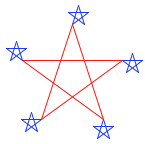

---
export_on_save:
  html: true
html:
  toc: true
  offline: true 
toc:
  depth_from: 3
  depth_to: 5
  ordered: false
---

# CS 61A Class Notes

<u>**Text book**</u>
 
* [Structure and Interpretation of Computer Programs (SICP)](https://mitpress.mit.edu/sites/default/files/sicp/index.html) 
* [Composing Programs](http://composingprograms.com/) (Majorly referred in this course)
* [Dive into Python 3](https://diveintopython3.problemsolving.io/index.html)

---

<u>**Table of Contents**</u>


<!-- @import "[TOC]" {cmd="toc" depthFrom=1 depthTo=6 orderedList=false} -->

<!-- code_chunk_output -->

- [CS 61A Class Notes](#cs-61a-class-notes)
  - [Chapter 3: Interpreting Computer Programs](#chapter-3-interpreting-computer-programs)
    - [3.1 Introduction](#31-introduction)
      - [3.1.1 Programming Languages](#311-programming-languages)
    - [3.2 Functional Programming](#32-functional-programming)
      - [3.2.1 Expressions](#321-expressions)
        - [<u>Call expressions</u>](#ucall-expressionsu)
        - [<u>Special forms</u>](#uspecial-formsu)
        - [<u>`if` expression</u>](#uif-expressionu)
        - [<u>Boolean special forms</u>](#uboolean-special-formsu)
      - [3.2.2 Definitions](#322-definitions)
        - [<u>`lambda` special form</u>](#ulambda-special-formu)
      - [3.2.3 Compound Values](#323-compound-values)
      - [3.2.4 Symbolic Data](#324-symbolic-data)
      - [3.2.5 Turtle Graphics](#325-turtle-graphics)
    - [3.3 Exceptions](#33-exceptions)
        - [<u>Raising exceptions</u>](#uraising-exceptionsu)
        - [<u>Handling exceptions</u>](#uhandling-exceptionsu)
      - [3.3.1 Exception Objects](#331-exception-objects)
    - [3.4 Interpreters for Languages with Combination](#34-interpreters-for-languages-with-combination)

<!-- /code_chunk_output -->


---

## Chapter 3: Interpreting Computer Programs 

### 3.1 Introduction

A programming language like Python is useful because we can define an ***interpreter***, a program that carries out Python's *evaluation* and *execution* procedures.

An interpreter is just another **program** which determines the meaning of expressions in a programming language.

$\implies$  the *most fundamental* idea in programming.
<br/>

#### 3.1.1 Programming Languages 

Programming languages vary widely in their *syntactic structures*, *features*, and *domain of application*.

Among general purpose programming languages, the constructs of function and function application are pervasive.

On the other hand, powerful languages exist that do **NOT** include an object system, higher-order functions, assignmeng, or even control constructs such as `while` and `for` statements.

* As an example with a *minimum* set of features, we are going to use the [Scheme](https://en.wikipedia.org/wiki/Scheme_(programming_language)) programming language. (The subset of Scheme used in this text does **not** allow mutable values at all.)
<br/>

In this chapter, we study 

* the **design of interpreters** and, 
* the **computational processes** they create when executing programs.
<br/>


Many interpreters have an elegant common structure: two **mutually recursive functions**,

1. one evaluates expressions in environments;
2. one applies functions to arguments.

These functions are recursive in that they are defined in terms of each other: applying a function requires evaluating the expressions in its body, while evaluating an expression may involve applying one or more functions.
<br/>
<br/>


---


### 3.2 Functional Programming 

The software running on any modern computer is writtern in a variety of programming languages.  

* **Physical languages**: (*e.g.*, machine languages for particular computers.) are concerned with the representation of data and control in terms of individual bets of storage and primitive machine instructions.

* **High-level languages**: erected on a machine-language substrate, hide concerns about the representation of data as collections of bits and the representation of programs as sequences of primitive instructions.  These languages have means of combination and abstraction, such as the function definition, that are appropriate to the larger-scale organization of software systems.

In this section, we introduce a high-level programming language that encourages a *functional style*.  Our object of study, a subset of the Scheme language, employs a very similar model of computation to Python's, but uses **only** expressions (no statements!), specializes in *symbolic computation*, and employs **only** *immutable values*.
<br/>


#### 3.2.1 Expressions 

Scheme programs consist of expressions, which are either ***call expressions*** or ***special forms***.
<br/>

##### <u>Call expressions</u>

A call expression consists of an **operator** expression *followed* by zero or more **operand** sub expressions, as in Python.

Both the operator and operand are contained within **parentheses**.

```scheme
(quotient 10 2)
5
``` 

Scheme exclusively uses **prefix** notation: operators are often symbols, such as `+` and `*`.

> *Recall: Python uses **infix** notation, where the operator appears in between the operands*

Call expressions can be *nested*, and they may *span* more than one line.

```scheme
(+ (* 3 5) (- 10 6))
19

(+ (* 3
      (+ (* 2 4)
         (+ 3 5)))
   (+ (- 10 7)
      6))
57
``` 

The **evaluation** of a Scheme call expression follows the exact same rules as in Python:

1. Evaluate the operator.  It should evaluate to a procedure.
2. Evaluate the operands, left to right
3. Apply tht procedure to the evaluated operands.
<br/>


##### <u>Special forms</u>

What makes a special form "special" is that they do **not** follow the three rules of evaluation of call expression.  

Indeed, each special form follows its own *special rules* for execution, such as short-circuiting before evaluating all the operands.

Some examples of special forms are the `if`, `cond`, `define`, and `lambda` forms.
<br/>


##### <u>`if` expression</u>

The general form of an `if` expression is:

```scheme
(if <predicate> <consequent> [alternative])
``` 

The first operand is what's known as a **predicate** expression in Scheme, an expression whose value is interpreted as *boolean values* of either `#t` or `#f`. 

The **rules for evaluating** an `if` special form expression are as follows:

1. Evaluate `<predicate>` 
2. If `<predicate>` evaluates to a truth-y value, evaluate and return the value of the expression `<consequent>`; otherwise, evaluate and return the value of `[alternative]` *if it is provided*.

> The difference between the rules of regular call expression and an `if` expression:
> * Step 2 of evaluating call expresiions requires evaluating **all** of the operands **in order**.
> * An `if` expression will only evaluate **two** of its operands, the *conditional expression* and **either** `<consequent>` or `[alternative]`.

We can also compare a Scheme `if` expression witht a Python `if` statement:

* Scheme `if` expression (note that it is an epxression) evaluates to some value.  Howver, the Python `if` statement simply directs the flow of the program.
* A Scheme `if` expression expects just a **single** expression for each of the true result and the false result.
* There is no `elif` cases in Scheme.  If you want to have multiple cases using the `if` expression, you would need multiple beanched `if` expressions (*i.e.*, nested `if` expressions)

<br/>


##### <u>Boolean special forms</u>

Numerical values can be compared using familiar comparison operators, but prefix notation is used in this case as well.

```scheme
(>= 2 1)
#t
``` 

The boolean values `#t` (or `true`) and `#f` (or `false`) in Scheme can be combined with boolean special forms, which have evaluation procedures similar to those in Python:

* `(and <e1> ... <en>)` 
  * The interpreter evaluates the expression `<e>` one at a time, in left to right order.
  * If any `<e>` evaluates to `false`, the value of the `and` expression is `false`, and the rest of the `<e>`'s are **not** evaluated.
  * If all `<e>`'s evaluate to true values, the value of the `and` expression is the value of the **last one**.
<br/>

* `(or <e1> ... <en>)` 
  * The interpreter evaluates the expressions `<e>` one at a time, in left to right order.
  * If any `<e>` evaluates to a true value, that value is returned as the value fo the `or` expression, and the rest of the `<e>`'s are **not** evaluated.
  * If all `<e>`'s evaluate to `false`, the value of the `or` expression is `false`.
<br/>

* `(not <e>)`
  * The value of a `not` expression is `true` when the expression `<e>` evaluates to `false`, and `false` otherwise.
<br/>

<br/>


#### 3.2.2 Definitions

Values can be **named** using the `define` special form.

```scheme
(define pi 3.14)
(* pi 2)
6.28
``` 

The rules to evaluate this expression are:

1. Evaluate the `<expression>`.
2. Bind its value to the `<name>` in the current frame.
3. Return `<name>`.
<br/>


New functions (called ***procedures*** in Scheme) can be defined using a second version of the `define` special form.

The general form of a procedure definition is:

```scheme
(define (<name> <formal parameters>) <body>)
``` 

* The `<name>` is a symbol to be associated with the procedure definition in the environment.
* The `<formal parameters>` are the names used within the body of the procedure to refer to the corresponding arguments of the procedure.
* The `<body>` is an expression that will yield the value of the procedure application when the formal parameters are replaced by the actual arguments to which the procedure is applied.
* The `<name>` and `<formal parameters>` are grouped within parentheses, just as they would be in an actual call to the procedure being defined.

To evaluate this expression:

1. Create a lambda procedure with the given parameters and `<body>`.
2. Bind the procedure to the `<name>` in the current frame.
3. Return `<name>`.


*e.g.*,
```scheme
(define (square x) (* x x))

(square 21)
441
(square (+ 2 5))
49
(square (square 3))
81
``` 

User defined procedures (functions) can take multiple arguments and include special forms:

```scheme
(define (average x y)
  (/ (+ x y) 2))

(average 1 3)
2

(define (abs x)
    (if (< x 0)
        (- x)
        x))

(abs -3)
3
``` 

Scheme supports local definitions with the same lexical scoping as Python.  Below, we define an iterative procedure for computing square roots using nested definitions and recursion:

```scheme
(define (sqrt x)
  (define (good-enough? guess)
    (< (abs (- (square guess) x)) 0.001))
  (define (improve guess)
    (average guess (/ x guess)))
  (define (sqrt-iter guess)
    (if (good-enough? guess)
        guess
        (sqrt-iter (improve guess))))
  (sqrt-iter 1.0))

(sqrt 9)
3.00009155413138
``` 
<br/>

Two more properties of the `define` special form:

* The operands of a `define` special form are **NOT** evaluated at all!  *e.g.*, `<body>` is not evaluated when a procedure is defined, but rather when it is called.  `<name>` and the parameter names are all names that should not be evaluated when executing this `define` expression.
* The `<body>` may contain **multiple** expressions (no equivalent version of a Python `return` statement in Scheme).  The function will simply return the value of the **last expression** in the body.
  
<br/>


##### <u>`lambda` special form</u>

Anonymous functions are created using the `lambda` special form.  `lambda` is used to create procedures in the same way as `define`, except that no name is specified for the procedure:

```scheme
(lambda (<formal parameters>) <body>)
``` 

The resulting procedure is just as much a procedure as one that is created uisng `define`.  The only difference is that it has not been associated with any name in the environment.

The following expressions are **equivalent**:

```scheme
(define (plus4 x) (+ x 4))
(define plus4 (lambda (x) (+ x 4)))
``` 

A lambda expression can be used as the operator in a call expression:

```scheme
((lambda (x y z) (+ x y (square z))) 1 2 3)
12
``` 
<br/>
<br/>


#### 3.2.3 Compound Values

Pairs are built into the Scheme language.  

* pairs are created with the `cons` built-in function;
* the elements of a pair are accessed with `car` and `cdr`.

*e.g.*,
```scheme
(define x (cons 1 2))
x

(car x)
1
(cdr x)
2
``` 

Recursive lists are alos built into the language, using pairs.  A special value denoted `nil` or `'()` represents the empty list.  A recursive list value is rendered by placing its elements within parentheses, separated by spaces.

```scheme
(cons 1
      (cons 2
            (cons 3
                  (cons 4 nil))))
(1 2 3 4)

(list 1 2 3 4)
(1 2 3 4)

(define one-through-four (list 1 2 3 4))
(car one-through-four)
1
(cdr one-through-four)
(2 3 4)
(car (cdr one-through-four))
2
(cons 10 one-through-four)
(10 1 2 3 4)
``` 

Whether a list is empty can be determined using the primitive `null?` predicate.  Using it, we can define the standard sequence operation for computing `length` and selecting elements:

```scheme
(define (length items)
  (if (null? items)
      0
      (+ 1 (length (cdr items)))))
(define (getitem items n)
  (if (= n 0)
      (car items)
      (getitem (cdr items) (- n 1))))
(define squares (list 1 4 9 16 25))

(length squares)
5
(getitem squares 3)
16
``` 
<br/>
<br/>


#### 3.2.4 Symbolic Data 

One of Scheme's strengths is working with arbitary symbols as data.

> *All the compound data objects we have used so far were constructed ultimately from numbers.*

To manipulate symbols, we need a new element in our language $\implies$ the ability to ***quote*** a data object.

In Scheme, we refer to the *symbols* rather than their *values* by preceding them with a single **quotation mark**.

```scheme
(define a 1)
(define b 2)
(list a b)
(1 2)
(list 'a 'b)
(a b)
(list 'a b)
(a 2)
``` 

In Scheme, any expression that is **not** evaluated is said to be ***quoted***.  In *language*, quotation allow us to talk about **language itself**, and so it is in Scheme:

```scheme
(list 'define 'list)
(define list)
``` 

Quotation also allows us to type in compound objects, using the conventioanl printed representation for lists:

```scheme
(car '(a b c))
a
(cdr '(a b c))
(b c)
``` 
<br/>
<br/>


#### 3.2.5 Turtle Graphics

The implementation of Scheme that serves as a companion to this text includes Turtle graphics, an illustrating environment developed as part of the Logo language (another Lisp dialect).

This turtle begins in the center of a canvas, moves and turns based on procedures, and draws lines behind it as it moves.

Single-argument procedures such as `forward` and `right` change the position and heading of the turtle.  Common procedures have abbreviations: `forward` can also be called as `fd`, *etc*.

>The `begin` special form in Scheme allow a single expression to include multiple sub-expressions.  This form is useful for issuing multiple commands.

*e.g.*,
```scheme
> (define (repeat k fn) (if (> k 0)
                            (begin (fn) (repeat (- k 1) fn))
                            nil))
> (repeat 5
          (lambda () (fd 100)
                     (repeat 5
                             (lambda () (fd 20) (rt 144)))
                     (rt 144)))
nil
``` 

<br/>

The full repertoire of Turtle procedures is also built into Python as the [turtle library module](https://docs.python.org/3/library/turtle.html).
<br/>

Scheme can express recursive drawings using its turtle graphics in a remarkably compact form.

For example, Sierpinski's triangle is a fractal taht draws each triangle as three neighboring triangles that have vertexes at the midpoints of the legs of the triangle that contains them.  It can be drawn to a finite recursive depth by this Scheme program.

```scheme
> (define (repeat k fn)
    (if (> k 0)
        (begin (fn) (repeat (- k 1) fn))
        nil))

> (define (tri fn)
    (repeat 3 (lambda () (fn) (lt 120))))

> (define (sier d k)
    (tri (lambda ()
           (if (= k 1) (fd d) (leg d k)))))

> (define (leg d k)
    (sier (/ d 2) (- k 1))
    (penup)
    (fd d)
    (pendown))
``` 

The `triangle` procedure is a general method for repeating a drawing procedure three times with a left turn following each repetition.  The `sier` procedure takes a length `d` and a recursive depth `k`.  It draws a plain triangle if the deptn is 1, and otherwise draws a triangle made up to calls to `leg`.  The `leg` procedure draws a single leg of a recursive Sierpinski triangle by a recursive call to `sier` that fills the first half of the length of the leg, then by moving the turtle to the next vertex.  The procedure `penup` and `pendown` stop the turtle from drawing as it moves by lifting its pen up and then placing it down again.  The mutual recursion between `sier` and `leg` yields this reults.

```scheme
> (sier 400 6)
``` 

<br/>

<br/>
<br/>


---


### 3.3 Exceptions

Programmers must be always mindful of possible errors that may arise in their programs.  Examples abound:

* a funciton may not receive arguments that it is designed to accept, 
* a necessary resource may be missing,
* a connection across a network may be lost
* ...

$\implies$ One must anticipate the exceptional circumstances that may arise and take appropriate measures to handle them.


There is no single correct approach to handling errors in a program:

* some persistent service like a web server should be robust to errors, logging them for later consideration but continuing to service new requests as long as possible.
* the Python interpreter handles errors by terminating immediately and printing an error message, so that programmers can address issues as soon as they arise.


***Exceptions*** provides a general mechanism for adding error-handling logic to programs.  *Raising an exception* is a technique for 
1. interrupting the nomal flow of execution in a program, 
2. signaling that some exceptional circumstance has arisen,
3. and returning directly to an enclosing part of the program that was designated to react to that circumstance.

> The Python interpreter arises an exception each time it detects an error in an expression or statement.  Users can also arise exceptions with `arise` and `assert` statements.

<br/>


##### <u>Raising exceptions</u>

An exception is a object instance with a class that inherits, either directly or indirectly, from the `BaseException` class.  

*e.g.*, the `assert` statement arises an exception with the class `AssertionError`.

In general, *any* exception instance can be raised with the `raise` statement.  The general form of raise statements are described in the [Python docs](https://docs.python.org/3/reference/simple_stmts.html#raise).

The most common use of `raise` constructs an exception instance and raises it.

```python
>>> raise Exception('An error occurred')
Traceback (most recent call last):
  File "<stdin>", line 1, in <module>
Exception: an error occurred
``` 

When an exception is raised, **no** further statements in the current block of code are executed.  Unless the exception is ***handled***, the interpreter will return directly to the interactive read-eval-print loop, or terminate entirely if Python was started with a file argument.

In addition, the interpreter will print a *stack backtrace*, which is a structured block of text that describes the nested set of active function calls in the branch of execution in which the exception was raised.  In the example above, the file name `<stdin>` indicates that the execption was raised by the user in an interactive session, rather than from code in a file.
<br/>


##### <u>Handling exceptions</u>

An exception can be handled by an enclosing `try` statement.  A `try` statement consists of multiple clauses; the first begins with `try` and the rest begin with `except`:

```python
try:
    <try suite>
except <exception class> as <name>:
    <except suite>
...
``` 

* The `<try suite>` is **always** executed immediately when the `try` statement is executed.
* Suites of the `except` clauses are **only** executed when an exception is raised during the course of executing the `<try suite>`.
  * Each `except` clause specifies the particular class of execution to handle.  
  * *e.g.*, if the `<exception class>` is `AssertionError`, then any instance of a class inheriting from `AssertionError` that is raised during the course of executing the `<try suite>` will be handled by the following `<except suite>`.
  * Within the `<except suite>`, the identifier `<name>` is bound to the exception object that was raised, but this binding does not persist beyond the `<except suite>`.

For example, we can handle a `ZeroDivisionError` exception using a `try` statement that binds the name `x` to 0 when the exception is raised.

```python
>>> try:
        x = 1 / 0
    except ZeroDivisionError as e:
        print('handling a', type(e))
        x = 0
handling a <class '`ZeroDivisionError`>

>>> x
0
``` 

A `try` statement will handle exceptions that occur within the body of a function that is applied (either directly or indrectly) within the `<try suite>`.  When an exception is raised, control *jumps directly* to the body of the `<except suite>` of the *most recent* `try` statement that handles taht type of exception.

```python
>>> def invert(x):
        result = 1/x  # Raises a ZeroDivisionError if x is 0
        print('Never printed if x is 0')
        return result

>>> def invert_safe(x):
        try:
            return invert(x)
        except ZeroDivisionError as e:
            return str(e)

>>> invert_safe(2)
Never printed if x is 0
0.5
>>> invert_safe(0)
'division by zero'
``` 

This example illustates that the print expression in `invert` is never evaluated, and instead control is transferred to the suite of the `except` clause in `invert_safe`.  Coercing the `ZeroDivisionError e` to a string gives the human-interpretable string returned by `invert_safe`: `'division by zero'`.
<br/>
<br/>


#### 3.3.1 Exception Objects

Exception objects themselves can have attributes, such as the error message stated in an `assert` statement and information about where in the course of execution the exception was raised.  User-defined exception classes can have additional attributes.

Let's take the Newton's method to find the zeros of arbitary functions as an example.

We are going to define an exception class that returns the best guess discovered in the course of iterative improvement whenever a `ValueError` occurs.  A math domain error (a type of `ValueError`) is raised when `sqrt` is applied to a negative number.  This exception is handled by raising an `IterImproveError` that stores the most recent guess from Newton's method as an attribute.

First, we define a new class that inherits from `Exception`.

```python
>>> class IterImproveError(Exception):
        def __init__(self, last_guess):
            self.last_guess = last_guess
``` 

Next, we define a version of `improve`, our generic iterative improvement algorithm.  This version handles any `ValueError` by raising an `IterImproveError` that stores the most recent guess.

```python
>>> def improve(update, done, guess=1, max_updates=1000):
        k = 0
        try:
            while not done(guess) and k < max_updates:
                guess = update(guess)
                k = k + 1
            return guess
        except ValueError:
            raise IterImproveError(guess)
``` 

Finally, we define `find_zero`, which returns the result of `improve` applied to a Newton update function returned by `newton_update`, which is defined in Chapter 1.  This version of `find_zero` handles an `IterImproveError` by returning its last guess.

```python
>>> def find_zero(f, guess=1):
        def done(x):
            return f(x) == 0
        try:
            return improve(newton_update(f), done, guess)
        except IterImproveError as e:
            return e.last_guess
``` 


Consider applying `find_zero` to find the zero of the function $2x^2 + \sqrt{x}$.  This function has a zero at 0, but evaluating it on any negative number will raise a `ValueError`.  Our revised implementation returns the last guess found before the error.

```python
>>> from math import sqrt
>>> find_zero(lambda x: 2*x*x + sqrt(x))
-0.030211203830201594
``` 

Although this approximation is still far from the correct answer of 0, some applications would prefer this coarse approximation to a `ValueError`.

Exceptions are another technique that help us as programs to separate the concerns of our program into modular parts.

In this example, Python's exception mechanism allowed us to separate the logic for iterative improvement, which appears unchanged in the suite of the `try` clause, from the logic for handling errors, which appears in `except` clauses.

We will also find that exceptions are a useful feature when implementing interpreters in Python.
<br/>
<br/>


---


### 3.4 Interpreters for Languages with Combination 


